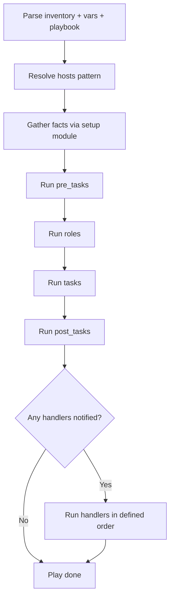

# 04. Playbooks Deep Dive

> Playbooks are the real Ansible unit of work. Understand the structure, lifecycle, and idioms.

## What a playbook is

A playbook is a YAML file with one or more **plays**. Each play targets a group of hosts and runs an ordered list of **tasks** using modules. Plays can also have **handlers**, **pre_tasks**, **post_tasks**, **vars**, and **roles**.

## Minimal example

```yaml
# site.yml
- name: Configure web tier
  hosts: web
  become: true
  vars:
    nginx_port: 80
  tasks:
    - name: Install nginx
      ansible.builtin.package:
        name: nginx
        state: present

    - name: Deploy nginx config
      ansible.builtin.template:
        src: nginx.conf.j2
        dest: /etc/nginx/nginx.conf
        mode: "0644"
      notify: restart nginx

    - name: Ensure nginx is running
      ansible.builtin.service:
        name: nginx
        state: started
        enabled: true

  handlers:
    - name: restart nginx
      ansible.builtin.service:
        name: nginx
        state: restarted
```

Run:

```bash
ansible-playbook -i inventory site.yml
```

## Anatomy of a play

| Element | Purpose |
|---|---|
| `name` | Human description, shown in output |
| `hosts` | Inventory pattern to target |
| `become` | Run as root (sudo) |
| `gather_facts` | Whether to collect host facts (default true) |
| `vars`, `vars_files`, `vars_prompt` | Variables for the play |
| `pre_tasks` | Tasks before roles run |
| `roles` | Reusable bundles of tasks/vars/handlers |
| `tasks` | Ordered task list |
| `post_tasks` | Tasks after roles and tasks finish |
| `handlers` | Tasks triggered via `notify` from other tasks |

## How a play runs



- Tasks run **top to bottom** on each host.
- By default, Ansible runs **5 hosts in parallel** (forks). Tune in `ansible.cfg`.
- A failed task on a host **stops further tasks on that host** unless you use `ignore_errors` or `block/rescue`.

## Task anatomy

```yaml
- name: Create deploy user             # required, shown in output
  ansible.builtin.user:                # module (FQCN)
    name: deploy
    shell: /bin/bash
    groups: sudo
    state: present
  become: true                         # run as root for this task
  when: ansible_os_family == "Debian"  # conditional
  tags: [users, base]                  # tags for selective runs
  register: deploy_user_result         # save result to a variable
  changed_when: deploy_user_result.changed
  notify: refresh ssh keys             # trigger a handler if changed
```

## Handlers

- Special tasks that run **only when notified** by another task that **changed** something.
- Run **once per play** at the end, regardless of how many times notified.
- Useful for restarts, reloads, service refreshes.

```yaml
tasks:
  - name: Deploy nginx config
    ansible.builtin.template:
      src: nginx.conf.j2
      dest: /etc/nginx/nginx.conf
    notify: restart nginx

handlers:
  - name: restart nginx
    ansible.builtin.service:
      name: nginx
      state: restarted
```

To run handlers immediately (rare):

```yaml
- name: Force handlers now
  ansible.builtin.meta: flush_handlers
```

## Multiple plays

```yaml
- name: Configure load balancers
  hosts: lb
  roles:
    - haproxy

- name: Configure web servers
  hosts: web
  roles:
    - nginx
    - app

- name: Configure databases
  hosts: db
  roles:
    - postgresql
```

Plays run **sequentially**; tasks within a play run in parallel across hosts.

## Common playbook patterns

### Rolling updates

```yaml
- name: Rolling app update
  hosts: web
  serial: 2              # 2 hosts at a time
  max_fail_percentage: 10
  tasks:
    - name: Drain from LB
      ansible.builtin.uri:
        url: "http://lb/api/drain/{{ inventory_hostname }}"
        method: POST

    - name: Deploy new version
      ansible.builtin.copy:
        src: "app-{{ app_version }}.tar.gz"
        dest: /opt/app/

    - name: Restart service
      ansible.builtin.service:
        name: app
        state: restarted

    - name: Re-add to LB
      ansible.builtin.uri:
        url: "http://lb/api/enable/{{ inventory_hostname }}"
        method: POST
```

### Delegate to another host

```yaml
- name: Add host to load balancer
  community.general.haproxy:
    state: enabled
    backend: web
    host: "{{ inventory_hostname }}"
  delegate_to: lb1.example.com
```

### Run once

```yaml
- name: Run DB migration once
  ansible.builtin.command: ./migrate.sh
  run_once: true
  delegate_to: db1.example.com
```

### Local action

```yaml
- name: Generate a temp file on control node
  ansible.builtin.tempfile:
    state: file
  delegate_to: localhost
```

## Useful command-line flags

```bash
ansible-playbook site.yml --check --diff           # dry run with file diffs
ansible-playbook site.yml --tags base              # run only tasks tagged 'base'
ansible-playbook site.yml --skip-tags slow         # skip slow tasks
ansible-playbook site.yml --limit web1             # restrict to one host
ansible-playbook site.yml --start-at-task "Deploy" # resume from a task
ansible-playbook site.yml -e "app_version=1.2.3"   # pass extra vars
ansible-playbook site.yml --syntax-check           # YAML and structure check
ansible-playbook site.yml --list-tasks             # show what would run
ansible-playbook site.yml --list-hosts             # show targeted hosts
```

## Idempotency rules

- Use **modules**, not raw shell.
- For `shell`/`command`, set `creates:`, `removes:`, or `changed_when:` so the task only reports `changed` when it actually does work.
- Use `state: present` / `state: absent` semantics.
- Verify with two consecutive runs: the second should report `changed=0`.

## What good looks like

- Each play has a clear purpose and a small number of tasks.
- Common logic lives in **roles** (see [07-roles-collections-galaxy.md](07-roles-collections-galaxy.md)).
- Handlers used for service restarts.
- `--check --diff` runs cleanly on every PR.
- Two back-to-back runs show no changes the second time.

## Anti-patterns

- One playbook with hundreds of tasks and no roles.
- Tasks that always report `changed: true`.
- Hardcoded paths and versions that should be variables.
- Skipping `name:` on tasks.

## Next

Move to [05-variables-facts-templates.md](05-variables-facts-templates.md) to wire data into your tasks.
