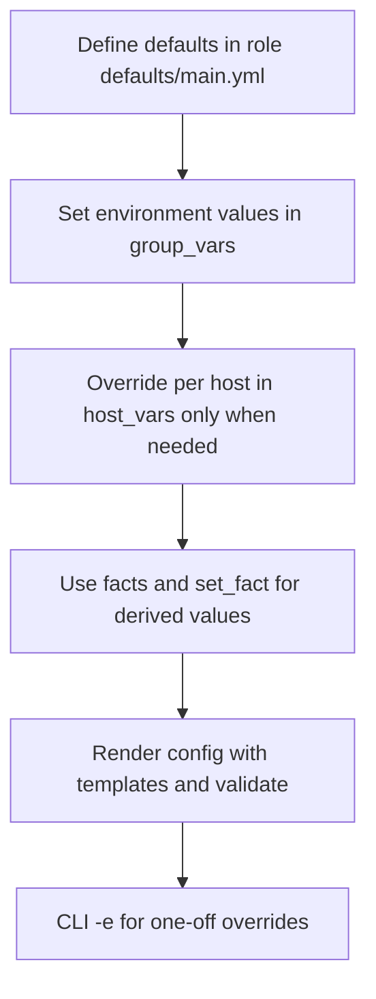

# 05. Variables, Facts, and Jinja2 Templates

> How Ansible passes data into tasks: variable precedence, facts, and templated config files.

## Why this matters

Real automation needs **data**: hostnames, ports, sizes, environment differences. Ansible's variable model lets you keep one set of playbooks and feed environment-specific data without copy-paste.

## Variables: what they are

A variable is a named value that templates and tasks can reference. Values can be strings, numbers, lists, or dicts.

```yaml
vars:
  http_port: 80
  app_name: shop
  upstreams:
    - app1.example.com:8080
    - app2.example.com:8080
  feature_flags:
    new_checkout: true
    canary_search: false
```

Reference with `{{ ... }}`:

```yaml
- name: Open firewall port
  ansible.posix.firewalld:
    port: "{{ http_port }}/tcp"
    permanent: true
    state: enabled
```

## Where variables come from

In rough order of precedence (low → high):

1. **Role defaults** (`roles/<role>/defaults/main.yml`) — safe defaults.
2. **Inventory `group_vars/all`** — fleet-wide values.
3. **Inventory `group_vars/<group>`** — per-group values.
4. **Inventory `host_vars/<host>`** — per-host overrides.
5. **Play `vars`** and **`vars_files`**.
6. **Set facts** (`set_fact`).
7. **Role and task `vars`**.
8. **`include_vars`** at runtime.
9. **`-e` / `--extra-vars`** on the CLI — highest, overrides everything.

Rule of thumb:
- **Defaults** in roles.
- **Constants** in `group_vars/all`.
- **Environment values** in `group_vars/<env>`.
- **Per-host overrides** in `host_vars/<host>` (sparingly).
- **`-e`** only for one-off overrides (e.g., `--extra-vars app_version=1.2.3`).

## `group_vars` and `host_vars` layout

```
inventory/
├── hosts.yml
├── group_vars/
│   ├── all.yml
│   ├── web.yml
│   ├── db.yml
│   └── prod.yml
└── host_vars/
    └── db1.example.com.yml
```

You can also use directories per group:

```
group_vars/web/
  vars.yml      # plain vars
  vault.yml     # encrypted with ansible-vault
```

This pattern is standard for separating secrets from non-secrets.

## Facts

**Facts** are variables Ansible gathers automatically about each host (OS, IPs, CPU, memory, mounts). They live under `ansible_facts` and are also exposed as top-level `ansible_*` variables.

```yaml
- name: Show distribution
  ansible.builtin.debug:
    msg: "{{ ansible_distribution }} {{ ansible_distribution_version }}"

- name: Show primary IP
  ansible.builtin.debug:
    var: ansible_default_ipv4.address
```

### Useful built-in facts

| Variable | Example |
|---|---|
| `ansible_hostname` | `web1` |
| `ansible_fqdn` | `web1.example.com` |
| `ansible_distribution` | `Ubuntu` |
| `ansible_distribution_version` | `22.04` |
| `ansible_os_family` | `Debian` |
| `ansible_kernel` | `5.15.0-...` |
| `ansible_architecture` | `x86_64` |
| `ansible_processor_vcpus` | `8` |
| `ansible_memtotal_mb` | `16384` |
| `ansible_default_ipv4.address` | `10.0.0.5` |
| `ansible_mounts` | list of dicts per mount |
| `ansible_date_time.iso8601` | timestamp |

### Disabling fact gathering

Fact gathering takes time on large fleets. Disable when not needed:

```yaml
- hosts: all
  gather_facts: false
  tasks: [...]
```

Or gather only what you need with `gather_subset`:

```yaml
- hosts: all
  gather_facts: true
  vars:
    ansible_facts_gather_subset: ['!all', 'min', 'network']
```

### Custom facts

Drop a script or INI/JSON file in `/etc/ansible/facts.d/<name>.fact` on the target. They appear under `ansible_local.<name>`.

```ini
# /etc/ansible/facts.d/datacenter.fact
[location]
region=us-east
rack=rack-12
```

Then:

```yaml
- ansible.builtin.debug:
    var: ansible_local.datacenter.location.region
```

### `set_fact`

Create a fact during a play that other tasks can use:

```yaml
- name: Compute config path
  ansible.builtin.set_fact:
    app_config_path: "/etc/{{ app_name }}/{{ env }}.yml"

- name: Use it
  ansible.builtin.template:
    src: app.yml.j2
    dest: "{{ app_config_path }}"
```

## Jinja2 templates

Ansible uses [Jinja2](https://jinja.palletsprojects.com/) for variable expansion and templated files.

### In tasks

```yaml
- name: Build greeting
  ansible.builtin.debug:
    msg: "Hello {{ ansible_hostname | upper }}, you have {{ ansible_processor_vcpus }} CPUs"
```

### In template files

`templates/nginx.conf.j2`:

```jinja
worker_processes {{ ansible_processor_vcpus }};

events {
  worker_connections 1024;
}

http {
  upstream app {
    
    server {{ backend }};
    
  }

  server {
    listen {{ http_port }};
    server_name {{ ansible_fqdn }};

    location / {
      proxy_pass http://app;
    }

    
    location /checkout {
      proxy_pass http://app/checkout-v2;
    }
    
  }
}
```

Use it:

```yaml
- name: Render nginx config
  ansible.builtin.template:
    src: nginx.conf.j2
    dest: /etc/nginx/nginx.conf
    mode: "0644"
    validate: "nginx -t -c %s"
  notify: restart nginx
```

`validate:` runs a syntax check against the rendered file before installing it. Highly recommended for configs that can break a service.

### Useful Jinja2 filters

| Filter | Example | Result |
|---|---|---|
| `default` | `{{ x | default('foo') }}` | Fallback if undefined |
| `upper` / `lower` | `{{ name | upper }}` | Case change |
| `length` | `{{ users | length }}` | Count |
| `join` | `{{ list | join(',') }}` | Concatenate |
| `to_json` / `to_yaml` | `{{ obj | to_yaml }}` | Serialize |
| `to_nice_json` | Pretty JSON | Readable output |
| `regex_replace` | `{{ s | regex_replace('a','b') }}` | Substitute |
| `bool` | `{{ x | bool }}` | Cast to bool |
| `b64encode` / `b64decode` | Base64 | Useful for K8s secrets |
| `hash` | `{{ s | hash('sha256') }}` | Hash a string |
| `selectattr` | `{{ users | selectattr('admin') | list }}` | Filter list of dicts |

### Tests

```yaml
- ansible.builtin.debug:
    msg: "Port is open"
  when: result.tcp_open is defined and result.tcp_open
```

Common: `defined`, `undefined`, `none`, `string`, `number`, `match`, `search`.

## Variable scoping rules

- Variables defined at the play level apply to all tasks in that play.
- Variables defined at the task level apply only to that task.
- Facts and `set_fact` results persist for the rest of the play on that host.
- `vars_files` are loaded at play start.

## Workflow



## What good looks like

- Variables are scoped consistently: defaults vs constants vs env vs host.
- Templates have a `validate:` step for risky configs.
- No secrets in plain `group_vars`; they live in `vault.yml`.
- Reviewers can read a `group_vars/prod.yml` and know what prod looks like.

## Anti-patterns

- Repeating the same value in every host_vars file.
- Magic constants embedded directly in playbooks.
- Templates that render only because of side effects (e.g., relying on time).
- Using `-e` for things that should live in inventory.

## Next

Move to [06-conditionals-loops-handlers-blocks.md](06-conditionals-loops-handlers-blocks.md).
