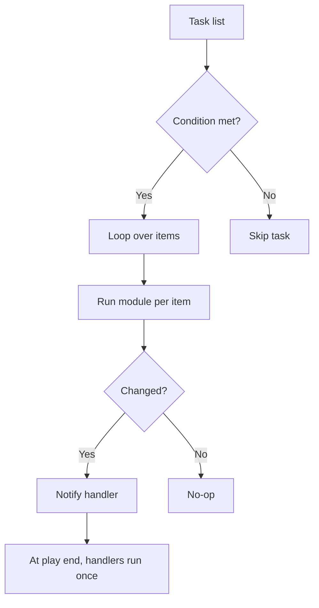

# 06. Conditionals, Loops, Handlers, Blocks, and Tags

> Control flow tools that turn a flat task list into real automation logic.

## Conditionals: `when`

Run a task only if a condition is true.

```yaml
- name: Install firewalld on RHEL family
  ansible.builtin.package:
    name: firewalld
    state: present
  when: ansible_os_family == "RedHat"

- name: Install ufw on Debian family
  ansible.builtin.package:
    name: ufw
    state: present
  when: ansible_os_family == "Debian"
```

Combine conditions with `and` / `or`:

```yaml
- name: Restart only if config changed and service is running
  ansible.builtin.service:
    name: nginx
    state: restarted
  when:
    - config_result is changed
    - nginx_state.stdout == "active"
```

Common idioms:
- `when: var is defined`
- `when: var is not defined`
- `when: result.failed`
- `when: ansible_facts['os_family'] == 'Debian'`

## Loops

### `loop` (modern, replaces `with_items`)

```yaml
- name: Create users
  ansible.builtin.user:
    name: "{{ item }}"
    state: present
  loop:
    - alice
    - bob
    - carol
```

### Looping over dicts

```yaml
- name: Create users with attributes
  ansible.builtin.user:
    name: "{{ item.name }}"
    groups: "{{ item.groups }}"
    shell: "{{ item.shell | default('/bin/bash') }}"
    state: present
  loop:
    - { name: alice, groups: ['sudo','dev'] }
    - { name: bob,   groups: ['dev'] }
```

### Looping over a list defined in vars

```yaml
vars:
  packages:
    - nginx
    - htop
    - jq

tasks:
  - name: Install base packages
    ansible.builtin.package:
      name: "{{ item }}"
      state: present
    loop: "{{ packages }}"
```

Or just pass the list to a module that supports it (much faster):

```yaml
- name: Install base packages (single call)
  ansible.builtin.package:
    name: "{{ packages }}"
    state: present
```

Prefer the **single call** form when the module supports lists.

### Loop control

```yaml
- name: Wait briefly between actions
  ansible.builtin.uri:
    url: "http://localhost/health/{{ item }}"
  loop: [a, b, c]
  loop_control:
    pause: 2          # seconds between iterations
    label: "{{ item }}"   # nicer output
```

### Looping over a range

```yaml
- name: Create 5 numbered files
  ansible.builtin.file:
    path: "/tmp/file_{{ item }}"
    state: touch
  loop: "{{ range(1, 6) | list }}"
```

### `until` (retry until condition)

```yaml
- name: Wait for app to be ready
  ansible.builtin.uri:
    url: http://localhost:8080/health
    status_code: 200
  register: health
  retries: 30
  delay: 2
  until: health.status == 200
```

## Handlers

A **handler** is a task that runs only when another task **notifies** it and reports `changed`.

```yaml
tasks:
  - name: Update sshd_config
    ansible.builtin.template:
      src: sshd_config.j2
      dest: /etc/ssh/sshd_config
      validate: "sshd -t -f %s"
    notify: restart sshd

handlers:
  - name: restart sshd
    ansible.builtin.service:
      name: sshd
      state: restarted
```

Key behaviors:
- Handlers run **after all tasks** in a play, in **the order they are defined** in the handlers section.
- Each handler runs **once per host**, even if notified multiple times.
- A failed task does **not** prevent later tasks from notifying handlers in the same host's flow if the failure is handled.

Force handlers earlier:

```yaml
- ansible.builtin.meta: flush_handlers
```

Listen pattern (many tasks notify one handler):

```yaml
tasks:
  - name: Update file A
    ansible.builtin.template: { ... }
    notify: "reload service"

  - name: Update file B
    ansible.builtin.template: { ... }
    notify: "reload service"

handlers:
  - name: reload service
    listen: "reload service"
    ansible.builtin.service:
      name: myapp
      state: reloaded
```

## Blocks

A **block** groups tasks together. It supports shared `when`, `become`, `tags`, and adds `rescue` and `always` clauses (like try/except/finally).

```yaml
- name: Risky deploy with rollback
  block:
    - name: Stop service
      ansible.builtin.service:
        name: myapp
        state: stopped

    - name: Deploy new artifact
      ansible.builtin.unarchive:
        src: "myapp-{{ version }}.tar.gz"
        dest: /opt/myapp/

    - name: Start service
      ansible.builtin.service:
        name: myapp
        state: started

  rescue:
    - name: Restore previous version
      ansible.builtin.command: /opt/myapp/restore-previous.sh

    - name: Fail loudly
      ansible.builtin.fail:
        msg: "Deploy failed, restored previous version"

  always:
    - name: Notify monitoring
      ansible.builtin.uri:
        url: "http://monitor/deploy-event"
        method: POST
```

Use blocks for:
- Grouping related tasks visually.
- Sharing `when` or `become` across many tasks.
- Implementing rollback logic with `rescue`.
- Cleanup tasks with `always`.

## Tags

Tags let you run only part of a playbook.

```yaml
tasks:
  - name: Install packages
    ansible.builtin.package:
      name: "{{ packages }}"
      state: present
    tags: [base, packages]

  - name: Configure firewall
    ansible.posix.firewalld:
      service: http
      state: enabled
    tags: [security, firewall]

  - name: Deploy app
    ansible.builtin.unarchive:
      src: app.tar.gz
      dest: /opt/app
    tags: [deploy]
```

Run only certain tags:

```bash
ansible-playbook site.yml --tags deploy
ansible-playbook site.yml --tags "base,security"
ansible-playbook site.yml --skip-tags slow
```

Special built-in tags:
- `always`: always runs unless `--skip-tags always` is used.
- `never`: never runs unless explicitly requested with `--tags`.

```yaml
- name: Heavy index rebuild
  ansible.builtin.command: /opt/app/reindex.sh
  tags: [never, reindex]
```

Run with `--tags reindex` only when needed.

## Combining all of the above

```yaml
- name: Configure web tier
  hosts: web
  become: true
  serial: 2

  tasks:
    - name: Base package setup
      block:
        - name: Install base packages
          ansible.builtin.package:
            name: "{{ base_packages }}"
            state: present
          tags: [packages]

        - name: Configure nginx
          ansible.builtin.template:
            src: nginx.conf.j2
            dest: /etc/nginx/nginx.conf
            validate: "nginx -t -c %s"
          notify: reload nginx
          tags: [config]

      when: ansible_os_family in ['Debian', 'RedHat']

    - name: Wait for app health
      ansible.builtin.uri:
        url: http://localhost:8080/health
        status_code: 200
      register: hc
      retries: 30
      delay: 2
      until: hc.status == 200
      tags: [validate]

  handlers:
    - name: reload nginx
      ansible.builtin.service:
        name: nginx
        state: reloaded
```

## Workflow



## What good looks like

- Conditions reference facts or registered results, not hardcoded host names.
- Loops use `loop:` (not deprecated `with_*`).
- Single-call list form is used when modules support it.
- Blocks wrap risky operations with `rescue` and `always`.
- Tags let operators run only the parts they need.

## Anti-patterns

- `when: inventory_hostname == 'web1'` instead of grouping properly.
- Loops that hide a per-iteration shell command better solved by a real module.
- Handlers that only sometimes run because someone added `ignore_errors: true` everywhere.
- Untagged playbooks that force the operator to run everything.

## Next

Move to [07-roles-collections-galaxy.md](07-roles-collections-galaxy.md) to make automation reusable.
