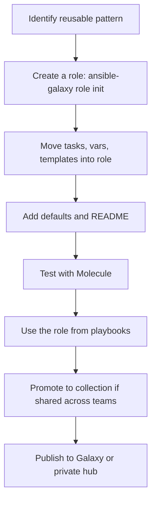

# 07. Roles, Collections, and Ansible Galaxy

> Reusable building blocks. Roles package related tasks, variables, templates, and handlers. Collections package roles, modules, and plugins.

## Why roles

Once a playbook grows beyond a couple of plays, copy-paste creeps in. **Roles** solve this by:

- Bundling tasks, vars, templates, files, and handlers into one reusable unit.
- Giving every role the same predictable structure.
- Making playbooks short and declarative: "apply these roles to these hosts."

## Standard role layout

```
roles/
└── nginx/
    ├── defaults/
    │   └── main.yml          # safe defaults
    ├── vars/
    │   └── main.yml          # internal constants (high precedence)
    ├── tasks/
    │   ├── main.yml          # entry point
    │   ├── install.yml
    │   └── configure.yml
    ├── handlers/
    │   └── main.yml
    ├── templates/
    │   └── nginx.conf.j2
    ├── files/
    │   └── ssl-cert.pem
    ├── meta/
    │   └── main.yml          # dependencies, author, supported platforms
    ├── README.md
    └── tests/
        └── test.yml
```

Generate the skeleton:

```bash
ansible-galaxy role init nginx
```

## Example: a small `nginx` role

`roles/nginx/defaults/main.yml`:

```yaml
nginx_port: 80
nginx_user: www-data
nginx_worker_connections: 1024
nginx_sites: []
```

`roles/nginx/tasks/main.yml`:

```yaml
- name: Install nginx
  ansible.builtin.package:
    name: nginx
    state: present

- name: Render main nginx.conf
  ansible.builtin.template:
    src: nginx.conf.j2
    dest: /etc/nginx/nginx.conf
    mode: "0644"
    validate: "nginx -t -c %s"
  notify: reload nginx

- name: Render site configs
  ansible.builtin.template:
    src: site.conf.j2
    dest: "/etc/nginx/sites-available/{{ item.name }}.conf"
  loop: "{{ nginx_sites }}"
  loop_control:
    label: "{{ item.name }}"
  notify: reload nginx

- name: Ensure nginx is enabled and running
  ansible.builtin.service:
    name: nginx
    state: started
    enabled: true
```

`roles/nginx/handlers/main.yml`:

```yaml
- name: reload nginx
  ansible.builtin.service:
    name: nginx
    state: reloaded
```

Use the role in a playbook:

```yaml
- name: Configure web tier
  hosts: web
  become: true
  roles:
    - role: nginx
      vars:
        nginx_port: 8080
        nginx_sites:
          - { name: shop, root: /var/www/shop }
          - { name: api,  root: /var/www/api }
```

Or with `import_role` / `include_role` for finer control:

```yaml
tasks:
  - name: Apply nginx role
    ansible.builtin.import_role:
      name: nginx
    vars:
      nginx_port: 8080

  - name: Conditionally apply tuning role
    ansible.builtin.include_role:
      name: tuning
    when: tune_enabled | bool
```

| Form | When to use |
|---|---|
| `roles:` keyword | Default, predictable, runs before `tasks:` |
| `import_role` | Static include, all tasks visible up-front, supports `tags` well |
| `include_role` | Dynamic include, runs at task time, supports `when:` cleanly |

## Role dependencies

`roles/nginx/meta/main.yml`:

```yaml
galaxy_info:
  author: your-team
  description: Install and configure nginx
  license: Apache-2.0
  min_ansible_version: "2.14"
  platforms:
    - name: Ubuntu
      versions: ["22.04"]
    - name: EL
      versions: ["8", "9"]

dependencies:
  - role: common
  - role: firewall
    vars:
      firewall_open_ports: [80, 443]
```

Dependencies run **before** the role's own tasks. Use sparingly to avoid hidden coupling.

## Collections

A **collection** is a packaging format that contains:

- **Modules** (`plugins/modules/`)
- **Roles** (`roles/`)
- **Plugins** (filter, inventory, connection, lookup, callback, etc.)
- **Docs**, **playbooks**, and **meta** info.

Format: `namespace.collection`, e.g., `ansible.posix`, `community.general`, `amazon.aws`, `kubernetes.core`.

### Why collections matter

- They are the **modern packaging unit** for Ansible content.
- `ansible-core` ships with only `ansible.builtin`; everything else comes from collections.
- Collections version independently from `ansible-core`.

### Install collections

`requirements.yml`:

```yaml
collections:
  - name: ansible.posix
    version: ">=1.5.0"
  - name: community.general
    version: ">=8.0.0"
  - name: amazon.aws
    version: ">=7.0.0"
  - name: kubernetes.core
    version: ">=3.0.0"
```

```bash
ansible-galaxy collection install -r requirements.yml -p ./collections
```

Use modules with FQCN:

```yaml
- name: Open a firewalld port
  ansible.posix.firewalld:
    port: 8080/tcp
    permanent: true
    state: enabled
```

## Ansible Galaxy

[Ansible Galaxy](https://galaxy.ansible.com/) is the public hub for **community roles and collections**. Search for what you need before writing your own.

### Install a role

```bash
ansible-galaxy role install geerlingguy.nginx
```

### Install all dependencies from a project

`requirements.yml`:

```yaml
roles:
  - name: geerlingguy.nginx
    version: "3.1.0"
  - src: https://github.com/your-org/internal-role.git
    name: your.internal-role
    version: main

collections:
  - name: community.general
    version: ">=8.0.0"
```

```bash
ansible-galaxy install -r requirements.yml
```

### Choosing community content

Look at:
- **Last commit date** and **release cadence**.
- **Open issues** and **active maintainers**.
- **CI badges** (Molecule tests).
- Whether the collection is **certified** (Red Hat Automation Hub).

If in doubt, **fork or vendor it** so you control the version.

## Building your own collection

```bash
ansible-galaxy collection init mycompany.platform
```

Structure:

```
mycompany/platform/
├── galaxy.yml
├── plugins/
│   ├── modules/
│   ├── filter/
│   └── lookup/
├── roles/
│   ├── base/
│   ├── nginx/
│   └── monitoring/
├── playbooks/
└── README.md
```

Build and publish:

```bash
ansible-galaxy collection build
ansible-galaxy collection publish mycompany-platform-1.0.0.tar.gz \
  --api-key=<...> --server=<galaxy or private hub>
```

Use it in projects:

```yaml
# requirements.yml
collections:
  - name: mycompany.platform
    version: ">=1.0.0,<2.0.0"
    source: https://galaxy-or-private-hub.example.com
```

## Project layout best practice

```
ansible-project/
├── ansible.cfg
├── requirements.yml
├── inventory/
│   ├── prod.yml
│   ├── group_vars/
│   └── host_vars/
├── playbooks/
│   ├── site.yml
│   ├── web.yml
│   └── db.yml
├── roles/                # local roles
│   └── company-base/
├── collections/          # installed via requirements.yml
└── vault/
    └── ...
```

CI installs dependencies first:

```bash
ansible-galaxy install -r requirements.yml -p ./collections
```

## Workflow



## What good looks like

- Playbooks are mostly `roles:` blocks.
- Each role has clear `defaults`, a README, and Molecule tests.
- Internal shared roles live in a **collection** with semantic versioning.
- Third-party content is pinned by version, not by branch.
- Collections install paths are committed (or installed in CI), so runs are reproducible.

## Anti-patterns

- Putting everything in one role.
- Role defaults that depend on undocumented variables.
- Cloning third-party roles into your repo without keeping the source.
- Mixing many unrelated roles into one collection.

## Next

Move to [08-ansible-vault-secrets.md](08-ansible-vault-secrets.md) to handle secrets safely.
