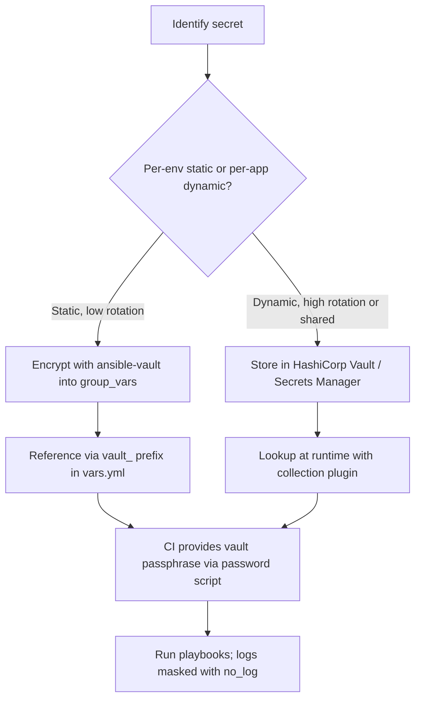

# 08. Ansible Vault and Secrets Management

> Encrypt secrets at rest and integrate with external secret stores so playbooks never expose them.

## Why this matters

Playbooks need secrets: SSH keys, DB passwords, API tokens, TLS keys. Storing these in plain Git is a security incident waiting to happen. Ansible Vault is the built-in solution; external stores are the production-grade extension.

## Ansible Vault basics

Vault encrypts files (or individual variables) with AES-256 using a passphrase or a password file. Encrypted files look like:

```
$ANSIBLE_VAULT;1.2;AES256
65613031633935343466373163...
```

Ansible decrypts them transparently at runtime when you provide the password.

## Common Vault commands

```bash
# Create a new encrypted file
ansible-vault create group_vars/prod/vault.yml

# Edit an encrypted file
ansible-vault edit group_vars/prod/vault.yml

# Encrypt an existing file
ansible-vault encrypt secrets.yml

# Decrypt (back to plain text)
ansible-vault decrypt secrets.yml

# Rekey to a new password
ansible-vault rekey group_vars/prod/vault.yml

# View without writing
ansible-vault view group_vars/prod/vault.yml

# Encrypt a single string for inline use
ansible-vault encrypt_string 'super-secret' --name 'db_password'
```

The `encrypt_string` output can be pasted directly into a YAML var:

```yaml
db_password: !vault |
  $ANSIBLE_VAULT;1.2;AES256
  35666431653133653265663...
```

## Running playbooks with Vault

```bash
# Prompt for password
ansible-playbook site.yml --ask-vault-pass

# Use a password file (preferred for automation)
ansible-playbook site.yml --vault-password-file ~/.vault_pass.txt

# Multiple vault IDs (different passwords for dev vs prod)
ansible-playbook site.yml \
  --vault-id dev@~/.vault_dev \
  --vault-id prod@~/.vault_prod
```

Configure default password file in `ansible.cfg`:

```ini
[defaults]
vault_password_file = ~/.vault_pass.txt
```

Or via env var:

```bash
export ANSIBLE_VAULT_PASSWORD_FILE=~/.vault_pass.txt
```

## The split-file pattern

Keep non-secrets and secrets in separate files in the same group:

```
inventory/
└── group_vars/
    └── prod/
        ├── vars.yml       # plain values (committed as plain text)
        └── vault.yml      # encrypted secrets
```

`vars.yml`:

```yaml
db_host: db.prod.example.com
db_user: app
db_password: "{{ vault_db_password }}"
```

`vault.yml` (encrypted, but decrypted view):

```yaml
vault_db_password: "real-prod-password-here"
```

Why prefix vault values with `vault_`:
- Makes it obvious in playbooks which values come from the vault.
- Grep-friendly during code review.

## Multiple vault passwords (vault IDs)

For dev/staging/prod separation, use **vault IDs**:

```bash
ansible-vault encrypt --vault-id prod@prompt group_vars/prod/vault.yml
ansible-vault encrypt --vault-id dev@prompt group_vars/dev/vault.yml
```

Run with both available:

```bash
ansible-playbook site.yml \
  --vault-id dev@~/.vault_dev \
  --vault-id prod@~/.vault_prod
```

Ansible tries each ID until one decrypts the file.

## Password file security

A password file is just plain text containing the passphrase. Protect it:

- File mode `0600`, owned by the operator.
- Stored outside the project (e.g., `~/.vault_pass`).
- **Never** commit it.
- Add to `.gitignore` defensively.

For automation, prefer a **password script** that fetches the passphrase from a secret store at runtime:

```bash
#!/usr/bin/env bash
# ~/.vault_pass.sh
aws secretsmanager get-secret-value \
  --secret-id ansible/vault-pass \
  --query SecretString --output text
```

```ini
[defaults]
vault_password_file = ~/.vault_pass.sh
```

Make it executable: `chmod 700 ~/.vault_pass.sh`.

## External secret stores

Vault is great, but at scale most teams pull secrets from a **central secret store** at runtime, so:

- Secrets rotate without re-encrypting files.
- Access is audited centrally.
- Different teams or pipelines can have scoped access.

Common stores and Ansible integrations:

| Store | Ansible lookup or module |
|---|---|
| HashiCorp Vault | `community.hashi_vault.vault_kv2_get`, `community.hashi_vault.vault_login` |
| AWS Secrets Manager | `amazon.aws.aws_secret` lookup, `community.aws.secretsmanager_secret` |
| AWS SSM Parameter Store | `amazon.aws.aws_ssm` lookup |
| Azure Key Vault | `azure.azcollection.azure_keyvault_secret` |
| GCP Secret Manager | `google.cloud.gcp_secret_manager` lookup |
| 1Password / Bitwarden | community lookups |

Example: HashiCorp Vault lookup

```yaml
- name: Get DB password from HashiCorp Vault
  ansible.builtin.debug:
    msg: >-
      {{ lookup('community.hashi_vault.vault_kv2_get',
                'secret/data/app/db',
                url='https://vault.example.com',
                token=vault_token).secret.password }}
```

Example: AWS Secrets Manager lookup

```yaml
- name: Pull API token from AWS Secrets Manager
  ansible.builtin.set_fact:
    api_token: "{{ lookup('amazon.aws.aws_secret', 'prod/api/token', region='us-east-1') }}"
```

## Avoiding leaks

- **Mark sensitive vars** to keep them out of logs:

  ```yaml
  - name: Set DB password
    ansible.builtin.set_fact:
      db_password: "{{ vault_db_password }}"
    no_log: true

  - name: Run DB init
    community.postgresql.postgresql_query:
      login_password: "{{ db_password }}"
      ...
    no_log: true
  ```

- Use `no_log: true` on any task that prints secrets in `-v` output.
- Use the `sensitive: true` flag in `ansible-vault encrypt_string` (Ansible 2.x+ shows masked output).
- **Never** log full module results with `register:` + `debug` for tasks that handle secrets.

## CI/CD considerations

- Store the vault passphrase in the CI secret store (GitHub Actions secrets, GitLab CI variables, Jenkins credentials).
- Use a **password script** in CI that fetches the passphrase from the CI secret store.
- Restrict who can trigger runs against prod.
- Audit logs of every run that touches secrets.

## Rotation

- Rotate Vault passphrases regularly (`ansible-vault rekey`).
- For external stores, rotation happens in the store; Ansible just re-reads.
- Build a runbook that includes secret rotation steps and a rollback plan.

## Workflow



## What good looks like

- No plaintext secrets in Git.
- Vault files split from plain values per environment.
- Vault passphrases injected by a CI secret store, never typed into pipelines.
- Production secrets live in a central secret store with rotation.
- `no_log: true` on every task that touches a secret.

## Anti-patterns

- One vault file for everything, one passphrase across all environments.
- Vault passphrases stored next to vault files.
- `register:` + `debug: var=...` on tasks that handle secrets, leaking them in CI logs.
- Long-lived static API tokens encrypted in Vault that nobody rotates.

## Next

Move to [09-error-handling-debugging.md](09-error-handling-debugging.md).
