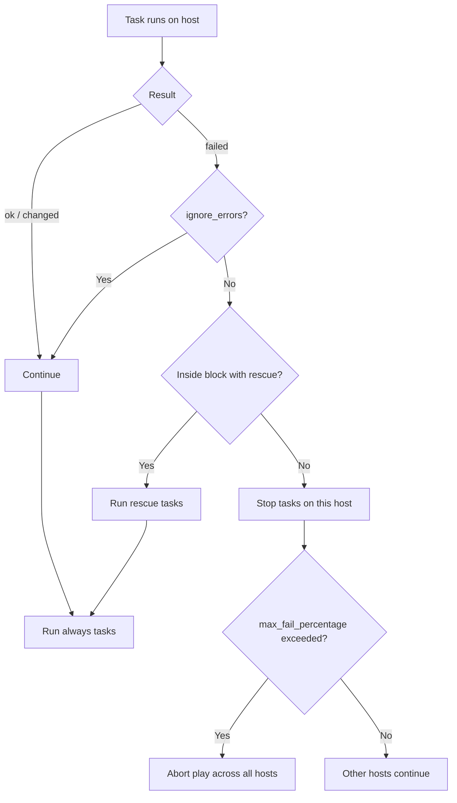

# 09. Error Handling, Debugging, and Strategies

> Make playbooks predictable when things go wrong, and diagnose them fast.

## Why error handling matters at scale

Run a playbook on 5 hosts and you'll watch each error. Run on 500 hosts and you need:

- Defined behavior on failure (stop, continue, rollback?).
- Useful logs and structured output.
- A way to inspect intermediate state.
- Strategies that match the change risk.

## Failure model

Each task on each host can be:

- `ok`: ran, no change.
- `changed`: ran, changed state.
- `skipped`: condition false.
- `failed`: module returned an error.
- `unreachable`: SSH or connection failed.

By default:
- A `failed` task stops further tasks **for that host** (other hosts continue).
- An `unreachable` host is removed from the play.
- A configurable percentage of host failures can abort the whole play.

## `ignore_errors`

Continue even if a task fails:

```yaml
- name: Best-effort cache warmup
  ansible.builtin.uri:
    url: http://localhost/warmup
    method: POST
  ignore_errors: true
```

Use sparingly. Most production tasks should **fail loudly**.

## `failed_when` and `changed_when`

Define what counts as failure or change, especially for `shell` / `command`:

```yaml
- name: Check disk usage
  ansible.builtin.shell: df --output=pcent / | tail -n 1 | tr -d ' %'
  register: disk_usage
  changed_when: false
  failed_when: disk_usage.stdout | int > 90
```

This makes shell tasks honest about idempotency and failure semantics.

## `block` / `rescue` / `always`

Try/catch/finally for groups of tasks. Covered in [06-conditionals-loops-handlers-blocks.md](06-conditionals-loops-handlers-blocks.md). Use for **rollback** logic on risky changes.

## `any_errors_fatal` and `max_fail_percentage`

Control how host failures affect the play.

```yaml
- name: Risky migration
  hosts: db
  any_errors_fatal: true   # any host failing aborts the whole play
  tasks:
    - name: Apply schema
      community.postgresql.postgresql_query:
        query: "{{ lookup('file','migrations/v123.sql') }}"
```

```yaml
- name: Rolling web update
  hosts: web
  serial: 5
  max_fail_percentage: 20   # abort if more than 20% of a batch fails
  tasks:
    - ansible.builtin.import_role:
        name: app_deploy
```

## Retries and waits

```yaml
- name: Wait for service to be healthy
  ansible.builtin.uri:
    url: http://localhost:8080/health
    status_code: 200
  register: hc
  retries: 30
  delay: 2
  until: hc.status == 200
```

For longer waits:

```yaml
- name: Wait for port to open
  ansible.builtin.wait_for:
    host: "{{ inventory_hostname }}"
    port: 22
    timeout: 600
  delegate_to: localhost
```

## Debugging tools

### `debug` module

```yaml
- name: Show a value
  ansible.builtin.debug:
    msg: "DB host = {{ db_host }}"

- name: Show a registered result
  ansible.builtin.debug:
    var: result
    verbosity: 2     # only with -vv or higher
```

### Verbose output

```bash
ansible-playbook site.yml -v       # ok / changed details
ansible-playbook site.yml -vv      # task config and var resolution
ansible-playbook site.yml -vvv     # connection details
ansible-playbook site.yml -vvvv    # SSH-level trace
```

### Dry-run with diff

```bash
ansible-playbook site.yml --check --diff
```

Tells you what **would** change in supported modules (template, copy, lineinfile, etc.).

### `--start-at-task`

Resume a long playbook at a specific task:

```bash
ansible-playbook site.yml --start-at-task "Deploy artifact"
```

### `--step`

Pause before each task and ask for confirmation. Useful for debugging risky plays.

```bash
ansible-playbook site.yml --step
```

### `--list-tasks` / `--list-hosts`

Show what would run and where:

```bash
ansible-playbook site.yml --list-tasks
ansible-playbook site.yml --list-hosts
```

### Ad-hoc inspection during a run

You can interrupt and inspect via the `debug` strategy or by using `ansible.builtin.pause` to pause a play and shell out:

```yaml
- ansible.builtin.pause:
    prompt: "Press enter when you have inspected the host"
```

### The `debug` strategy plugin

```yaml
- hosts: web
  strategy: debug
  tasks: [...]
```

When a task fails, Ansible drops you into an interactive debugger to inspect variables and decide what to do (`p`, `c`, `r`, `q`).

## Logging and callbacks

Set a callback plugin in `ansible.cfg`:

```ini
[defaults]
stdout_callback = yaml          # human-readable
# stdout_callback = json        # structured for parsing
# stdout_callback = community.general.unixy
log_path = ./ansible.log        # mirror everything to a file
```

For CI, use `json` or `junit` callbacks so the system can parse and surface failures.

## Strategies: linear vs free vs host_pinned

The **strategy** controls how Ansible parallelizes tasks across hosts.

| Strategy | Behavior |
|---|---|
| `linear` (default) | All hosts run task N before any moves to task N+1. Easy to reason about. |
| `free` | Each host races through tasks independently. Faster but harder to debug. |
| `host_pinned` | Like `free`, but only N hosts are processed at once. |

```yaml
- hosts: web
  strategy: free
  tasks: [...]
```

Use `free` when host-to-host independence is high and total runtime matters.

## `serial` for batching

Rolling changes across a fleet:

```yaml
- hosts: web
  serial: 5             # 5 hosts at a time
  # or:
  # serial: "20%"
  # serial:
  #   - 1               # canary first
  #   - 5
  #   - "20%"
  tasks: [...]
```

Combine with `max_fail_percentage` for safety.

## Failure communication

After a run, surface results to humans:

- Use `community.general.slack` or `community.general.mail` modules in `always:` blocks.
- For CI, emit JUnit XML via the `junit` callback for the CI system to display failures.
- For production runs via AWX, the platform already shows results per host.

## Workflow



## What good looks like

- Risky tasks live in `block` with `rescue` rollback.
- Critical plays use `any_errors_fatal` or tight `max_fail_percentage`.
- Shell tasks have explicit `changed_when` and `failed_when`.
- `--check --diff` runs cleanly before every change.
- Logs go to a known location and to CI artifacts.
- Failures notify a chat channel automatically.

## Anti-patterns

- `ignore_errors: true` sprinkled everywhere to "make it pass".
- Shell tasks reporting `changed: true` every run, hiding real changes.
- No `serial:` on production rolling updates.
- Manually re-running the whole playbook instead of `--start-at-task`.

## Next

Move to [10-testing-molecule-cicd.md](10-testing-molecule-cicd.md).
