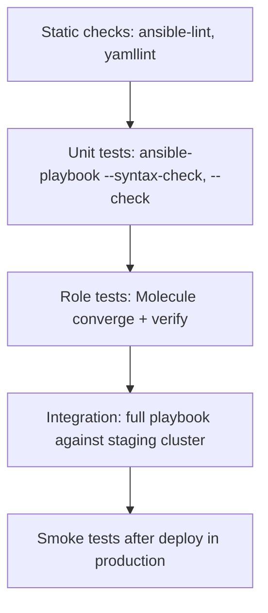
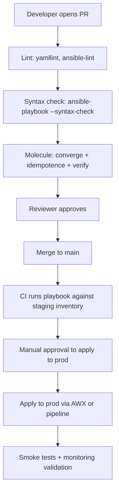

# 10. Testing with Molecule and CI/CD

> Treat Ansible like real code: lint, unit test roles, integration test in disposable environments, and run via CI.

## Why test Ansible

Without tests:

- A typo in a role silently breaks a fleet.
- Idempotency regressions go unnoticed.
- Refactoring is scary because nothing verifies behavior.

With tests:

- PRs catch issues before they hit prod.
- Refactoring roles is safe.
- New contributors learn the role by reading its tests.

## Test pyramid for Ansible



The bigger you go, the slower and more expensive. Fail fast at the top.

## Static analysis

### `yamllint`

Catches YAML syntax and style issues.

```bash
pip install yamllint
yamllint .
```

`.yamllint`:

```yaml
extends: default
rules:
  line-length:
    max: 160
  truthy:
    allowed-values: ['true', 'false']
```

### `ansible-lint`

The de-facto linter for Ansible. Catches common bugs, deprecations, and best-practice violations.

```bash
pip install ansible-lint
ansible-lint
ansible-lint playbooks/ roles/
```

`.ansible-lint`:

```yaml
profile: production
skip_list:
  - yaml[line-length]
exclude_paths:
  - collections/
  - .cache/
```

Run on every PR.

## Syntax and check mode

```bash
ansible-playbook site.yml --syntax-check
ansible-playbook site.yml --check --diff -i inventory/dev
```

`--check` does **not** make changes for modules that support check mode. Useful as a quick regression test against a staging inventory.

## Molecule

[Molecule](https://ansible.readthedocs.io/projects/molecule/) is the standard test framework for **roles** (and collections). It:

1. Spins up disposable instances (Docker, Podman, or cloud).
2. Runs your role against them (**converge**).
3. Optionally runs again to test **idempotency**.
4. Runs assertions (**verify**) using Ansible or testinfra.
5. Tears everything down.

### Install

```bash
pip install "molecule[docker]" molecule-plugins[docker] ansible-lint
```

### Initialize a scenario in an existing role

```bash
cd roles/nginx
molecule init scenario --driver-name docker
```

This creates `roles/nginx/molecule/default/` with a `converge.yml`, `molecule.yml`, and `verify.yml`.

### Example `molecule/default/molecule.yml`

```yaml
dependency:
  name: galaxy
driver:
  name: docker
platforms:
  - name: instance-ubuntu
    image: geerlingguy/docker-ubuntu2204-ansible:latest
    pre_build_image: true
  - name: instance-rhel
    image: geerlingguy/docker-rockylinux9-ansible:latest
    pre_build_image: true
provisioner:
  name: ansible
  config_options:
    defaults:
      stdout_callback: yaml
verifier:
  name: ansible
```

### `molecule/default/converge.yml`

```yaml
- name: Converge
  hosts: all
  become: true
  roles:
    - role: nginx
      vars:
        nginx_port: 8080
```

### `molecule/default/verify.yml`

```yaml
- name: Verify
  hosts: all
  become: true
  tasks:
    - name: Check nginx is installed
      ansible.builtin.package:
        name: nginx
        state: present
      check_mode: true
      register: pkg
      failed_when: pkg.changed

    - name: Check nginx is listening on 8080
      ansible.builtin.wait_for:
        host: 127.0.0.1
        port: 8080
        timeout: 10

    - name: Hit the default site
      ansible.builtin.uri:
        url: http://127.0.0.1:8080/
        status_code: 200
```

### Run the test

```bash
molecule test
```

This runs the full sequence: lint → create → prepare → converge → idempotence → verify → destroy.

Other useful commands:

```bash
molecule create        # just spin up containers
molecule converge      # apply role
molecule login         # SSH into a container for debugging
molecule destroy       # tear down
molecule reset         # remove all scenario state
```

### Idempotency check

Molecule's `idempotence` step re-runs `converge` and **fails if any task reports `changed`**. This catches roles that aren't truly idempotent.

### Multiple scenarios

A role can have multiple scenarios for different distros, versions, or variable sets:

```
roles/nginx/molecule/
├── default/
├── tls/
└── multi-site/
```

Run a specific scenario:

```bash
molecule test -s tls
```

## Testing playbooks (not just roles)

Molecule is role-focused. For full playbooks, common approaches:

- A **staging inventory** that mirrors prod with smaller VMs. Run the playbook in CI.
- A **container-based mock** with `kind`/`docker-compose` of the target topology.
- An **ephemeral cloud environment** spun up per PR.

## CI integration

### GitHub Actions example

`.github/workflows/ansible.yml`:

```yaml
name: ansible-ci
on:
  push: { branches: [main] }
  pull_request: { branches: [main] }

jobs:
  lint:
    runs-on: ubuntu-latest
    steps:
      - uses: actions/checkout@v4
      - uses: actions/setup-python@v5
        with: { python-version: "3.12" }
      - run: pip install ansible-lint yamllint
      - run: yamllint .
      - run: ansible-lint

  molecule:
    runs-on: ubuntu-latest
    strategy:
      matrix:
        role: [nginx, base, monitoring]
    steps:
      - uses: actions/checkout@v4
      - uses: actions/setup-python@v5
        with: { python-version: "3.12" }
      - run: pip install "molecule[docker]" ansible-core
      - run: molecule test
        working-directory: roles/${{ matrix.role }}
```

### GitLab CI example

```yaml
stages: [lint, test]

lint:
  stage: lint
  image: python:3.12
  script:
    - pip install ansible-lint yamllint
    - yamllint .
    - ansible-lint

molecule:
  stage: test
  image: python:3.12
  services:
    - docker:dind
  variables:
    DOCKER_TLS_CERTDIR: ""
  script:
    - pip install "molecule[docker]" ansible-core
    - cd roles/nginx && molecule test
```

## Deployment pipeline pattern



## What good looks like

- `ansible-lint` and `yamllint` run on every PR and are clean.
- Every role has a Molecule scenario.
- Idempotence test passes for every role.
- Playbooks run cleanly in `--check --diff` against staging.
- CI builds are fast (under 10 minutes for most roles).
- Prod runs go through a controlled platform with audit logs.

## Anti-patterns

- "Just push and see" culture.
- Roles with no tests.
- Tests that lie (always pass even when broken).
- Sharing one giant Molecule scenario for ten unrelated roles.
- Skipping idempotence checks because they "always fail" (they shouldn't).

## Next

Move to [11-awx-automation-platform.md](11-awx-automation-platform.md).
