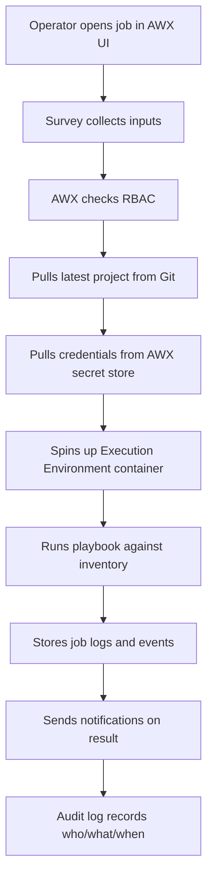
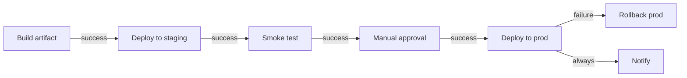

# 11. AWX, Tower, and Ansible Automation Platform

> Run Ansible as a controlled platform with a UI, RBAC, scheduling, audit logs, and APIs.

## Why a platform instead of laptops

Running `ansible-playbook` from individual laptops works at small scale but breaks down quickly:

- No central audit of who ran what.
- No RBAC: anyone with the repo can run prod.
- No scheduled or event-triggered runs.
- Secrets sprawl across many machines.
- Inventories diverge between operators.

A platform centralizes all of this.

## The product family

- **AWX**: the open-source upstream project ([github.com/ansible/awx](https://github.com/ansible/awx)).
- **Red Hat Ansible Automation Platform (AAP)**: Red Hat's commercial, supported product. Includes `automation controller` (the platform formerly known as Tower), `automation hub`, and `event-driven Ansible`.

They share the same concepts. AWX is fine for learning and small/medium teams; AAP is common in enterprises that need vendor support.

## Core concepts

| Concept | What it is |
|---|---|
| **Organization** | Top-level container for teams, projects, inventories. |
| **Team / User** | RBAC actors. |
| **Project** | A Git repo containing playbooks, roles, and `requirements.yml`. |
| **Inventory** | Static or dynamic inventory imported from cloud or scripts. |
| **Credentials** | Stored secrets (SSH keys, cloud creds, vault passphrases, vault IDs). |
| **Job Template** | A reusable run definition: playbook + inventory + credentials + extra vars. |
| **Job** | A single execution of a Job Template. |
| **Workflow Template** | A graph of Job Templates with success/fail/always edges. |
| **Schedule** | Cron-like trigger for Job Templates. |
| **Execution Environment** | Container image with `ansible-core` + collections + Python deps. |
| **Notification** | Outbound channel: Slack, email, webhook, PagerDuty. |
| **Survey** | Form that prompts the operator for input variables. |

## Why Execution Environments matter

Old Ansible Tower ran playbooks inside the controller's Python env, which led to dependency conflicts. **Execution Environments (EE)** solve this by packaging:

- `ansible-core` version.
- Collections.
- Python libraries (e.g., `boto3`, `kubernetes`).
- System packages (e.g., `git`, `openssh`).

Each Job Template uses a chosen EE, so different projects can have different requirements without breaking each other.

Build one with `ansible-builder`:

```yaml
# execution-environment.yml
version: 3
images:
  base_image:
    name: quay.io/ansible/awx-ee:latest
dependencies:
  galaxy: requirements.yml
  python: requirements.txt
  system: bindep.txt
```

```bash
ansible-builder build -t myteam/aap-ee:1.0
```

## A typical AWX workflow



## End-to-end example: build an EE, create a Job Template, run it

### 1. Define the Execution Environment

```yaml
# execution-environment.yml
version: 3
images:
  base_image:
    name: quay.io/ansible/awx-ee:latest
dependencies:
  galaxy: requirements.yml
  python: requirements.txt
  system: bindep.txt
```

```yaml
# requirements.yml
collections:
  - name: ansible.posix
  - name: community.general
  - name: amazon.aws
```

```
# requirements.txt
boto3>=1.34
botocore>=1.34
```

```
# bindep.txt
git [platform:rpm]
openssh-clients [platform:rpm]
```

Build and push:

```bash
ansible-builder build -t registry.example.com/awx/web-ee:1.0
docker push registry.example.com/awx/web-ee:1.0
```

### 2. Define resources as code via the AWX CLI

```bash
# Project
awx projects create \
  --name "platform-playbooks" \
  --scm_type git \
  --scm_url https://github.com/example/platform-playbooks.git \
  --scm_branch main

# Inventory
awx inventories create --name "prod" --organization Default

# Credential (SSH machine cred)
awx credentials create \
  --name "prod-ssh" --credential_type "Machine" \
  --inputs '{"username":"deploy","ssh_key_data":"@~/.ssh/awx_deploy"}'

# Job Template
awx job_templates create \
  --name "Deploy web" \
  --project "platform-playbooks" \
  --playbook "playbooks/web.yml" \
  --inventory "prod" \
  --execution_environment "web-ee:1.0" \
  --ask_variables_on_launch true
```

### 3. Launch the Job Template

```bash
awx job_templates launch --name "Deploy web" \
  --extra_vars '{"app_version":"1.4.2","env":"prod"}'
```

### 4. Survey JSON

```json
{
  "name": "Deploy web survey",
  "description": "Inputs for web deploy",
  "spec": [
    {
      "question_name": "App version",
      "variable": "app_version",
      "type": "text",
      "required": true
    },
    {
      "question_name": "Environment",
      "variable": "env",
      "type": "multiplechoice",
      "choices": "dev\nstaging\nprod",
      "required": true,
      "default": "staging"
    }
  ]
}
```

### 5. Trigger from CI (GitHub Actions)

```yaml
- name: Launch AWX job
  run: |
    curl -sSf -X POST \
      -H "Authorization: Bearer $AWX_TOKEN" \
      -H "Content-Type: application/json" \
      -d '{"extra_vars":{"app_version":"${{ github.sha }}"}}' \
      https://awx.example.com/api/v2/job_templates/42/launch/
```

## RBAC model

- **Roles**: Admin, Auditor, Use, Read, etc., scoped to objects (project, inventory, job template).
- A team can have **read** on an inventory and **use** on credentials but only **execute** on specific job templates.
- This lets you give an on-call rotation permission to **run** the right runbook without giving them edit rights on playbooks or inventory.

## Job Templates

A Job Template binds:

- Project + playbook.
- Inventory.
- Credentials.
- Execution Environment.
- Extra vars (or a Survey).
- Concurrency settings.
- Allow / require survey, prompt-on-launch options.

Operators trigger them via UI, API, or CLI:

```bash
awx job_templates launch --name "Deploy app" \
  --extra_vars '{"version":"1.2.3","env":"prod"}'
```

## Workflows

Chain multiple Job Templates with success/failure/always edges.

Example: a deploy workflow



Workflows give you orchestration without bespoke scripting.

## Schedules and Surveys

- **Schedules**: run a Job Template on a cron, e.g., nightly compliance scan.
- **Surveys**: ask for inputs at launch time, validated by type (text, integer, multiple choice, password).

## Event-driven Ansible

Part of AAP. Lets external events (webhooks, alerts, log streams) trigger Ansible rulebooks that decide what to run.

Example: a CloudWatch alarm sends a webhook to EDA → rulebook runs a remediation playbook automatically.

Use cases:

- Auto-remediation of known issues.
- Auto-scaling response.
- Compliance enforcement on configuration changes.

## API and `awx-cli`

Everything in the UI is also available via REST API and the `awx` CLI. This makes integrations easy:

- CI tools trigger Job Templates after merges.
- ChatOps bots launch runbooks from Slack.
- Custom dashboards pull job stats.

```bash
awx --conf.host https://awx.example.com \
    --conf.token "$AWX_TOKEN" \
    job_templates list
```

## Secrets handling

AWX stores credentials in an internal secret store, encrypted at rest. Better still, integrate with **external credential plugins**:

- HashiCorp Vault
- AWS Secrets Manager
- CyberArk Conjur
- Azure Key Vault

The Job Template references the credential by name; AWX fetches the actual value at run time. Operators never see secrets.

## Observability of the platform itself

- Internal metrics endpoint (Prometheus-compatible).
- Job event stream for postmortems.
- Centralized logging integration (syslog, ELK).
- Health checks for the controller cluster.

## High availability

For production AAP:

- Multiple controllers behind a load balancer.
- Separate execution nodes for capacity.
- External Postgres database (HA, backups).
- Monitor controller and execution-node queue depth.

## Cost and adoption tips

- Start with **AWX** to learn concepts.
- Move to **AAP** when you need vendor support, certified content, or regulated environments.
- Standardize Execution Environments so every team's runs are reproducible.
- Treat the platform itself as IaC: version EE definitions, projects, and templates.

## What good looks like

- 90%+ of production Ansible runs go through the platform.
- RBAC is enforced; ad-hoc laptop runs against prod are disabled.
- Schedules cover routine compliance and config-drift sweeps.
- Workflows compose deployments end to end.
- Secrets live in an external store, fetched at run time.
- Job logs and audit history are searchable.

## Anti-patterns

- AWX as a glorified cron, with no RBAC.
- Hardcoded creds in playbooks even though AWX has credential plugins.
- One huge Execution Environment for everything (slow, fragile).
- Mixing personal pet projects with production templates in the same org.

## Next

Move to [12-performance-tuning-at-scale.md](12-performance-tuning-at-scale.md).
