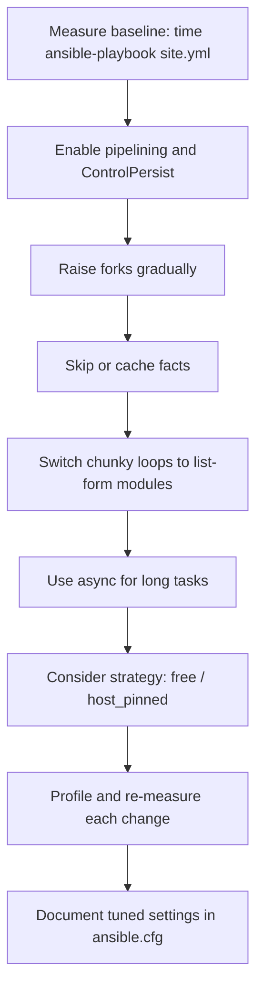

# 12. Performance Tuning at Scale

> Make Ansible runs fast and predictable across hundreds or thousands of hosts.

## Why this matters

A 30-minute playbook on 5 hosts becomes a 5-hour playbook on 500 hosts if nothing is tuned. The good news: Ansible scales well with a few well-known knobs.

## The main levers

| Lever | What it does |
|---|---|
| **Forks** | How many hosts Ansible runs in parallel |
| **SSH pipelining** | Removes a roundtrip per task |
| **Persistent SSH (ControlPersist)** | Reuses SSH connections |
| **Fact gathering scope** | Skip what you don't need |
| **Fact caching** | Reuse facts across runs |
| **Strategies (linear/free/host_pinned)** | How tasks parallelize |
| **`serial`** | Batch size for rolling work |
| **Async tasks** | Fire-and-forget long jobs |
| **Module efficiency** | Use list-form module calls instead of loops |
| **Execution Environments / Mitogen** | Lower-level runtime improvements |

## Forks

Default is `5`. Raise it for parallelism:

```ini
# ansible.cfg
[defaults]
forks = 50
```

Or on CLI: `ansible-playbook site.yml -f 100`.

Trade-offs:
- More forks → more parallel SSH connections → more CPU and memory on the control node.
- Targets must tolerate concurrent operations (e.g., package managers can lock).
- Sweet spot is usually **20-100** for general fleets, higher for stateless quick tasks.

## SSH pipelining

By default, Ansible writes a temp file on the target, executes it, then deletes it. **Pipelining** sends the module to the remote Python over the SSH session in one step, removing two roundtrips per task.

```ini
[ssh_connection]
pipelining = True
```

Requires `requiretty` disabled in `/etc/sudoers` on the target (it usually is).

Pipelining alone can cut playbook runtime by 30-50%.

## SSH ControlPersist

Reuses SSH connections instead of opening a new one per task.

```ini
[ssh_connection]
control_path = /tmp/ansible-%%h-%%p-%%r
ssh_args = -o ControlMaster=auto -o ControlPersist=60s
```

Many modern Ansible defaults already include this. Verify with `-vvvv` and look for `Reusing connection`.

## Fact gathering

Default fact gathering hits a lot of subsystems (network, hardware, mounts, etc.) and can add seconds per host.

### Skip when not needed

```yaml
- hosts: all
  gather_facts: false
  tasks: [...]
```

### Gather a subset

```yaml
- hosts: all
  gather_facts: true
  vars:
    ansible_facts_gather_subset: ['!all', 'min', 'network']
```

### Cache facts

Gather once, reuse across runs:

```ini
[defaults]
fact_caching = jsonfile
fact_caching_connection = /var/tmp/ansible_fact_cache
fact_caching_timeout = 7200
```

Or with Redis backend for shared cache across operators:

```ini
fact_caching = redis
fact_caching_connection = redis-host:6379:0
```

A play can then run with `gather_facts: false` and still reference cached facts.

## Strategies revisited

- `linear` (default): all hosts run task N before any moves to task N+1. Predictable; the slowest host throttles the play.
- `free`: each host races independently. Faster overall but harder to reason about and to correlate handlers.
- `host_pinned`: process N hosts at a time end-to-end; pairs well with `serial`.

```yaml
- hosts: web
  strategy: free
  tasks: [...]
```

Use `free` for large, independent fleets running similar tasks (e.g., a fleet-wide patch run).

## `serial` for safe batching

Big fleets need rolling updates. `serial` limits how many hosts run in each batch.

```yaml
- hosts: web
  serial:
    - 1          # canary
    - "10%"
    - "25%"
    - "100%"
  max_fail_percentage: 5
```

Combine with health checks between batches to stop early on regressions.

## Async and poll

Run a long task without blocking subsequent tasks. Poll for completion later or fire-and-forget.

```yaml
- name: Long-running migration (async)
  ansible.builtin.command: /opt/app/migrate.sh
  async: 3600          # max seconds to wait
  poll: 0              # 0 means fire-and-forget; >0 means poll every N sec
  register: migration

- name: Do other work meanwhile
  ansible.builtin.uri: ...

- name: Wait for migration to finish
  ansible.builtin.async_status:
    jid: "{{ migration.ansible_job_id }}"
  register: status
  until: status.finished
  retries: 60
  delay: 60
```

Async is great for OS upgrades, large data jobs, or anything that survives the SSH session dropping.

## Module efficiency

### Use list-form module calls

Slow (one shell-out per package):

```yaml
- ansible.builtin.package:
    name: "{{ item }}"
    state: present
  loop: [nginx, htop, jq, vim, curl]
```

Fast (one shell-out total):

```yaml
- ansible.builtin.package:
    name: [nginx, htop, jq, vim, curl]
    state: present
```

Same idea for `user`, `lineinfile`, `firewalld`, and many others. Check the module docs for list support.

### Avoid per-host SSH calls for things you can compute locally

If a value comes from a config file, read it once on the control node with `lookup('file', ...)` instead of running `cat` on every host.

### Replace many `lineinfile`s with one `template`

A single rendered template is faster and clearer than dozens of `lineinfile` edits.

## Mitogen (advanced)

[Mitogen for Ansible](https://mitogen.networkgenomics.com/ansible_detailed.html) is a strategy plugin that can dramatically reduce overhead by routing through a persistent Python process on the target. Reports of 2-7x speedups for some workloads.

Caveats:
- Third-party, not officially supported.
- Compatibility lags behind newer Ansible versions.
- Test thoroughly before adopting.

For most teams: tune the built-in knobs first; reach for Mitogen only if you've hit a ceiling.

## Logging and overhead

Verbose logging (`-vvv`) is slow. Use it for debugging, not bulk runs. Set `stdout_callback = yaml` or a structured callback for human-readable, fast output.

## Networking and DNS

- Resolve all hosts up front; slow DNS amplifies across thousands of connections.
- Use bastions sparingly; each hop adds latency.
- For very large fleets, deploy controllers (or AWX execution nodes) **close** to the hosts they manage.

## End-to-end tuning example

A before-and-after run on a 200-host fleet.

### Baseline `ansible.cfg`

```ini
[defaults]
forks = 5
```

Run and time it:

```bash
time ansible-playbook -i inventory site.yml
# real    18m42s
```

### Tuned `ansible.cfg`

```ini
[defaults]
forks = 50
gather_subset = !all,min,network
fact_caching = jsonfile
fact_caching_connection = /var/tmp/ansible_fact_cache
fact_caching_timeout = 7200
internal_poll_interval = 0.001

[ssh_connection]
pipelining = True
ssh_args = -o ControlMaster=auto -o ControlPersist=60s -o PreferredAuthentications=publickey
control_path = /tmp/ansible-%%h-%%p-%%r
```

Run again:

```bash
time ansible-playbook -i inventory site.yml
# real    4m11s
```

Typical 3-5x speedup from enabling pipelining, raising forks, and trimming fact gathering.

### Profile to find the slowest tasks

```bash
ANSIBLE_CALLBACKS_ENABLED=ansible.posix.profile_tasks \
  ansible-playbook site.yml
```

Example output:

```
Monday  21 June 2026  10:14:55 +0000 (0:01:43.122)
=============================================================
Install base packages ----------------------------- 92.41s
Gather minimal facts ------------------------------ 18.30s
Render nginx config ------------------------------- 12.04s
Restart nginx --------------------------------------  3.11s
```

Focus the next round of tuning on the slowest tasks.

## Workflow



## What good looks like

- Pipelining and ControlPersist enabled by default.
- Forks tuned to control-node CPU/RAM and target tolerance.
- Fact gathering scoped or cached.
- Big loops replaced by list-form module calls.
- Long jobs use async, not synchronous blocking.
- A baseline run-time is tracked and watched for regressions.

## Anti-patterns

- Default forks=5 on thousand-host fleets.
- Per-task `gather_facts: true` for trivial work.
- Loops that shell out per item instead of using list form.
- Logging at `-vvv` in production runs.
- Mitogen as a "magic fix" instead of fixing the playbook.

## Next

Move to [13-best-practices-linux-fleets.md](13-best-practices-linux-fleets.md).
