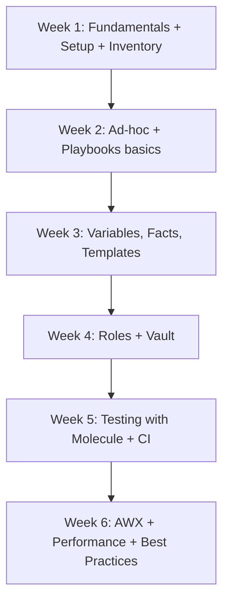

# Ansible — Comprehensive Learning Path for Linux Engineers

> A structured Ansible learning track for engineers managing Linux fleets at scale. Every topic builds on the previous one. All content is from **public sources only**: [Ansible documentation](https://docs.ansible.com/), Red Hat Ansible learning materials, and the public Ansible community.

## Why Ansible

- **Agentless**: nothing to install on managed hosts beyond SSH and Python.
- **Push model**: a control node connects out and runs tasks; nodes don't poll.
- **YAML-based**: simple, readable, version-controllable.
- **Idempotent modules**: re-runs produce the same end state, not side effects.
- **Huge module ecosystem**: 5000+ modules in collections for Linux, network, cloud, Windows, SaaS.
- **Works at every scale**: from one VM to thousands of bare-metal hosts.

## Learning Path

### Beginner — get started in a week

| # | Topic | Doc |
|---|-------|-----|
| 1 | Ansible Fundamentals | [01-ansible-fundamentals.md](01-ansible-fundamentals.md) |
| 2 | Installation, Setup, and Inventory | [02-installation-setup-inventory.md](02-installation-setup-inventory.md) |
| 3 | Ad-hoc Commands and Modules | [03-adhoc-commands-modules.md](03-adhoc-commands-modules.md) |

### Intermediate — write real playbooks

| # | Topic | Doc |
|---|-------|-----|
| 4 | Playbooks Deep Dive | [04-playbooks-deep-dive.md](04-playbooks-deep-dive.md) |
| 5 | Variables, Facts, and Jinja2 Templates | [05-variables-facts-templates.md](05-variables-facts-templates.md) |
| 6 | Conditionals, Loops, Handlers, Blocks, and Tags | [06-conditionals-loops-handlers-blocks.md](06-conditionals-loops-handlers-blocks.md) |

### Advanced — build reusable, reliable automation

| # | Topic | Doc |
|---|-------|-----|
| 7 | Roles, Collections, and Ansible Galaxy | [07-roles-collections-galaxy.md](07-roles-collections-galaxy.md) |
| 8 | Ansible Vault and Secrets Management | [08-ansible-vault-secrets.md](08-ansible-vault-secrets.md) |
| 9 | Error Handling, Debugging, and Strategies | [09-error-handling-debugging.md](09-error-handling-debugging.md) |
| 10 | Testing with Molecule and CI/CD | [10-testing-molecule-cicd.md](10-testing-molecule-cicd.md) |

### Production — operate at scale

| # | Topic | Doc |
|---|-------|-----|
| 11 | AWX, Tower, and Automation Platform | [11-awx-automation-platform.md](11-awx-automation-platform.md) |
| 12 | Performance Tuning at Scale | [12-performance-tuning-at-scale.md](12-performance-tuning-at-scale.md) |
| 13 | Best Practices for Linux Fleet Automation | [13-best-practices-linux-fleets.md](13-best-practices-linux-fleets.md) |

## Suggested 6-week learning plan

## How to study each topic

1. Read the topic doc.
2. Try the examples on a small lab (2-3 VMs or containers).
3. Build something real from the examples (a user setup, an Nginx role, etc.).
4. Move on when you can explain the topic to a peer without notes.

## Public references

- [Official Ansible documentation](https://docs.ansible.com/)
- [Ansible Galaxy](https://galaxy.ansible.com/)
- [Ansible collections index](https://docs.ansible.com/ansible/latest/collections/index.html)
- [Molecule documentation](https://ansible.readthedocs.io/projects/molecule/)
- [AWX project](https://github.com/ansible/awx)
- [Red Hat Ansible learning](https://www.redhat.com/en/services/training/ansible)

All examples in this folder are for public educational use.
