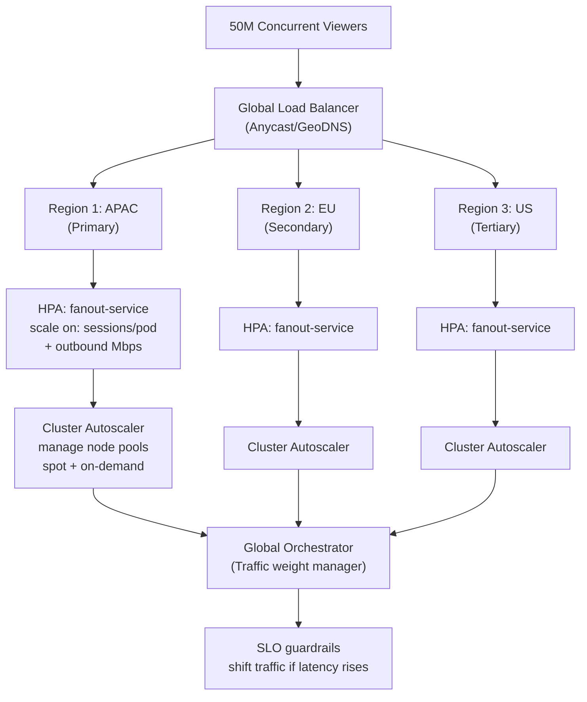
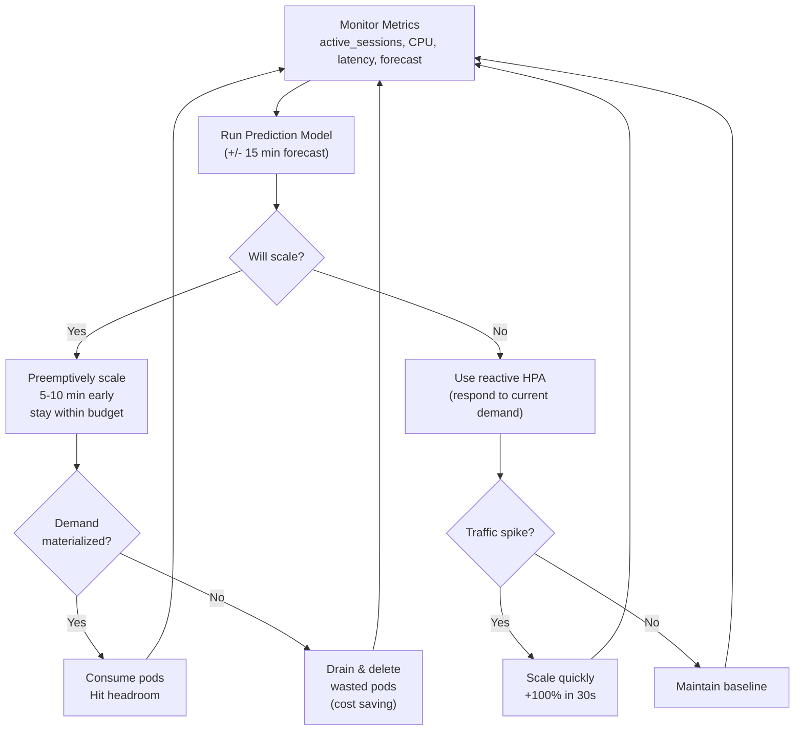

# Question 1: Autoscaling 50M+ Concurrent Viewers Without Over-Provisioning

**Interview Time**: 8-10 minutes  
**Difficulty**: ⭐⭐⭐⭐ (Advanced)  
**Topics**: HPA, node autoscaling, multi-cluster, cost optimization

---

## Problem Statement

> Design auto-scaling for **50M+ concurrent viewers** across **multiple K8s clusters** (at least 3 regions) without over-provisioning. The system should:
> - Handle traffic spikes gracefully
> - Keep costs at baseline +10-15% (not 2x)
> - Maintain SLO (p99 latency < 30s, error rate < 0.1%)
> - Distribute load intelligently across clusters

---

## Professional SRE Approach

### 1) Multi-Layer Autoscaling Architecture



### 2) HPA Configuration (Per Service)

#### Fanout Service (Pushes streams to viewers)
```yaml
apiVersion: autoscaling/v2
kind: HorizontalPodAutoscaler
metadata:
  name: fanout-hpa
spec:
  scaleTargetRef:
    apiVersion: apps/v1
    kind: Deployment
    name: fanout-service
  minReplicas: 100  # Warm baseline
  maxReplicas: 1500 # Hard cap (prevent runaway)
  metrics:
  - type: Resource
    resource:
      name: cpu
      target:
        type: Utilization
        averageUtilization: 70
  - type: Resource
    resource:
      name: memory
      target:
        type: Utilization
        averageUtilization: 75
  - type: Pods
    pods:
      metric:
        name: active_sessions_per_pod
      target:
        type: AverageValue
        averageValue: "5000"  # Max 5k sessions/pod
  - type: External
    external:
      metric:
        name: viewer_demand_forecast
        selector:
          matchLabels:
            metric_type: forecast
      target:
        type: Value
        value: "1" # Predictive scaling
  behavior:
    scaleUp:
      stabilizationWindowSeconds: 0 # Instant scale-up for spikes
      policies:
      - type: Percent
        value: 100 # Double pods every 30 sec if needed
        periodSeconds: 30
    scaleDown:
      stabilizationWindowSeconds: 300 # Wait 5 min before scaling down
      policies:
      - type: Percent
        value: 50 # Remove 50% excess every 60 sec
        periodSeconds: 60
```

#### API Service (Auth, metadata)
```yaml
apiVersion: autoscaling/v2
kind: HorizontalPodAutoscaler
metadata:
  name: api-hpa
spec:
  scaleTargetRef:
    apiVersion: apps/v1
    kind: Deployment
    name: api-service
  minReplicas: 50
  maxReplicas: 500
  metrics:
  - type: Resource
    resource:
      name: cpu
      target:
        type: Utilization
        averageUtilization: 80 # Higher threshold for API
  - type: Pods
    pods:
      metric:
        name: http_requests_per_second
      target:
        type: AverageValue
        averageValue: "1000"
```

### 3) Node Pool Strategy

```yaml
apiVersion: karpenter.sh/v1alpha5
kind: Provisioner
metadata:
  name: streaming-compute
spec:
  requirements:
  - key: karpenter.sh/capacity-type
    operator: In
    values: ["spot", "on-demand"] # Mix: 70% spot, 30% on-demand
  - key: node.kubernetes.io/instance-type
    operator: In
    values: ["c5.2xlarge", "c5.4xlarge"] # Compute-optimized
  - key: kubernetes.io/arch
    operator: In
    values: ["amd64"]
  limits:
    resources:
      cpu: "5000"
      memory: "2000Gi"
  providerRef:
    name: default
  ttlSecondsAfterEmpty: 30 # Quick cleanup
```

### 4) Avoid Over-Provisioning: Predictive + Reactive

#### Workflow: Smart Scaling Decision



#### Cost Model

$$\text{Cost} = \text{Baseline (always-on)} + \text{Headroom (10-15%)} + \text{Dynamic (scale with demand)}$$

Example:
- **Baseline**: 500 on-demand nodes (always active) = $X
- **Headroom**: 50-75 additional nodes (pre-warmth) = +0.1X
- **Dynamic**: 0-200 spot nodes (scale with spikes) = +0.2X max
- **Total**: $X to $1.3X (not $2X)

### 5) Per-Cluster Saturation Tracking

```yaml
apiVersion: monitoring.coreos.com/v1
kind: PrometheusRule
metadata:
  name: cluster-saturation
spec:
  groups:
  - name: streaming.saturation
    interval: 15s
    rules:
    - alert: ClusterNearCapacity
      expr: |
        (sum(rate(fanout_pod_active_sessions[5m])) / 
         (count(karpenter_nodes_allocatable{resource="cpu"}) * 5000)) > 0.85
      for: 2m
      labels:
        severity: SEV-2
      annotations:
        summary: "Cluster {{ $labels.cluster }} at 85% capacity"
        action: "Shift 10% traffic to secondary region"
```

---

## Key Metrics & SLO Guardrails

### Metrics to Track

| Metric | Good | Concerning | Action |
|---|---|---|---|
| **Pod CPU avg** | 65-70% | > 85% | Scale pods immediately |
| **Pod Sessions** | 4000/pod | > 5500/pod | HPA triggers, add pods |
| **Node CPU** | 70-75% | > 90% | Autoscaler adds nodes |
| **Scaling Lag** | < 30s | > 60s | Investigate metrics server |
| **HPA Decisions/min** | < 2 | > 10 | Oscillation; tune thresholds |
| **Spot Interruption Rate** | < 1% | > 5% | Increase on-demand ratio |
| **Tail Latency (p99)** | < 30s | > 50s | SLO breach; scale harder |

### Graceful Degradation

If scaling can't keep up:
1. **Shed low-priority features** (recommendations, overlays)
2. **Increase playback buffering** (accept 5s instead of 2s)
3. **Shift traffic to secondary region** (load balance)
4. **Accept error budget burn** (within SLO limits)

---

## Real-World Considerations

### Challenge 1: Metrics Server Lag
If metrics server is slow, HPA gets stale data → poor decisions.

**Solution**:
```yaml
# Install high-performance metrics server
kubectl patch deployment metrics-server -n kube-system --type='json' \
  -p='[{"op": "add", "path": "/spec/template/spec/containers/0/args/-", "value":"--metric-resolution=15s"}]'

# Monitor metrics server latency
kubectl top nodes --use-protocol-buffers
```

### Challenge 2: Spot Interruption Mid-Stream
Spot instances can be reclaimed anytime → viewer buffering.

**Solution**:
```yaml
# Use Karpenter's disruption budget
kind: Provisioner
metadata:
  name: streaming-compute
spec:
  disruption:
    consolidateAfter: 30s
    expireAfter: 720h
    budgets:
    - duration: 5m
      reasons:
      - "SpotBidEvicted"
      nodes: "5%" # Only interrupt 5% of spot nodes at a time
```

### Challenge 3: Cold Start During Traffic Ramp
New pods take time to warm (connect to cache, establish streams).

**Solution**:
```yaml
# Use init containers to pre-warm
spec:
  initContainers:
  - name: warmup
    image: busybox
    command: ['sh', '-c']
    args:
    - |
      echo "Pre-warming cache connections..."
      for i in {1..100}; do
        curl -s http://cache.default.svc:6379/ping &
      done
      wait
```

---

## Interview Answer Summary

**Opening**: "I'd design a **three-layer autoscaling** system: pod-level (HPA), node-level (Cluster Autoscaler/Karpenter), and cluster-level (global orchestrator)."

**Key Points**:
1. **Pod-level HPA** scales on multiple metrics (CPU, custom metrics like active_sessions, external forecast)
2. **Node pools** use mixed spot/on-demand (70/30) to control costs
3. **Predictive scaling** prevents over-provisioning; reactive scaling handles surprises
4. **Global traffic manager** shifts load if a cluster saturates
5. **Cost model**: Stay within +10-15% of baseline through careful headroom sizing
6. **SLO guardrails**: If latency rises, prioritize stability over cost

**Closing**: "The key is **observability + automation**: measure everything (metrics server health, scaling lag), automate decisions (HPA policies, cluster autoscaling), and have manual overrides for emergencies."

---

## References

- Kubernetes HPA: https://kubernetes.io/docs/tasks/run-application/horizontal-pod-autoscale/
- Karpenter: https://karpenter.sh/
- Predictive scaling: Google Cloud's target tracking
