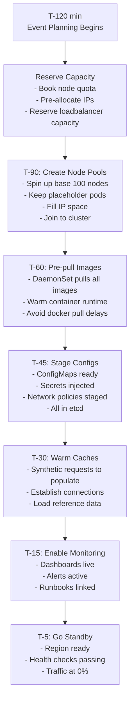
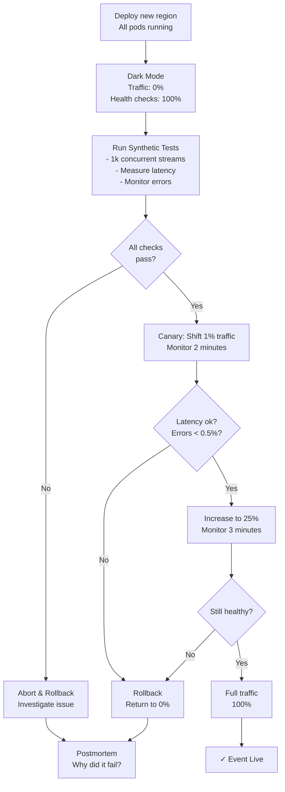

# Question 2: IPL Final Instant Regional Spinup (Zero Cold-Start)

**Interview Time**: 7-9 minutes  
**Difficulty**: ⭐⭐⭐⭐ (Advanced)  
**Topics**: Pre-warming, deployment velocity, readiness gates, traffic failover

---

## Problem Statement

> During an IPL final (sporting event with 50M+ viewers), a new region must go live in **< 5 minutes** with **zero cold-start impact**. Users shouldn't experience buffering or lag spikes. How would you:
> - Pre-warm infrastructure 1+ hour before event
> - Deploy pods/config in < 2 minutes
> - Run health checks without user impact
> - Cut over traffic smoothly

---

## Professional SRE Approach

### 1) Event Preparation Workflow (T-120 to T-5 minutes)



### 2) Pre-Warming Automation

#### DaemonSet: Image Pre-Puller
```yaml
apiVersion: apps/v1
kind: DaemonSet
metadata:
  name: image-warmup
  namespace: kube-system
spec:
  selector:
    matchLabels:
      app: image-warmup
  template:
    metadata:
      labels:
        app: image-warmup
    spec:
      priorityClassName: system-node-critical
      containers:
      - name: warmup
        image: busybox:latest
        command:
        - sh
        - -c
        - |
          # Pre-pull all streaming service images
          images=(
            "streaming.io/fanout-service:v1.2.3"
            "streaming.io/api-service:v1.2.3"
            "streaming.io/cache-layer:v1.2.3"
            "streaming.io/transcoder:v1.2.3"
          )
          for img in "${images[@]}"; do
            echo "Pre-pulling $img..."
            docker pull $img &
          done
          wait
          echo "All images pre-pulled"
          sleep infinity
        volumeMounts:
        - name: docker
          mountPath: /var/run/docker.sock
      volumes:
      - name: docker
        hostPath:
          path: /var/run/docker.sock
```

#### ConfigMap Template (Deployed T-45)
```yaml
apiVersion: v1
kind: ConfigMap
metadata:
  name: streaming-config-ipl-final
  labels:
    event: ipl-final
    region: india-south
data:
  transcoding-bitrates: |
    [
      {"bitrate": "500k", "profile": "baseline"},
      {"bitrate": "2m", "profile": "main"},
      {"bitrate": "8m", "profile": "high"}
    ]
  origin-servers: |
    [
      {"host": "origin-1.streaming.io", "weight": 0.5},
      {"host": "origin-2.streaming.io", "weight": 0.5}
    ]
  cache-ttl: "300"
  max-concurrent-streams: "50000"
```

### 3) Deployment Velocity (< 2 minutes)

#### Kustomize Template (Fast Deploy)
```yaml
# base/deployment.yaml
apiVersion: apps/v1
kind: Deployment
metadata:
  name: fanout-service
spec:
  replicas: 500 # Pre-sized for 50M viewers
  strategy:
    type: RollingUpdate
    rollingUpdate:
      maxUnavailable: 0 # No downtime
      maxSurge: 50 # Fast rollout
  selector:
    matchLabels:
      app: fanout-service
  template:
    metadata:
      labels:
        app: fanout-service
        event: ipl-final
    spec:
      affinity:
        podAntiAffinity:
          requiredDuringSchedulingIgnoredDuringExecution:
          - labelSelector:
              matchExpressions:
              - key: app
                operator: In
                values:
                - fanout-service
            topologyKey: kubernetes.io/hostname # 1 pod per node
      containers:
      - name: fanout
        image: streaming.io/fanout-service:v1.2.3
        resources:
          requests:
            cpu: 2
            memory: 4Gi
          limits:
            cpu: 2
            memory: 4Gi
        readinessProbe:
          httpGet:
            path: /health
            port: 8080
          initialDelaySeconds: 5
          periodSeconds: 5
          timeoutSeconds: 3
```

#### Deploy Command (Scripted)
```bash
#!/bin/bash
set -e

REGION="india-south"
EVENT="ipl-final"
KUBECONFIG="/etc/kube/${REGION}.config"

echo "T+0: Starting deployment..."
kubectl apply -k . --kubeconfig=$KUBECONFIG

echo "T+30: Waiting for pods to be ready..."
kubectl rollout status deployment/fanout-service -n streaming --timeout=60s

echo "T+60: Verifying all 500 pods healthy..."
READY=$(kubectl get pods -n streaming -l app=fanout-service | grep Running | wc -l)
if [ $READY -eq 500 ]; then
  echo "✓ All pods ready"
else
  echo "❌ Only $READY/500 pods ready. Abort."
  exit 1
fi

echo "T+90: Enable monitoring & logging..."
kubectl annotate deployment fanout-service -n streaming \
  event.streaming.io/status=ready \
  --overwrite

echo "✓ Deployment complete at T+90 seconds"
```

### 4) Readiness Gate: Dark Mode Testing



### 5) Traffic Failover (Global Orchestrator)

```yaml
apiVersion: networking.istio.io/v1beta1
kind: VirtualService
metadata:
  name: streaming-vs
spec:
  hosts:
  - streaming.example.com
  http:
  - match:
    - headers:
        user-region:
          exact: india-south
    route:
    - destination:
        host: streaming-service.streaming-india.svc.cluster.local
        port:
          number: 443
      weight: 1 # Start at 0%, increase in 25% steps
    timeout: 30s
    retries:
      attempts: 2
      perTryTimeout: 10s
  
  - match:
    - headers:
        user-region:
          exact: europe-west
    route:
    - destination:
        host: streaming-service.streaming-eu.svc.cluster.local
      weight: 100
    fallback:
    - destination:
        host: streaming-service.streaming-apac.svc.cluster.local # Failover
      weight: 0 # Activate if primary down
```

---

## Timeline Execution

```
T-120 min:  Event announced; capacity reservation starts
T-90  min:  First 100 nodes up; placeholder pods consuming IPs
T-60  min:  All images pre-pulled across cluster
T-45  min:  Configs staged; secrets injected
T-30  min:  Cache warming begins (synthetic requests)
T-15  min:  Monitoring dashboard live
T-5   min:  Region in "standby" mode (health checks passing)
T+0   min:  Event starts in primary region
T+90  sec:  Secondary region deployment begins
T+2   min:  All 500 pods deployed & readiness gates pass
T+3   min:  1% traffic shifted; monitoring ok
T+5   min:  100% traffic; secondary region live
```

---

## Key Metrics & Guardrails

### Pre-Event Checklist (T-15 min)
- [ ] All 100 pre-warm nodes healthy
- [ ] All images pulled (docker ps shows 4+ images per node)
- [ ] ConfigMaps & Secrets in etcd
- [ ] Network policies loaded
- [ ] Loadbalancer health checks passing
- [ ] Monitoring dashboards loading without latency
- [ ] Runbooks ready (link in pagerduty alerts)

### Deployment Validation (T+2 min)
| Metric | Expected | Action if Fail |
|---|---|---|
| Pod ready % | 100% | Wait another 30s |
| Synthetic latency | < 10s | Investigate; abort if > 20s |
| Error rate | < 0.1% | Troubleshoot; rollback if > 1% |
| CPU/node | 50-70% | Scale: expected for cold start |

### Traffic Cutover Validation (T+3-5 min)
- p50 latency stable (± 10% of baseline)
- p99 latency < 30s
- Error rate < 0.1%
- No user complaints in #realtime-alerts channel

---

## Cold-Start Elimination Techniques

### 1. Connection Pooling Warm-Up
```python
# Pre-established connections in init container
class StreamingService:
    def __init__(self):
        # Warm pools during startup
        self.cache_pool = redis.ConnectionPool(
            host='cache.streaming.svc',
            max_connections=1000,
            socket_keepalive=True
        )
        self.origin_conn = requests.Session()
        # Pre-establish 10 connections to origin
        for _ in range(10):
            self.origin_conn.get('http://origin.streaming.io/health')
```

### 2. Buffer Preloading
```yaml
# Pod startup sequence
spec:
  containers:
  - name: fanout
    lifecycle:
      postStart:
        exec:
          command:
          - /bin/sh
          - -c
          - |
            # Pre-load 1 hour of content buffer
            curl -X POST http://localhost:8080/warmup \
              -d '{"buffer_duration": "3600s"}'
```

### 3. DNS Propagation
```bash
# Pre-register IPs in DNS hours before event
# Use short TTL (60s) to allow fast updates if needed
kubectl patch service fanout-service \
  --type='merge' \
  -p='{"metadata": {"annotations": {"dns.google.com/ttl": "60"}}}'
```

---

## Interview Answer Summary

**Opening**: "I'd use a **T-minus timeline** with progressive warm-up: reserve capacity (T-120), pre-pull images (T-60), stage configs (T-45), warm caches (T-30), then **zero-traffic health checks** (T-5)."

**Key Points**:
1. **DaemonSet image pre-puller** eliminates docker pull delays
2. **Placeholder pods** consume IP space; replaced during deploy
3. **Deployment automated** in < 2 minutes (kustomize + kubectl rollout)
4. **Dark mode testing** validates region before traffic
5. **Canary traffic shifts** (1% → 25% → 100%) catch issues early
6. **Global orchestrator** (Istio) controls traffic with instant failover
7. **Readiness probes** deep (synthetic streams) not just HTTP ping

**Closing**: "The secret is **eliminating unknowns** before event time: we know images are pulled, configs are staged, caches are warm. When event starts, deployment is just 'turn the crank,' not 'figure it out live.'"

---

## Lessons from Real Events

- **Cache cold start**: 5-10s per request if not pre-warmed
- **Image pull delays**: Can add 2-3 minutes if not cached
- **DNS issues**: TTL too high → slow failover (use 60s max)
- **Readiness probe lag**: 10+ seconds if probes are heavyweight
- **Cascading failures**: One slow service brings down entire region
