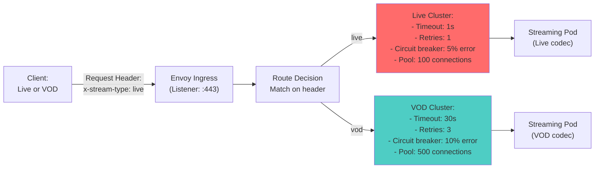
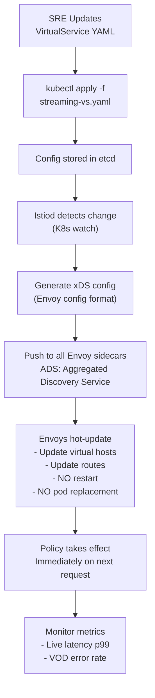

# Question 3: Envoy + Istio: Route Live Streams vs VOD Without Service Restarts

**Interview Time**: 8-10 minutes  
**Difficulty**: ⭐⭐⭐⭐ (Advanced)  
**Topics**: Service mesh, dynamic routing, traffic splitting, live configuration updates

---

## Problem Statement

> You have a single streaming service handling both **live streams** (10-30s latency) and **VOD** (video-on-demand, buffering acceptable). Requirements:
> - Route with different SLOs without restarting services
> - Live: ultra-low latency, minimal retries
> - VOD: higher latency ok, more resilience
> - Configuration changes in < 5 seconds
> - No service restart or pod replacement

---

## Professional SRE Approach

### 1) Service Mesh Architecture (Envoy Sidecars)



### 2) Istio VirtualService + DestinationRule (Zero-Restart Config)

```yaml
# This resource is CRD; Istiod watches and pushes config to Envoys
# NO service restart required!

apiVersion: networking.istio.io/v1beta1
kind: DestinationRule
metadata:
  name: streaming-dr
spec:
  host: streaming-service.streaming.svc.cluster.local
  trafficPolicy:
    connectionPool:
      tcp:
        maxConnections: 1000
      http:
        http1MaxPendingRequests: 10000
        http2MaxRequests: 100000
        maxRequestsPerConnection: 2
  subsets:
  - name: live
    labels:
      stream-type: live
    trafficPolicy:
      # Live-specific config
      connectionPool:
        http:
          http1MaxPendingRequests: 100 # Low queue
          maxRequestsPerConnection: 1 # No connection reuse (fresh for each)
      outlierDetection:
        consecutive5xxErrors: 2
        interval: 5s
        baseEjectionTime: 30s
        minRequestVolume: 100
        splitExternalLocalOriginErrors: true
  - name: vod
    labels:
      stream-type: vod
    trafficPolicy:
      # VOD-specific config
      connectionPool:
        http:
          http1MaxPendingRequests: 5000 # Higher queue
          maxRequestsPerConnection: 10 # Reuse connections
      outlierDetection:
        consecutive5xxErrors: 5
        interval: 30s
        baseEjectionTime: 60s
```

```yaml
apiVersion: networking.istio.io/v1beta1
kind: VirtualService
metadata:
  name: streaming-vs
spec:
  hosts:
  - streaming.example.com
  http:
  # Route 1: Live streams (detected by header or path)
  - match:
    - headers:
        x-stream-type:
          exact: live
    - uri:
        prefix: /live/
    name: "live-route"
    route:
    - destination:
        host: streaming-service.streaming.svc.cluster.local
        subset: live
        port:
          number: 443
    timeout: 1s # Ultra-tight timeout for live
    retries:
      attempts: 1 # Retry once; if fails, accept loss
      perTryTimeout: 300ms
    fault:
      delay:
        percentage: 0.0 # No delay injection for live
      abort:
        percentage: 0.0 # No chaos for live
  
  # Route 2: VOD (buffering ok)
  - match:
    - headers:
        x-stream-type:
          exact: vod
    - uri:
        prefix: /vod/
    name: "vod-route"
    route:
    - destination:
        host: streaming-service.streaming.svc.cluster.local
        subset: vod
        port:
          number: 443
    timeout: 30s # Generous timeout
    retries:
      attempts: 3 # Retry aggressively
      perTryTimeout: 5s
    fault:
      delay:
        percentage: 0.0
      abort:
        percentage: 0.0
  
  # Default route (no header matched)
  - name: "default-route"
    route:
    - destination:
        host: streaming-service.streaming.svc.cluster.local
        subset: live # Assume live for backward compat
        port:
          number: 443
    timeout: 2s
```

### 3) Hot Configuration Update Workflow (No Restart)



### 4) Configuration Change Example (Live to VOD)

**Before**: All traffic treated as live (1s timeout, 1 retry)

```yaml
# Old: No differentiation
route:
- destination: streaming-service
  timeout: 1s
  retries:
    attempts: 1
```

**Change**: Apply new VirtualService with live/VOD subsets

```bash
# T+0: Apply new config
kubectl apply -f streaming-vs.yaml

# T+1: Verify Istiod picked up the change
kubectl get virtualservice streaming-vs -o yaml | grep -A 5 "live-route"

# T+2: Monitor Prometheus for metric changes
# - Live requests now have p99 < 500ms (tighter)
# - VOD requests now have p99 < 20s (more generous)
# - Both have own retry counts

# T+5: Fully rolled out (no pods touched!)
```

**After**: Two distinct policies active

```yaml
# New: Live and VOD differentiated
live-route:
  timeout: 1s
  retries: 1
vod-route:
  timeout: 30s
  retries: 3
```

---

## Key Metrics & Observability

### Metrics to Track (Per Route)

```yaml
# Prometheus scrape from Envoy sidecar proxies
istio_request_total{
  destination_service_name="streaming-service",
  route="live-route",
  response_code="200"
}

istio_request_duration_milliseconds_bucket{
  destination_service_name="streaming-service",
  route="live-route",
  le="100"
}

# Live should be:
# - p99 latency: < 500ms
# - Error rate: 0.5% (acceptable for live)

# VOD should be:
# - p99 latency: < 20s
# - Error rate: 0.01% (more critical)
```

### Dashboard: Live vs VOD

```
┌────────────────────────────────────────┐
│ Live Stream Metrics                    │
├────────────────────────────────────────┤
│ Requests/sec:      12k                 │
│ p50 latency:       50ms                │
│ p99 latency:       450ms (✓ < 500ms)   │
│ Error rate:        0.3% (acceptable)   │
│ Timeouts:          < 1% (good)         │
├────────────────────────────────────────┤
│ VOD Stream Metrics                     │
├────────────────────────────────────────┤
│ Requests/sec:      3k                  │
│ p50 latency:       2s                  │
│ p99 latency:       15s (✓ < 20s)       │
│ Error rate:        0.01%               │
│ Retries invoked:   12% (healthy)       │
└────────────────────────────────────────┘
```

---

## Real-World Considerations

### Challenge 1: Header vs Path Detection
Clients might not set `x-stream-type` header. How to auto-detect?

**Solution**:
```yaml
# Add match condition: if path contains /live/, treat as live
match:
- uri:
    prefix: /live/
- headers:
    x-stream-type:
      exact: live
```

### Challenge 2: Mixed Live+VOD in Single Request
What if user switches from live to VOD mid-session?

**Solution**:
```yaml
# Use sticky sessions; route decision made on first request
# Then reuse same connection for all requests from that session
http:
  cookie:
    name: stream-type
    ttl: 1h
```

### Challenge 3: Gradual Rollout of New Config
What if you want to test new live timeout (1s → 2s) on 10% of traffic first?

**Solution** (Istio DestinationRule canary):
```yaml
# Create second destination subset for canary
subsets:
- name: live-v1
  labels:
    stream-type: live
    version: v1
- name: live-v2
  labels:
    stream-type: live
    version: v2

# In VirtualService, split traffic
route:
- destination:
    subset: live-v1
  weight: 90 # 90% old policy
- destination:
    subset: live-v2
  weight: 10 # 10% new policy (2s timeout)
```

---

## Interview Answer Summary

**Opening**: "I'd use **Istio VirtualService** to create **two separate routes** (live vs VOD) with **different timeout/retry policies**, all configured as **CRDs**. Istiod watches these changes and **pushes to Envoy sidecars via xDS**—no service restart."

**Key Points**:
1. **DestinationRule** defines two subsets: live (low resources, fast timeout) and VOD (high resources, generous timeout)
2. **VirtualService** matches on header (`x-stream-type`) or path prefix and routes accordingly
3. **Configuration changes** are applied via kubectl; Istiod pushes to Envoys in < 5 seconds
4. **Live config**: 1s timeout, 1 retry, low connection pool, aggressive circuit breaker
5. **VOD config**: 30s timeout, 3 retries, high connection pool, forgiving circuit breaker
6. **Hot updates**: No pod replacement; traffic shifted dynamically

**Closing**: "This is **zero-restart deployment**. We change Istio config, Envoys update in-memory, traffic immediately respects new policies. Perfect for live events where restart = user impact."

---

## Monitoring During Configuration Change

```bash
# Watch Istiod logs during change
kubectl logs -n istio-system deployment/istiod -f | grep "config updated"

# Verify Envoy sidecar received new config
istioctl analyze streaming-vs.yaml

# Check actual proxy config (xDS) sent to sidecars
istioctl pc routes <pod> -n streaming | grep -E "live-route|vod-route"

# Monitor metrics during transition
kubectl exec -it <pod> -c istio-proxy -- curl localhost:15000/stats/prometheus | grep istio_request_duration
```
