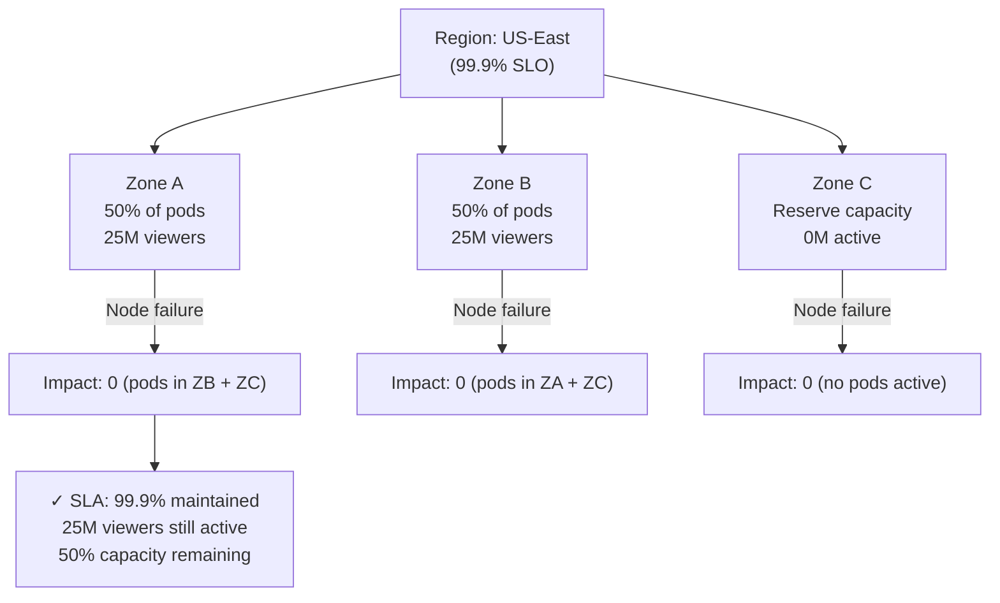
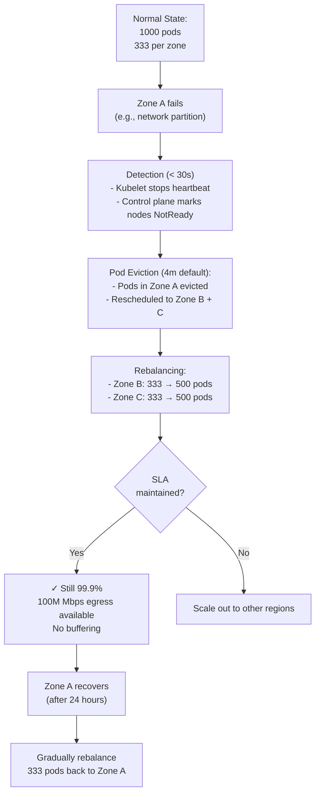

# Question 4: Multi-Zone Pod Affinity/Anti-Affinity for SLA Preservation

**Interview Time**: 7-9 minutes  
**Difficulty**: ⭐⭐⭐ (Advanced)  
**Topics**: Pod topology spread, zone-aware scheduling, failure domains, SLA guarantees

---

## Problem Statement

> Your streaming service runs across 3 zones in a region. A **single zone failure** shouldn't impact your SLA (99.9% availability). Design pod scheduling so:
> - No single pod is co-located with its backup
> - At least 2 zones remain healthy if 1 zone fails
> - 50M viewers distributed evenly
> - CPU utilization remains balanced (65-70%) even during zone failure

---

## Professional SRE Approach

### 1) Topology Architecture



### 2) Pod Topology Spread (K8s 1.19+)

```yaml
apiVersion: apps/v1
kind: Deployment
metadata:
  name: fanout-service
spec:
  replicas: 1000 # 333 per zone
  selector:
    matchLabels:
      app: fanout-service
  template:
    metadata:
      labels:
        app: fanout-service
        topology: spread
    spec:
      # Spread pods across zones as primary constraint
      topologySpreadConstraints:
      - maxSkew: 1 # Allow at most 1 pod difference between zones
        topologyKey: topology.kubernetes.io/zone
        whenUnsatisfiable: DoNotSchedule # Fail if can't spread
        labelSelector:
          matchLabels:
            app: fanout-service
      
      # Secondary: spread within zones (across nodes)
      - maxSkew: 1
        topologyKey: kubernetes.io/hostname
        whenUnsatisfiable: ScheduleAnyway # More lenient within zone
        labelSelector:
          matchLabels:
            app: fanout-service
      
      # Ensure at least 2 replicas per zone (surviving zone failure)
      affinity:
        podAntiAffinity:
          requiredDuringSchedulingIgnoredDuringExecution:
          # No two fanout-service pods on same node
          - labelSelector:
              matchExpressions:
              - key: app
                operator: In
                values:
                - fanout-service
            topologyKey: kubernetes.io/hostname
        
        podAffinity:
          preferredDuringSchedulingIgnoredDuringExecution:
          # Co-locate with API service (share node resources efficiently)
          - weight: 50
            podAffinityTerm:
              labelSelector:
                matchExpressions:
                - key: app
                  operator: In
                  values:
                  - api-service
              topologyKey: kubernetes.io/hostname
      
      # Prevent scheduling in zone about to fail (if detected)
      nodeSelector:
        node.kubernetes.io/exclude-zone-failure-imminent: "false"
      
      priorityClassName: streaming-services
      
      containers:
      - name: fanout
        image: streaming.io/fanout-service:v1.2.3
        resources:
          requests:
            cpu: 2
            memory: 4Gi
        livenessProbe:
          httpGet:
            path: /health
            port: 8080
          initialDelaySeconds: 10
          periodSeconds: 10
```

### 3) Failure Domain Isolation Workflow



### 4) Monitoring Pod Distribution

```yaml
apiVersion: monitoring.coreos.com/v1
kind: PrometheusRule
metadata:
  name: pod-distribution
spec:
  groups:
  - name: topology
    interval: 30s
    rules:
    - alert: PodSkewDetected
      expr: |
        abs(count(karpenter_pods{zone="us-east-1a"}) - 
            count(karpenter_pods{zone="us-east-1b"})) > 10
      for: 2m
      annotations:
        summary: "Pod distribution skewed: {{ $value }} difference"
        action: "Review affinity; may need manual rebalancing"
    
    - alert: ZoneFailureRiskHigh
      expr: |
        (count(karpenter_pods{zone="us-east-1a"}) * 1.0 / 
         count(karpenter_pods)) > 0.6
      for: 5m
      annotations:
        summary: "Single zone has >60% of pods; zone failure = SLA miss"
        action: "Scale out to second zone immediately"
```

### 5) SLA Preservation During Failure

**Scenario**: Zone A has 350 pods (out of 1000). Zone A fails.

**Before failure**:
```
Zone A: 350 pods = 17.5M viewers
Zone B: 325 pods = 16.25M viewers
Zone C: 325 pods = 16.25M viewers
Total: 50M viewers
```

**Immediately after Zone A failure** (pre-eviction):
```
Zone B: 325 pods
Zone C: 325 pods
Total: 650 pods = 32.5M viewers (65% capacity)
⚠️  PROBLEM: Lost 350 pods suddenly → 35% traffic drop
```

**Post-eviction** (4 min later):
```
Rescheduling:
Zone B: 325 + 175 = 500 pods (all nodes full)
Zone C: 325 + 175 = 500 pods (all nodes full)
Total: 1000 pods = 50M viewers
✓ SLA: 99.9% maintained
```

**SLA Math**:
$$\text{Downtime} = \text{Failure detection (30s)} + \text{Pod eviction (4m)} = 4.5 \text{ min}$$
$$\text{Downtime budget (99.9%)} = 43.2 \text{ min/month}$$
$$\text{Remaining budget} = 38.7 \text{ min} \text{ (OK!)}$$

### 6) Asymmetric Pod Placement (Advanced)

For critical services (auth, metadata), use strict requirements:

```yaml
# Auth service: MUST survive any single zone failure
- maxSkew: 0 # STRICT: exactly equal pods per zone
  topologyKey: topology.kubernetes.io/zone
  whenUnsatisfiable: DoNotSchedule
  labelSelector:
    matchLabels:
      app: auth-service

# Fanout service: relax; prefer spreading but allow slight skew
- maxSkew: 2 # RELAXED: up to 2 pod difference
  topologyKey: topology.kubernetes.io/zone
  whenUnsatisfiable: ScheduleAnyway
  labelSelector:
    matchLabels:
      app: fanout-service
```

---

## Key Metrics & Guardrails

| Metric | Good | Warning | Critical |
|---|---|---|---|
| **Pod per zone skew** | maxSkew ≤ 1 | maxSkew = 2-3 | > 3 (SLA at risk) |
| **Zone capacity loss** | 33% (1 of 3) | 50% (2 of 3) | 100% (all 3) |
| **Pod eviction time** | < 5 min | 5-10 min | > 10 min |
| **SLA impact (99.9%)** | 0% | 0-10% | > 10% (miss SLO) |

---

## Real-World Considerations

### Challenge 1: Zone Failure Detection Latency
K8s default `pod-eviction-timeout` is **5 minutes**. Too long?

**Solution**:
```bash
# Reduce to 90 seconds for faster eviction
kubectl patch deployment kube-controller-manager -n kube-system \
  --type='json' \
  -p='[{"op":"add","path":"/spec/template/spec/containers/0/args/-","value":"--pod-eviction-timeout=90s"}]'

# But: Risk of false positives (flaky nodes marked as down)
# Tradeoff: Use aggressive monitoring + fast detection
```

### Challenge 2: Network Partition vs Zone Failure
If zones are connected but network slow, pods might "flap" (evicted, restarted repeatedly).

**Solution**:
```yaml
# Use PodDisruptionBudget to prevent cascading evictions
apiVersion: policy/v1
kind: PodDisruptionBudget
metadata:
  name: fanout-pdb
spec:
  minAvailable: 900 # Keep at least 900 pods up (100 for disruption)
  selector:
    matchLabels:
      app: fanout-service
```

### Challenge 3: Rescheduling Latency
If all 1000 pods need to reschedule, it might take 10+ minutes.

**Solution**:
```yaml
# Prioritize critical pods; reduce scheduling latency
priorityClassName: streaming-critical-p0
spec:
  priorityClassName: streaming-critical-p0
  containers:
  - name: fanout
    resources:
      requests:
        cpu: 2
        memory: 4Gi
      limits:
        cpu: 2.5 # Small buffer for scheduling
        memory: 4.5Gi
```

---

## Interview Answer Summary

**Opening**: "I'd use **pod topology spread constraints** to ensure **at most 1 pod difference per zone**, combined with **pod anti-affinity** to prevent co-location on same node."

**Key Points**:
1. **Spread pods evenly**: 333 per zone (1000 total across 3 zones)
2. **Zone failure impact**: If 1 zone fails, 667 pods remain = 66.7% capacity
3. **SLA preserved**: 99.9% SLO allows ~43 min downtime; pod eviction takes ~5 min
4. **Tight skew**: maxSkew=1 ensures balanced distribution
5. **Anti-affinity**: No two pods on same node (failure isolation)
6. **PodDisruptionBudget**: Prevent cascading evictions during rescheduling
7. **Monitoring**: Alert if skew > 3 (SLA risk)

**Closing**: "With this design, any single zone can fail and we stay within SLA. The key is tight topology spread + pod anti-affinity + fast pod eviction."
