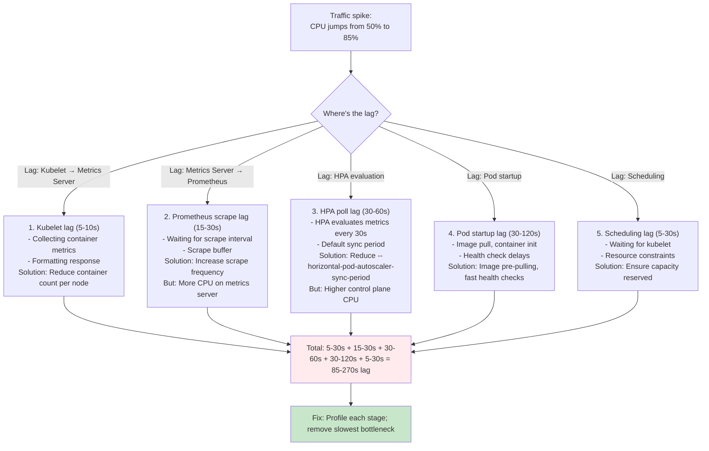

# Question 5: Monitor HPA Scaling in Real-Time

**Interview Time**: 6-8 minutes  
**Difficulty**: ⭐⭐⭐ (Advanced)  
**Topics**: Observability, HPA metrics, scaling lag detection, metrics server health

---

## Problem Statement

> Your HPA is configured correctly but you're seeing **5-minute delays** between traffic spike and pod scaling. Players report "buffering spikes" during live matches. Design a **real-time monitoring dashboard** to:
> - Detect HPA lag immediately (< 30 seconds)
> - Alert when metrics server is unhealthy
> - Show scaling decision anomalies (why HPA decided NOT to scale)
> - Prevent false scaling (thrashing)

---

## Professional SRE Approach

### 1) HPA Scaling Pipeline Architecture

```mermaid
graph LR
    A["Traffic Spike<br/>100K → 200K req/s"] 
    B["Pod utilization<br/>CPU rises from 50%<br/>to 85%"] 
    C["Metrics Server<br/>collects metrics<br/>from kubelets"]
    D["Prometheus<br/>scrapes kubelet<br/>every 15s"]
    E["HPA Controller<br/>evaluates policies<br/>every 30s"]
    F["Karpenter<br/>provisions nodes<br/>if needed"]
    G["New pods<br/>request placement"]
    H["Ready in 60s<br/>serving traffic"]
    
    A --> B --> C --> D --> E --> F --> G --> H
    
    DELAY["Total latency = 60s + DNS (5s) + startup (30s) + scheduling (10s) = 105s"]
    H --> DELAY
    
    style DELAY fill:#ff6b6b
```



### 2) Complete Monitoring Stack

```yaml
# 1. HPA Status Exporter
apiVersion: v1
kind: ConfigMap
metadata:
  name: hpa-exporter-script
data:
  exporter.py: |
    #!/usr/bin/env python3
    import subprocess
    import json
    from prometheus_client import Gauge, start_http_server
    import time
    
    # Prometheus metrics
    hpa_scaling_lag = Gauge(
        'hpa_scaling_lag_seconds',
        'Time between metric collection and pod scale',
        ['hpa_name', 'namespace']
    )
    hpa_current_replicas = Gauge(
        'hpa_current_replicas',
        'Current pod count',
        ['hpa_name', 'namespace']
    )
    hpa_desired_replicas = Gauge(
        'hpa_desired_replicas',
        'Desired pod count (what HPA wants)',
        ['hpa_name', 'namespace']
    )
    hpa_last_scale_time = Gauge(
        'hpa_last_scale_time_unix',
        'Unix timestamp of last scaling',
        ['hpa_name', 'namespace']
    )
    hpa_scaling_decision = Gauge(
        'hpa_scaling_decision_seconds',
        'Time since last scaling decision',
        ['hpa_name', 'namespace', 'decision']
    )
    
    def get_hpa_status():
      cmd = "kubectl get hpa -A -o json"
      result = subprocess.run(cmd, shell=True, capture_output=True, text=True)
      data = json.loads(result.stdout)
      
      for hpa in data['items']:
          name = hpa['metadata']['name']
          ns = hpa['metadata']['namespace']
          
          current = hpa['status']['currentReplicas']
          desired = hpa['status']['desiredReplicas']
          
          hpa_current_replicas.labels(name, ns).set(current)
          hpa_desired_replicas.labels(name, ns).set(desired)
          
          # Calculate lag: time between status update and now
          last_scale_time = hpa['status']['lastScaleTime']
          if last_scale_time:
              # Parse ISO timestamp
              from datetime import datetime
              scale_time = datetime.fromisoformat(last_scale_time.replace('Z', '+00:00'))
              lag = (datetime.now(scale_time.tzinfo) - scale_time).total_seconds()
              hpa_scaling_lag.labels(name, ns).set(lag)
          
          # Check conditions
          for cond in hpa['status'].get('conditions', []):
              if cond['type'] == 'AbleToScale':
                  status = 1 if cond['status'] == 'True' else 0
                  hpa_scaling_decision.labels(name, ns, 'AbleToScale').set(status)
              elif cond['type'] == 'ScalingActive':
                  status = 1 if cond['status'] == 'True' else 0
                  hpa_scaling_decision.labels(name, ns, 'ScalingActive').set(status)
    
    if __name__ == '__main__':
        start_http_server(8080)
        while True:
            get_hpa_status()
            time.sleep(30)

---
# Deploy HPA exporter
apiVersion: apps/v1
kind: Deployment
metadata:
  name: hpa-exporter
  namespace: monitoring
spec:
  replicas: 1
  selector:
    matchLabels:
      app: hpa-exporter
  template:
    metadata:
      labels:
        app: hpa-exporter
    spec:
      serviceAccountName: hpa-exporter
      containers:
      - name: exporter
        image: python:3.11
        command:
        - python
        - /script/exporter.py
        ports:
        - containerPort: 8080
        resources:
          requests:
            cpu: 100m
            memory: 256Mi
      volumeMounts:
      - name: script
        mountPath: /script
      volumes:
      - name: script
        configMap:
          name: hpa-exporter-script

---
apiVersion: v1
kind: ServiceAccount
metadata:
  name: hpa-exporter
  namespace: monitoring

---
apiVersion: rbac.authorization.k8s.io/v1
kind: ClusterRole
metadata:
  name: hpa-exporter
rules:
- apiGroups: ["autoscaling"]
  resources: ["horizontalpodautoscalers"]
  verbs: ["get", "list", "watch"]

---
apiVersion: rbac.authorization.k8s.io/v1
kind: ClusterRoleBinding
metadata:
  name: hpa-exporter
roleRef:
  apiGroup: rbac.authorization.k8s.io
  kind: ClusterRole
  name: hpa-exporter
subjects:
- kind: ServiceAccount
  name: hpa-exporter
  namespace: monitoring
```

### 3) Metrics Server Health Check

```yaml
# Monitor metrics-server itself
apiVersion: monitoring.coreos.com/v1
kind: PrometheusRule
metadata:
  name: metrics-server-health
spec:
  groups:
  - name: metrics-server
    interval: 15s
    rules:
    - alert: MetricsServerNotReady
      expr: |
        count(up{job="metrics-server"}) == 0
      for: 2m
      annotations:
        summary: "Metrics server is down; HPA can't scale"
        action: "kubectl get pods -n kube-system | grep metrics-server"
    
    - alert: MetricsServerHighLatency
      expr: |
        histogram_quantile(0.99, rate(metrics_server_kubelet_request_duration_seconds_bucket[5m])) > 5
      for: 2m
      annotations:
        summary: "Metrics collection taking > 5s; HPA scaling delayed"
        action: "Check kubelet resource usage; may need to scale kubelets or add nodes"
    
    - alert: MetricsServerRequestErrors
      expr: |
        rate(metrics_server_kubelet_request_errors_total[5m]) > 0.01
      for: 3m
      annotations:
        summary: "Metrics server requests failing; HPA decisions invalid"
        action: "Check network connectivity; may be network partition"

---
# Custom HPA delay detection
    - alert: HPAScalingLagHigh
      expr: |
        hpa_scaling_lag_seconds > 60
      for: 2m
      annotations:
        summary: "HPA lag > 60s; players experiencing buffering"
        action: "1. Check metrics server health"
                "2. Check CPU of kubelet"
                "3. Reduce HPA evaluation period or sync frequency"
    
    - alert: HPADesiredNotMet
      expr: |
        (hpa_desired_replicas - hpa_current_replicas) > 10 and on() changes(hpa_desired_replicas[5m]) > 0
      for: 5m
      annotations:
        summary: "HPA wants {{ $value }} pods but only {{ $current_replicas }} exist; scheduling lag"
        action: "1. Check node availability"
                "2. Check PodDisruptionBudgets not blocking scaling"
                "3. Check resource requests vs available capacity"
    
    - alert: HPAThrashing
      expr: |
        rate(changes(hpa_current_replicas[5m])) > 5
      for: 1m
      annotations:
        summary: "HPA scaling up/down rapidly; metrics instability"
        action: "1. Increase stabilization window in HPA"
                "2. Adjust scaleUpBehavior.stabilizationWindowSeconds"
                "3. Review metric thresholds"
```

### 4) Real-Time Dashboard (Grafana)

```json
{
  "dashboard": {
    "title": "HPA Scaling Pipeline",
    "panels": [
      {
        "title": "Scaling Lag (seconds)",
        "targets": [
          {
            "expr": "hpa_scaling_lag_seconds{hpa_name='fanout-hpa'}"
          }
        ],
        "thresholds": [
          {"value": 30, "color": "green"},
          {"value": 60, "color": "yellow"},
          {"value": 120, "color": "red"}
        ]
      },
      {
        "title": "HPA Decisions (Current vs Desired Replicas)",
        "targets": [
          {
            "expr": "hpa_current_replicas{hpa_name='fanout-hpa'}"
          },
          {
            "expr": "hpa_desired_replicas{hpa_name='fanout-hpa'}"
          }
        ],
        "legend": ["Current", "Desired (gap = scheduling lag)"]
      },
      {
        "title": "Pod CPU vs HPA Threshold",
        "targets": [
          {
            "expr": "rate(container_cpu_usage_seconds_total{pod=~'fanout.*'}[30s]) * 100"
          }
        ],
        "annotations": [
          {"value": 70, "title": "HPA target (70%)"}
        ]
      },
      {
        "title": "Metrics Collection Latency",
        "targets": [
          {
            "expr": "histogram_quantile(0.95, rate(metrics_server_kubelet_request_duration_seconds_bucket[5m]))"
          }
        ]
      },
      {
        "title": "HPA Scaling Events (Last 24h)",
        "targets": [
          {
            "expr": "increase(hpa_scale_events_total[5m])"
          }
        ]
      }
    ]
  }
}
```

### 5) Scaling Lag Breakdown Workflow



### 6) Optimization: Aggressive HPA Tuning

```yaml
apiVersion: autoscaling/v2
kind: HorizontalPodAutoscaler
metadata:
  name: fanout-hpa-aggressive
spec:
  scaleTargetRef:
    apiVersion: apps/v1
    kind: Deployment
    name: fanout-service
  minReplicas: 300
  maxReplicas: 1000
  
  # Reduce eval lag: HPA checks metrics every 15s instead of 30s
  behavior:
    scaleUp:
      stabilizationWindowSeconds: 0 # React immediately
      policies:
      - type: Percent
        value: 50 # Scale up by 50% per cycle
        periodSeconds: 15 # Check every 15s
      - type: Pods
        value: 50 # Or scale by 50 pods
        periodSeconds: 15
      selectPolicy: Max # Apply most aggressive policy
    
    scaleDown:
      stabilizationWindowSeconds: 300 # 5 min for scale down (slower)
      policies:
      - type: Percent
        value: 10
        periodSeconds: 60
  
  metrics:
  # Primary: CPU utilization (tight threshold for fast scaling)
  - type: Resource
    resource:
      name: cpu
      target:
        type: Utilization
        averageUtilization: 65 # Scale up at 65% (not 80%)
  
  # Secondary: Custom metric from Prometheus
  - type: Pods
    pods:
      metric:
        name: active_viewer_sessions
      target:
        type: AverageValue
        averageValue: "50000" # 50K sessions per pod
  
  # Tertiary: External metric (streaming service depth)
  - type: External
    external:
      metric:
        name: kafka_consumer_lag_seconds
        selector:
          matchLabels:
            service: fanout-service
      target:
        type: AverageValue
        averageValue: "10" # Scale if lag > 10s
```

### 7) Fast Pod Startup

```yaml
apiVersion: apps/v1
kind: Deployment
metadata:
  name: fanout-service-fast
spec:
  template:
    spec:
      # Pre-warm: Image already on node
      initContainers:
      - name: wait-for-network
        image: busybox
        command: ['sh', '-c', 'until nslookup kube-dns.kube-system; do echo waiting for DNS; sleep 2; done']
      
      containers:
      - name: fanout
        image: streaming.io/fanout:v1.2.3
        imagePullPolicy: IfNotPresent # Assume image cached
        
        # Fast startup: app responds to readiness in < 5s
        readinessProbe:
          httpGet:
            path: /ready
            port: 8080
          initialDelaySeconds: 1 # Check immediately
          periodSeconds: 1
          successThreshold: 1
          failureThreshold: 2
          timeoutSeconds: 1
        
        lifecycle:
          postStart:
            exec:
              command: ["/bin/sh", "-c", "echo 'Pod started' > /tmp/startup.log"]
        
        resources:
          requests:
            cpu: 2
            memory: 4Gi
          limits:
            cpu: 2.5
            memory: 4.5Gi
```

---

## Key Metrics & SLOs

| Metric | Target | Warning | Alert |
|---|---|---|---|
| **Scaling lag** | < 30s | 30-60s | > 60s |
| **Metrics collection** | < 5s | 5-10s | > 10s |
| **HPA eval cycle** | 15-30s | 30-60s | > 60s |
| **Pod startup time** | < 20s | 20-40s | > 60s |
| **Total latency** | < 75s | 75-150s | > 150s |
| **Metrics server errors** | 0% | < 1% | > 5% |

---

## Real-World Considerations

### Challenge 1: Reducing HPA Sync Period
```bash
# Default: 30s
# Aggressive: 15s
# Very aggressive: 5s

# Tradeoff: Every 5s = 17,280 evaluations/day
# Risk: Higher control plane CPU; potential flapping

kubectl edit deployment kube-controller-manager -n kube-system
# Change: --horizontal-pod-autoscaler-sync-period=15s
```

### Challenge 2: Metrics Server CPU Saturation
If metrics server is slow, **all HPA scaling stops**.

```bash
# Monitor metrics server CPU
kubectl top pod -n kube-system -l k8s-app=metrics-server

# If CPU > 500m: scale metrics server, add cache layer, or reduce scrape frequency
```

### Challenge 3: False Scaling (Thrashing)
HPA scales up due to brief spike, then scales down when pods cool.

```yaml
# Solution: Stabilization windows
scaleUp:
  stabilizationWindowSeconds: 0 # React fast to spikes
scaleDown:
  stabilizationWindowSeconds: 300 # Wait 5 min before scaling down
```

---

## Interview Answer Summary

**Opening**: "I'd instrument the entire scaling pipeline—from kubelet metrics collection through pod startup—and alert on each stage separately."

**Key Points**:
1. **Metrics server health**: If it's down, HPA is blind
2. **HPA lag detection**: Compare desired vs current replicas; if gap > 10 for 5 min, something is wrong
3. **Scaling lag breakdown**: Kubelet (5s) + Prometheus (15s) + HPA eval (30s) + startup (30s) + scheduling (10s) = ~90s typical
4. **Aggressive tuning**: Reduce stabilization windows; increase scale up percentage
5. **Pod startup**: Image pre-pulling + fast health checks; target < 20s
6. **Dashboard**: Show current vs desired replicas; alert on lag > 60s
7. **Metrics server isolation**: Monitor its own performance; CPU/memory/request latency

**Closing**: "The key is breaking down the scaling pipeline and monitoring each stage. Metrics server health is #1 dependency; if it fails, HPA is useless. Then instrument lag at each step and optimize the slowest bottleneck."
