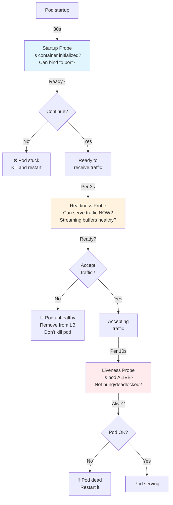
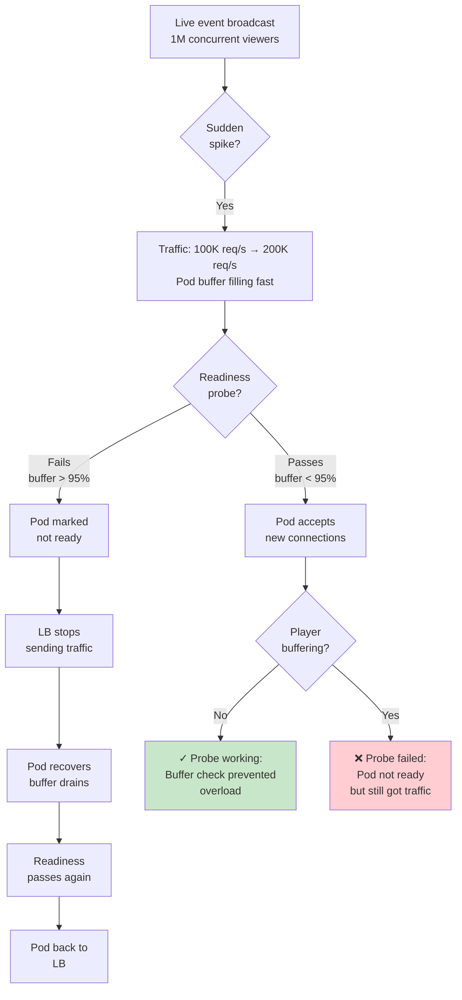

# Question 6: Readiness/Liveness Probes for Streaming

**Interview Time**: 7-9 minutes  
**Difficulty**: ⭐⭐⭐ (Advanced)  
**Topics**: Health check strategy, buffering detection, probe tuning, cascade failures

---

## Problem Statement

> Your streaming app has fast HTTP health checks but misses **streaming-specific failures**:
> - **Buffering**: Pod is "ready" but can't keep up with stream bitrate
> - **Lag**: Transcoding service is stuck; latency > 5 seconds
> - **Resource exhaustion**: CPU/memory high but pod still reports "ready"
> - **Dependencies**: Kafka unavailable but probe doesn't check it
> 
> Design deep health checks that catch these **before users experience problems**.

---

## Professional SRE Approach

### 1) Three-Layer Health Check Strategy



### 2) Production Probe Configuration

```yaml
apiVersion: apps/v1
kind: Deployment
metadata:
  name: fanout-service
spec:
  template:
    spec:
      containers:
      - name: fanout
        image: streaming.io/fanout:v1.2.3
        ports:
        - containerPort: 8080
          name: http
        - containerPort: 9090
          name: metrics
        
        # ============= STARTUP PROBE =============
        # Purpose: Wait for app to initialize before readiness checks
        # Triggered at pod startup; stops once succeeded
        startupProbe:
          httpGet:
            path: /startup
            port: 8080
          initialDelaySeconds: 0
          periodSeconds: 2
          timeoutSeconds: 5
          failureThreshold: 20 # 20 * 2s = 40s max startup time
          successThreshold: 1
        
        # ============= READINESS PROBE =============
        # Purpose: Can pod serve traffic **right now**?
        # Removed from LB if fails; pod kept alive for debugging
        readinessProbe:
          exec:
            command:
            - /bin/sh
            - -c
            - |
              # Check 1: Can bind to network
              if ! lsof -i :8080 | grep -q LISTEN; then
                exit 1
              fi
              
              # Check 2: HTTP endpoint responds
              if ! curl -sf http://localhost:8080/health > /dev/null; then
                exit 1
              fi
              
              # Check 3: Streaming buffer health
              # Query internal metrics; if buffer > 95% full, not ready
              BUFFER_PCT=$(curl -s http://localhost:9090/metrics | \
                grep 'streaming_buffer_used_percent' | tail -1 | awk '{print $2}')
              if (( $(echo "$BUFFER_PCT > 95" | bc -l) )); then
                echo "Buffer at ${BUFFER_PCT}%; not ready" > /dev/stderr
                exit 1
              fi
              
              # Check 4: Transcoding lag acceptable
              # If lag > 5s, can't keep up; not ready for new connections
              LAG=$(curl -s http://localhost:9090/metrics | \
                grep 'transcoding_lag_seconds' | tail -1 | awk '{print $2}')
              if (( $(echo "$LAG > 5" | bc -l) )); then
                echo "Transcoding lag ${LAG}s; not ready" > /dev/stderr
                exit 1
              fi
              
              # Check 5: Dependencies healthy
              # Kafka, Redis, upstream
              for dep in kafka-broker redis-cache origin-server; do
                if ! curl -sf http://localhost:8080/health/dependency/$dep > /dev/null; then
                  echo "Dependency $dep unhealthy" > /dev/stderr
                  exit 1
                fi
              done
              
              exit 0
          initialDelaySeconds: 5
          periodSeconds: 3
          timeoutSeconds: 10
          failureThreshold: 3 # 3 consecutive failures = remove from LB
          successThreshold: 1
        
        # ============= LIVENESS PROBE =============
        # Purpose: Is pod **alive** or hung/deadlocked?
        # Pod restarted if fails; more lenient than readiness
        livenessProbe:
          exec:
            command:
            - /bin/sh
            - -c
            - |
              # Check 1: Process running
              pgrep -f "fanout-service" > /dev/null || exit 1
              
              # Check 2: Not in zombie state
              ps aux | grep -E 'Z.*fanout' && exit 1 || true
              
              # Check 3: Goroutine count not growing (no leak)
              # Grab current goroutine count
              GOROUTINES=$(curl -s http://localhost:9090/metrics | \
                grep 'go_goroutines' | grep -v '#' | awk '{print $2}')
              
              # Compare to baseline (stored in /tmp)
              if [ -f /tmp/baseline_goroutines ]; then
                BASELINE=$(cat /tmp/baseline_goroutines)
                RATIO=$(echo "scale=2; $GOROUTINES / $BASELINE" | bc)
                if (( $(echo "$RATIO > 3" | bc -l) )); then
                  echo "Goroutine leak detected: $BASELINE → $GOROUTINES" > /dev/stderr
                  exit 1
                fi
              else
                echo "$GOROUTINES" > /tmp/baseline_goroutines
              fi
              
              # Check 4: Recent heartbeat (pod responsive)
              # Check if /tmp/heartbeat is recent
              HEARTBEAT_AGE=$(($(date +%s) - $(stat -f%m /tmp/heartbeat 2>/dev/null || echo 0)))
              if [ "$HEARTBEAT_AGE" -gt 30 ]; then
                echo "Heartbeat stale: ${HEARTBEAT_AGE}s old" > /dev/stderr
                exit 1
              fi
              
              exit 0
          initialDelaySeconds: 30
          periodSeconds: 10
          timeoutSeconds: 5
          failureThreshold: 3 # 3 consecutive failures over 30s = restart
          successThreshold: 1
        
        resources:
          requests:
            cpu: 2
            memory: 4Gi
          limits:
            cpu: 2.5
            memory: 4.5Gi
```

### 3) Deep Health Endpoint Implementation

```go
// /health endpoint - Fast, simple check
func handleHealth(w http.ResponseWriter, r *http.Request) {
    if !appReady {
        http.Error(w, "not ready", http.StatusServiceUnavailable)
        return
    }
    w.WriteHeader(http.StatusOK)
    json.NewEncoder(w).Encode(map[string]string{"status": "ok"})
}

// /startup endpoint - Initialization checks
func handleStartup(w http.ResponseWriter, r *http.Request) {
    if !serverBound {
        http.Error(w, "server not bound", http.StatusServiceUnavailable)
        return
    }
    if !configLoaded {
        http.Error(w, "config not loaded", http.StatusServiceUnavailable)
        return
    }
    if !dependenciesConnected {
        http.Error(w, "dependencies not ready", http.StatusServiceUnavailable)
        return
    }
    w.WriteHeader(http.StatusOK)
    json.NewEncoder(w).Encode(map[string]string{"status": "startup_complete"})
}

// /ready endpoint - Streaming-specific readiness checks
func handleReady(w http.ResponseWriter, r *http.Request) {
    checks := map[string]bool{
        "http_responding": true,
        "buffer_healthy": bufferUsedPercent < 95,
        "transcoding_lag_ok": transcodingLagSeconds < 5,
        "kafka_connected": kafkaProducer.IsConnected(),
        "redis_responsive": redisPing() == nil,
        "origin_reachable": originServerHealthy,
        "cpu_not_saturated": getCPUPercent() < 95,
        "memory_not_saturated": getMemPercent() < 95,
    }
    
    allHealthy := true
    for check, healthy := range checks {
        if !healthy {
            allHealthy = false
            log.Printf("Readiness check failed: %s", check)
        }
    }
    
    if !allHealthy {
        w.WriteHeader(http.StatusServiceUnavailable)
        json.NewEncoder(w).Encode(checks)
        return
    }
    
    w.WriteHeader(http.StatusOK)
    json.NewEncoder(w).Encode(checks)
}

// /metrics endpoint - Prometheus metrics for readiness insight
func handleMetrics(w http.ResponseWriter, r *http.Request) {
    fmt.Fprintf(w, "# HELP streaming_buffer_used_percent Streaming buffer utilization\n")
    fmt.Fprintf(w, "# TYPE streaming_buffer_used_percent gauge\n")
    fmt.Fprintf(w, "streaming_buffer_used_percent %d\n", bufferUsedPercent)
    
    fmt.Fprintf(w, "# HELP transcoding_lag_seconds Lag in transcoding pipeline\n")
    fmt.Fprintf(w, "# TYPE transcoding_lag_seconds gauge\n")
    fmt.Fprintf(w, "transcoding_lag_seconds %.2f\n", transcodingLagSeconds)
    
    fmt.Fprintf(w, "# HELP kafka_producer_errors_total\n")
    fmt.Fprintf(w, "# TYPE kafka_producer_errors_total counter\n")
    fmt.Fprintf(w, "kafka_producer_errors_total %d\n", kafkaErrors)
}

// Background goroutine: Write heartbeat
func heartbeatWriter() {
    ticker := time.NewTicker(5 * time.Second)
    for range ticker.C {
        ioutil.WriteFile("/tmp/heartbeat", []byte(time.Now().Unix()), 0644)
    }
}
```

### 4) Probe Tuning Workflow for Live Streaming



### 5) Monitoring Probe Health

```yaml
apiVersion: monitoring.coreos.com/v1
kind: PrometheusRule
metadata:
  name: probe-health
spec:
  groups:
  - name: probes
    interval: 15s
    rules:
    - alert: ReadinessProbeFailureRate
      expr: |
        rate(kubelet_probe_failure_total{probe_type="readiness"}[5m]) > 0.1
      for: 2m
      annotations:
        summary: "Readiness probes failing > 10%; pods may be overloaded"
        action: "Check buffer utilization, transcoding lag"
    
    - alert: LivenessProbeFailureRate
      expr: |
        rate(kubelet_probe_failure_total{probe_type="liveness"}[5m]) > 0.05
      for: 3m
      annotations:
        summary: "Liveness probes failing; pods may be hung"
        action: "Check CPU, memory, goroutine leaks"
    
    - alert: PodRestartingDueToLiveness
      expr: |
        increase(kubelet_pod_restarts_total{reason="liveness_probe_failed"}[5m]) > 5
      annotations:
        summary: "More than 5 pods restarted due to liveness probe"
        action: "Probe may be too strict; review liveness threshold"
    
    - alert: ProbeTimeoutRate
      expr: |
        rate(kubelet_probe_timeout_total[5m]) > 0.01
      for: 2m
      annotations:
        summary: "Probes timing out > 1%; may indicate slow endpoint or latency"
        action: "Check /startup, /ready endpoint latency"
    
    - alert: StreamingBufferUnhealthy
      expr: |
        streaming_buffer_used_percent > 95
      for: 30s
      annotations:
        summary: "Streaming buffer > 95%; pod about to lose readiness"
        action: "Scale pod, check transcoding lag, monitor bitrate"
    
    - alert: TranscodingLagTooHigh
      expr: |
        transcoding_lag_seconds > 5
      for: 1m
      annotations:
        summary: "Transcoding lag > 5s; pod will fail readiness soon"
        action: "Check transcoding service load; may need to scale"
```

### 6) Debugging Probe Failures

```bash
#!/bin/bash
# Diagnose probe failures

POD=$1

echo "=== Checking pod probes ==="
kubectl get pod $POD -o yaml | grep -A 10 "Probe"

echo "=== Pod events ==="
kubectl describe pod $POD | grep -A 20 "Events"

echo "=== Pod logs (last 50 lines) ==="
kubectl logs $POD --tail=50

echo "=== Exec into pod and test probes manually ==="
echo "Testing /startup:"
kubectl exec $POD -- curl -v http://localhost:8080/startup

echo "Testing /ready:"
kubectl exec $POD -- curl -v http://localhost:8080/ready

echo "Testing liveness (goroutine check):"
kubectl exec $POD -- curl -s http://localhost:9090/metrics | grep go_goroutines

echo "Checking buffer:"
kubectl exec $POD -- curl -s http://localhost:9090/metrics | grep buffer_used

echo "Checking transcoding lag:"
kubectl exec $POD -- curl -s http://localhost:9090/metrics | grep transcoding_lag
```

---

## Key Metrics & SLOs

| Probe | Interval | Timeout | Threshold | Failure Count | Purpose |
|---|---|---|---|---|---|
| **Startup** | 2s | 5s | - | 20 (40s) | Wait for init |
| **Readiness** | 3s | 10s | Buffer < 95%, lag < 5s | 3 (9s) | Catch buffering |
| **Liveness** | 10s | 5s | Responsive, goroutines stable | 3 (30s) | Detect hangs |

---

## Real-World Considerations

### Challenge 1: Readiness vs Liveness Confusion
- **Readiness**: Pod is healthy AND can handle traffic
- **Liveness**: Pod is not dead/hung

```go
// Wrong: Liveness checks same as readiness
livenessProbe:
  httpGet:
    path: /ready
    port: 8080
// Result: One slow request = pod restarts (bad!)

// Right: Liveness only checks "alive"
livenessProbe:
  exec:
    command: ["pgrep", "-f", "fanout-service"]
// Result: Pod keeps running; readiness handles traffic load
```

### Challenge 2: Probe Timeout Cascades
If probe endpoint is slow, probe times out → probe failure → liveness restart.

```yaml
readinessProbe:
  exec:
    command: ["/bin/sh", "-c", "timeout 5 curl http://localhost:8080/ready"]
  timeoutSeconds: 10 # Must be > timeout in command
```

### Challenge 3: Buffering Detection Complexity
Hard to check buffer health from outside; need instrumentation.

```go
// Expose buffer metrics; probe reads them
type BufferMetrics struct {
    UsedPercent float64
    CurrentSize int64
    MaxSize     int64
    UnderflowCount int64
}

func getBufferMetrics() BufferMetrics {
    return BufferMetrics{
        UsedPercent: (float64(buffer.Len()) / float64(buffer.Cap())) * 100,
        CurrentSize: int64(buffer.Len()),
        MaxSize: int64(buffer.Cap()),
        UnderflowCount: buffer.UnderflowCount,
    }
}
```

---

## Interview Answer Summary

**Opening**: "I'd use a **three-layer probe strategy**: startup checks for initialization, readiness checks for streaming-specific health (buffer, lag, dependencies), and liveness only checks if the pod is alive."

**Key Points**:
1. **Startup probe**: Wait for app init; prevents readiness checks too early
2. **Readiness probe**: Deep checks—buffer utilization < 95%, transcoding lag < 5s, dependencies healthy
3. **Liveness probe**: Only check "alive"—process running, goroutines stable, heartbeat recent
4. **Buffer detection**: Expose metrics; readiness probe reads them; if > 95%, fail readiness
5. **Transcoding lag**: If lag > 5s, pod can't keep up; fail readiness
6. **Probe isolation**: Remove from LB on readiness failure; restart on liveness failure
7. **Monitoring**: Alert on readiness failure rate, liveness restart rate, probe timeouts

**Closing**: "The key is that readiness detects streaming-specific problems (buffering, lag) before users see them. Liveness only checks if pod is alive. Separate concerns = cleaner failure modes."
