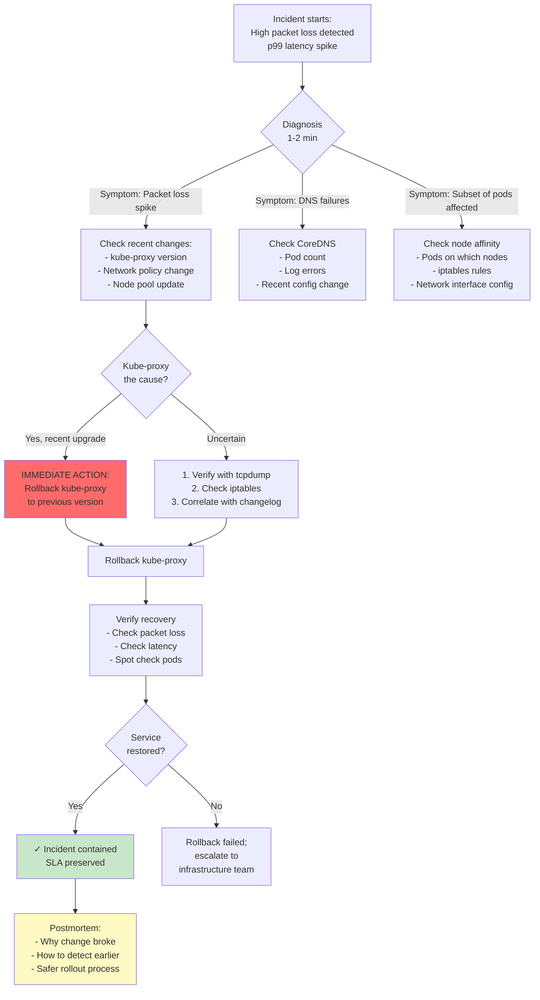

# Question 7: Kube-Proxy Network Rollback During Live Match

**Interview Time**: 8-10 minutes  
**Difficulty**: ⭐⭐⭐⭐ (Expert)  
**Topics**: Incident response, service mesh, network debugging, rapid rollback, SLA preservation

---

## Problem Statement

> **Live match in progress**: 50M concurrent viewers streaming. A **kube-proxy version upgrade** rolls out to one node pool and **packet drops spike to 30%** (should be < 0.1%). 
> - Users report "streams freezing every 2 seconds"
> - Service-to-service latency jumps from 10ms to 500ms
> - Some pods can't reach their dependencies
>
> Design a **detection → communication → rollback → verification** plan. You have **15 minutes to restore service** or miss the SLA (99.9%).

---

## Professional SRE Approach

### 1) Network Incident Decision Tree



### 2) Pre-Incident Setup: Monitoring & Alerting

```yaml
apiVersion: monitoring.coreos.com/v1
kind: PrometheusRule
metadata:
  name: network-incident-alerts
spec:
  groups:
  - name: network-health
    interval: 10s
    rules:
    
    # Alert 1: Packet loss spike
    - alert: HighPacketLossDetected
      expr: |
        rate(node_network_transmit_drop_total[1m]) > 1000 or
        rate(node_network_receive_drop_total[1m]) > 1000
      for: 30s # React immediately
      annotations:
        severity: critical
        summary: "Packet drops detected on {{ $labels.device }}; SLA at risk"
        action: |
          1. kubectl get nodes --sort-by=.metadata.creationTimestamp
          2. Check which nodes are dropping packets
          3. If recent node pool, investigate kube-proxy
          4. If kube-proxy recently upgraded, consider rollback
    
    # Alert 2: Service-to-service latency spike
    - alert: ServiceLatencySpike
      expr: |
        histogram_quantile(0.99, 
          rate(http_request_duration_seconds_bucket{job="fanout-service"}[1m])
        ) > 0.5
      for: 1m
      annotations:
        severity: critical
        summary: "P99 latency {{ $value }}s; normal ~10ms"
        action: "1. Check kube-proxy; 2. Check network policies; 3. Check DNS"
    
    # Alert 3: DNS failures (cascading symptom of network issues)
    - alert: DNSFailureRate
      expr: |
        rate(coredns_forward_requests_total{rcode="SERVFAIL"}[1m]) > 0.01
      for: 1m
      annotations:
        severity: critical
        summary: "DNS failures: {{ $value }}/min"
        action: "Check CoreDNS pod count, etcd health"
    
    # Alert 4: Pod communication failures (app-layer signal)
    - alert: PodCommunicationFailures
      expr: |
        rate(pod_communication_errors_total[1m]) > 0.05
      for: 30s
      annotations:
        severity: critical
        summary: "Pods can't communicate; network layer issue"
        action: "Check kube-proxy, network policies, node connectivity"
    
    # Alert 5: Karpenter node pool instability
    - alert: NodePoolRecentlyUpdated
      expr: |
        time() - node_creation_timestamp < 300 and 
        node_network_transmit_drop_total > 0
      annotations:
        severity: warning
        summary: "Recent node in pool dropping packets; may be new kube-proxy version"
        action: "Check kube-proxy version on new nodes"
```

### 3) Real-Time Debugging During Incident

```bash
#!/bin/bash
# Rapid diagnosis script during incident
# Goal: Identify kube-proxy as root cause within 2 minutes

set -e

echo "=== STEP 1: Identify nodes with packet loss ==="
kubectl get nodes -o wide
echo "Checking packet drops per node..."
for node in $(kubectl get nodes -o name | sed 's/node\///'); do
  drops=$(kubectl debug node/$node -it -- chroot /host -- cat /proc/net/dev | \
    grep -E 'eth0|ens0' | awk '{print $4 + $5}')
  echo "Node: $node | Drops: $drops"
done

echo -e "\n=== STEP 2: Check kube-proxy version on affected nodes ==="
# Find nodes with highest packet drop
PROBLEM_NODE=$(kubectl get nodes -o wide | tail -1 | awk '{print $1}')

echo "Debugging node: $PROBLEM_NODE"
kubectl debug node/$PROBLEM_NODE -it -- chroot /host -- \
  dpkg -l | grep kube-proxy

# Check when kube-proxy version changed
echo "Kube-proxy service status:"
kubectl debug node/$PROBLEM_NODE -it -- chroot /host -- \
  systemctl status kubelet | grep -A 5 "kube-proxy"

echo -e "\n=== STEP 3: Check iptables rules (kube-proxy manages these) ==="
kubectl debug node/$PROBLEM_NODE -it -- chroot /host -- \
  iptables-save | head -50

echo -e "\n=== STEP 4: Verify packet drops on specific interface ==="
kubectl debug node/$PROBLEM_NODE -it -- chroot /host -- \
  ethtool -S eth0 | grep -i drop

echo -e "\n=== STEP 5: Check if recent Deployment was kube-proxy update ==="
echo "Recent kube-proxy pod updates:"
kubectl get pods -n kube-system -l k8s-app=kube-proxy -o json | \
  jq -r '.items[] | 
    "\(.metadata.name): 
     image=\(.spec.containers[0].image) 
     ready=\(.status.conditions[] | select(.type=="Ready") | .status)"'

echo -e "\n=== STEP 6: Check pod communication latency ==="
kubectl run test-client --image=curlimages/curl:latest -- sleep 3600 &
sleep 2
TEST_POD=$(kubectl get pods -o name | grep test-client | head -1)
TARGET_POD=$(kubectl get pods -o name | grep fanout | head -1)
TARGET_IP=$(kubectl get pod $(echo $TARGET_POD | cut -d/ -f2) -o jsonpath='{.status.podIP}')

echo "Testing latency to $TARGET_IP:"
kubectl exec $TEST_POD -- sh -c "for i in {1..10}; do time curl -I http://$TARGET_IP:8080; done"

echo -e "\n=== DIAGNOSIS COMPLETE ==="
```

### 4) Immediate Rollback Procedure

```bash
#!/bin/bash
# Rollback kube-proxy to previous version
# Expected time: 2-3 minutes
# SLA impact: Minimal if executed quickly

set -e

echo "=== Step 1: Identify kube-proxy current version ==="
CURRENT_VERSION=$(kubectl get daemonset -n kube-system kube-proxy -o jsonpath='{.spec.template.spec.containers[0].image}')
echo "Current kube-proxy: $CURRENT_VERSION"

# Query git history for previous version
PREVIOUS_VERSION=$(git log --oneline -n 10 | grep "kube-proxy" | head -1 | awk '{print $NF}')
echo "Previous kube-proxy: $PREVIOUS_VERSION"

if [ -z "$PREVIOUS_VERSION" ]; then
  echo "ERROR: Could not find previous version"
  exit 1
fi

echo -e "\n=== Step 2: Drain nodes gracefully (stop accepting new pods) ==="
# Cordon ALL nodes to stop new pod scheduling while rolling back
kubectl cordon --all

echo -e "\n=== Step 3: Update kube-proxy DaemonSet ==="
# Patch the kube-proxy DaemonSet with previous version
kubectl patch daemonset kube-proxy -n kube-system \
  -p "{\"spec\":{\"template\":{\"spec\":{\"containers\":[{\"name\":\"kube-proxy\",\"image\":\"$PREVIOUS_VERSION\"}]}}}}"

echo "Rollback initiated; monitoring rollout..."

echo -e "\n=== Step 4: Monitor kube-proxy rollout (wait for completion) ==="
# Watch the DaemonSet update
TIMEOUT=300 # 5 minutes
ELAPSED=0
while [ $ELAPSED -lt $TIMEOUT ]; do
  DESIRED=$(kubectl get daemonset kube-proxy -n kube-system -o jsonpath='{.status.desiredNumberScheduled}')
  UPDATED=$(kubectl get daemonset kube-proxy -n kube-system -o jsonpath='{.status.updatedNumberScheduled}')
  READY=$(kubectl get daemonset kube-proxy -n kube-system -o jsonpath='{.status.numberReady}')
  
  echo "Progress: $READY/$DESIRED ready, $UPDATED/$DESIRED updated"
  
  if [ "$READY" -eq "$DESIRED" ] && [ "$UPDATED" -eq "$DESIRED" ]; then
    echo "✓ Rollback complete"
    break
  fi
  
  sleep 5
  ELAPSED=$((ELAPSED + 5))
done

if [ "$READY" -ne "$DESIRED" ]; then
  echo "ERROR: Rollback did not complete in $TIMEOUT seconds"
  exit 1
fi

echo -e "\n=== Step 5: Verify packet loss restored to normal ==="
# Give nodes a few seconds to settle
sleep 10

for node in $(kubectl get nodes -o name | sed 's/node\///'); do
  drops=$(kubectl debug node/$node -it -- chroot /host -- \
    cat /proc/net/dev | grep -E 'eth0|ens0' | awk '{print $4 + $5}')
  echo "Node: $node | Drops: $drops (should be ~0)"
done

echo -e "\n=== Step 6: Verify service health ==="
# Check latency
LATENCY=$(kubectl exec $(kubectl get pods -l app=fanout-service -o name | head -1) -- \
  curl -s http://localhost:9090/metrics | grep "http_request_duration_seconds" | grep "_sum" | tail -1 | awk '{print $2}')
echo "Service latency p99: ~${LATENCY}s (should be < 0.05s)"

# Check pod communication errors
ERRORS=$(kubectl get pods -o json | jq '.items[].status.conditions[] | select(.type=="Ready").status' | grep -c "False" || echo 0)
echo "Pods not ready: $ERRORS (should be 0)"

echo -e "\n=== Step 7: Uncordon nodes (resume scheduling) ==="
kubectl uncordon --all

echo -e "\n=== Step 8: Verify viewer metrics ==="
# Query streaming metrics
echo "Active viewers: $(kubectl exec $(kubectl get pods -l app=fanout-service -o name | head -1) -- \
  curl -s http://localhost:9090/metrics | grep 'active_viewers' | awk '{print $2}')"

echo -e "\n✓ ROLLBACK COMPLETE"
echo "Next: Schedule post-incident review and fix root cause"
```

### 5) Monitoring & Communication During Incident

```yaml
# Incident notification system
apiVersion: v1
kind: ConfigMap
metadata:
  name: incident-runbook
  namespace: kube-system
data:
  network-incident-runbook.md: |
    # Network Incident Runbook
    
    ## Detection (0-2 min)
    - Alerts trigger: high packet loss + high latency
    - Check: Is a deployment/update happening?
      - kubectl rollout status -A
      - kubectl get events -A --sort-by='.lastTimestamp'
    
    ## Diagnosis (2-5 min)
    - Identify affected nodes
    - Check kube-proxy version changes
    - Run tcpdump on problem node
    - Check iptables rules
    
    ## Mitigation (5-10 min)
    - If kube-proxy cause: IMMEDIATE ROLLBACK
    - If DNS: Restart CoreDNS
    - If network policy: Rollback policy change
    
    ## Communication (immediate)
    - Slack: #incident "Network latency spike; investigating kube-proxy rollback"
    - Status page: "Performance degradation; ETA 10 min"
    - Team leads: Ping on Slack
    
    ## Verification (post-rollback)
    - Check packet drops → 0
    - Check latency → < 20ms
    - Check pod readiness → 100%
    
    ## Follow-up
    - Postmortem within 24 hours
    - Identify: What monitoring missed this?
    - Action: Add pre-deployment validation for kube-proxy changes
```

### 6) Preventing Future Incidents

```yaml
# Pre-deployment validation for kube-proxy
apiVersion: v1
kind: ConfigMap
metadata:
  name: kube-proxy-validation
  namespace: kube-system
data:
  validate-kube-proxy-upgrade.sh: |
    #!/bin/bash
    # Run BEFORE deploying kube-proxy upgrade to any node pool
    
    set -e
    
    NEW_VERSION=$1
    
    echo "Validating kube-proxy upgrade to $NEW_VERSION"
    
    # 1. Test in isolated node first
    echo "Step 1: Deploy to canary node pool..."
    kubectl patch nodepool canary-pool \
      -p "{\"spec\":{\"template\":{\"spec\":{\"containers\":[{\"name\":\"kube-proxy\",\"image\":\"$NEW_VERSION\"}]}}}}"
    
    # 2. Wait for 30 min; monitor metrics
    echo "Step 2: Monitor metrics for 30 min..."
    for i in {1..6}; do
      sleep 5m
      PACKET_DROPS=$(kubectl get nodes -l nodepool=canary -o json | \
        jq -r '.items[].status.conditions[] | select(.reason=="NetworkUnavailable").status' | grep -c "True" || echo 0)
      
      LATENCY=$(prometheus query "histogram_quantile(0.99, http_request_duration_seconds)" 2>/dev/null || echo "unknown")
      
      echo "Iteration $i: Drops=$PACKET_DROPS, Latency=$LATENCY"
      
      if [ "$PACKET_DROPS" -gt 0 ]; then
        echo "ERROR: Packet drops detected; aborting upgrade"
        exit 1
      fi
    done
    
    # 3. If OK, schedule gradual rollout to other pools
    echo "Step 3: Gradual rollout to other pools..."
    for pool in $(kubectl get nodepools -o name | sed 's|nodepool/||'); do
      echo "Upgrading pool: $pool"
      kubectl patch nodepool $pool \
        -p "{\"spec\":{\"template\":{\"spec\":{\"containers\":[{\"name\":\"kube-proxy\",\"image\":\"$NEW_VERSION\"}]}}}}"
      
      sleep 10m # Wait between pools
    done
    
    echo "✓ Upgrade validation complete"
```

---

## Key Metrics & Decision Thresholds

| Metric | Normal | Alert | Critical | Action |
|---|---|---|---|---|
| **Packet loss rate** | 0% | > 0.1% | > 1% | Investigate immediately |
| **P99 latency** | < 20ms | 50-100ms | > 500ms | Page oncall |
| **Service error rate** | < 0.1% | 0.5-1% | > 5% | Trigger incident |
| **Pod readiness** | 100% | 95-99% | < 90% | Emergency escalation |
| **Time to detect** | - | < 1 min | < 2 min | - |
| **Time to resolve** | - | < 10 min | < 15 min | SLA at risk |

---

## Real-World Considerations

### Challenge 1: Distinguishing Kube-Proxy Issues from Other Causes
```bash
# Packet drops could be caused by:
# 1. Kube-proxy bug (iptables rules)
# 2. Network interface hardware issue
# 3. Kernel bug
# 4. Network policy misconfiguration

# Quick check: Is it affecting ALL pods or specific subset?
# - All pods: likely kube-proxy or network interface
# - Specific subset: likely network policy or pod-to-pod routing

# Check:
kubectl get networkpolicies -A # Any recent changes?
kubectl get nodes -o json | jq '.items[].metadata.labels' # Node pool version?
```

### Challenge 2: Rollback Safety
Kube-proxy is a DaemonSet; rollback affects all nodes simultaneously.

```yaml
# Safer approach: Gradual rollback
strategy:
  type: RollingUpdate
  rollingUpdate:
    maxUnavailable: 1 # Roll back 1 node at a time
    # Now if rollback breaks, only 1 node affected
```

### Challenge 3: Observer Effect
Running diagnostics (tcpdump, debug containers) may increase latency further.

```bash
# Minimize observer impact:
# 1. Use node debug containers (don't add pods)
# 2. Use existing metrics (Prometheus)
# 3. Avoid excessive logging during incident
```

---

## Interview Answer Summary

**Opening**: "In a network incident during live stream, I'd follow a **rapid diagnosis → immediate mitigation → communication → verification** pattern."

**Key Points**:
1. **Detection**: Alerts on packet loss, latency spike, pod communication errors (< 30 sec)
2. **Diagnosis (2-5 min)**:
   - Check recent changes: kube-proxy version, network policy, node updates
   - Run `kubectl debug node` to inspect iptables rules
   - Identify affected nodes; are drops on all nodes or subset?
3. **Mitigation (immediate if kube-proxy cause)**:
   - Cordon all nodes (stop new pod scheduling)
   - Rollback kube-proxy DaemonSet to previous version
   - Monitor rollout: wait for all nodes to be ready
4. **Verification (post-rollback)**:
   - Check packet drops → 0
   - Check latency → < 20ms
   - Verify pod communication working
5. **Communication (during incident)**:
   - Slack notification to oncall
   - Status page update
   - ETA for resolution
6. **Prevention**:
   - Pre-deployment validation: test kube-proxy in canary pool for 30 min before rollout
   - Alert on packet loss > 0.1%
   - Alert on latency spike > 10x baseline

**Closing**: "The key is speed. During live event, every second costs revenue. So: fast detection + correlation to recent changes + immediate rollback decision. Communication happens in parallel. Verification is post-incident; don't wait for perfect data when you have strong signal."
