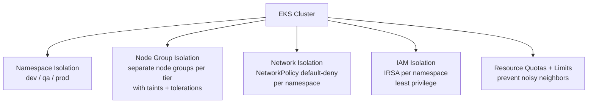
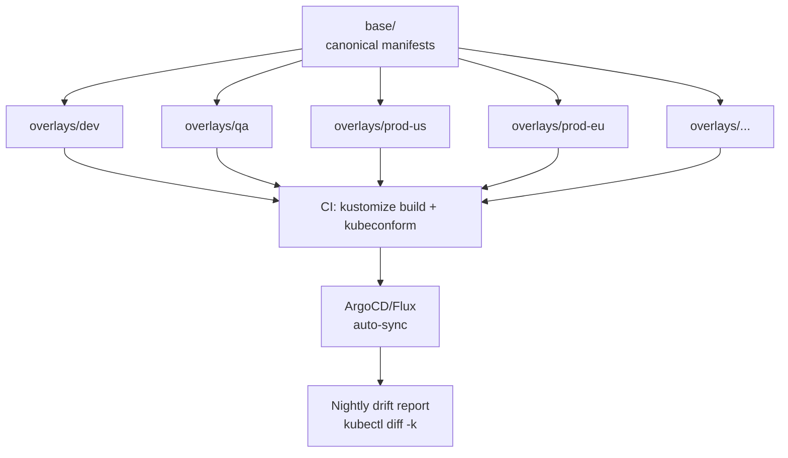
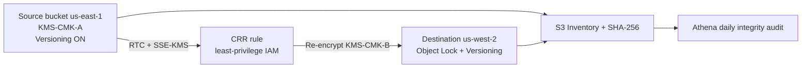
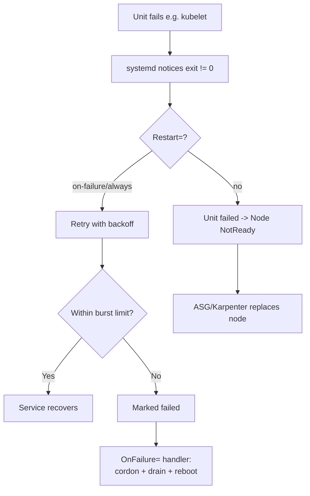
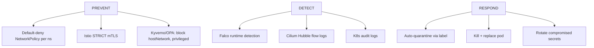
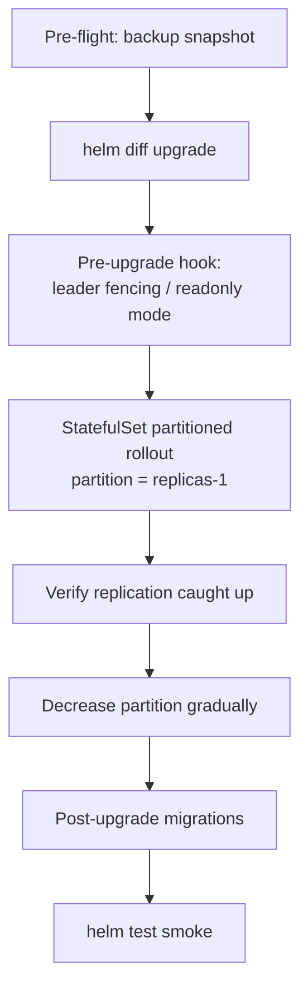
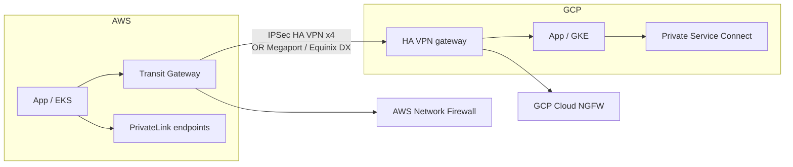
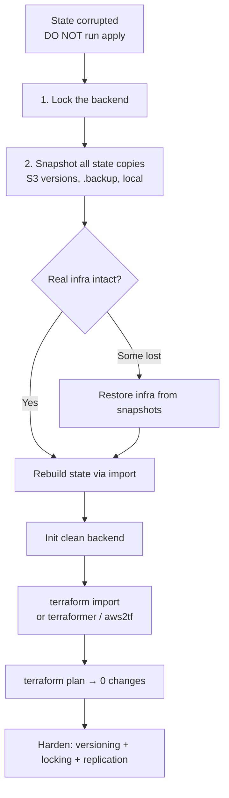

# Infra, Kubernetes, and Cloud Patterns (45 mins)

> Senior SRE interview question set with **detailed pro answers**, workflows, YAML, and commands.

---

## Table of Contents

1. [Multi-tenant EKS isolation](#1-multi-tenant-eks-cluster-isolation)
2. [Managing 10+ Kustomize overlays](#2-managing-10-kustomize-overlays-without-drift)
3. [Secure cross-region S3 replication](#3-secure-cross-region-s3-replication--integrity)
4. [systemd failure auto-recovery on container nodes](#4-systemd-failing-unit-on-containerized-node)
5. [Detect & mitigate pod-to-pod lateral movement](#5-detect--mitigate-pod-to-pod-lateral-movement)
6. [Zero-downtime stateful upgrades with Helm 3](#6-zero-downtime-stateful-upgrades-with-helm-3)
7. [Hybrid cloud routing — GCP ↔ AWS](#7-hybrid-cloud-routing-gcp--aws)
8. [Corrupted Terraform state — rebuild strategy](#8-corrupted-terraform-state--rebuild-strategy)
9. [Bash one-liner — containers using >500MB RSS](#9-bash-one-liner--containers-using-500mb-rss)

---

## 1. Multi-tenant EKS Cluster Isolation

### Problem
> Design a multi-tenant EKS cluster with isolation across **dev, QA, prod** — no noisy neighbors.

### Pro Answer

Use **4-layer isolation**: identity → compute → network → resource quotas.



### Implementation

**a) Node group isolation with taints**
```bash
eksctl create nodegroup --cluster=prod --name=prod-pool \
  --node-labels="tier=prod" \
  --node-taints="tier=prod:NoSchedule"
```

```yaml
tolerations:
- key: "tier"
  operator: "Equal"
  value: "prod"
  effect: "NoSchedule"
nodeSelector:
  tier: prod
```

**b) ResourceQuota + LimitRange (no noisy neighbors)**
```yaml
apiVersion: v1
kind: ResourceQuota
metadata:
  name: prod-quota
  namespace: prod
spec:
  hard:
    requests.cpu: "200"
    requests.memory: "400Gi"
    limits.cpu: "400"
    limits.memory: "800Gi"
    pods: "500"
---
apiVersion: v1
kind: LimitRange
metadata:
  name: default-limits
  namespace: prod
spec:
  limits:
  - default: {cpu: 500m, memory: 512Mi}
    defaultRequest: {cpu: 100m, memory: 128Mi}
    type: Container
```

**c) Default-deny NetworkPolicy per namespace**
```yaml
apiVersion: networking.k8s.io/v1
kind: NetworkPolicy
metadata: {name: default-deny, namespace: prod}
spec:
  podSelector: {}
  policyTypes: [Ingress, Egress]
```

**d) IRSA (IAM per namespace)**
```bash
eksctl create iamserviceaccount \
  --cluster=multi-tenant --namespace=prod --name=prod-sa \
  --attach-policy-arn=arn:aws:iam::aws:policy/prod-only-s3 --approve
```

### Key Takeaway
| Layer | Tool | Purpose |
|---|---|---|
| Compute | Node groups + taints | No CPU/IO contention |
| Network | NetworkPolicy | No lateral access |
| Identity | IRSA | No cross-tenant AWS access |
| Resource | Quotas + LimitRange | No noisy-neighbor starvation |

---

## 2. Managing 10+ Kustomize Overlays Without Drift

### Problem
> How do you manage 10+ Kustomize overlays without drift or duplication?

### Pro Answer

Use a **strict base + thin overlays + reusable components + GitOps + drift detection**.



### Directory Layout
```
manifests/
├── base/
├── components/        # reusable: monitoring, mesh, network-policies
└── overlays/
    ├── dev/
    ├── qa/
    ├── prod-us-east/
    ├── prod-us-west/
    └── prod-eu/
```

### Anti-drift Practices
- Only patches in overlays — no full manifest duplication
- Use `components` for cross-cutting concerns
- Schema validation in CI: `kustomize build | kubeconform`
- Nightly `kubectl diff -k` for drift report
- GitOps (ArgoCD/Flux) — single source of truth
- Image tags pinned in overlays only

### Thin Overlay Example
```yaml
# overlays/prod-us-east/kustomization.yaml
apiVersion: kustomize.config.k8s.io/v1beta1
kind: Kustomization
resources:
- ../../base
components:
- ../../components/monitoring
- ../../components/network-policies
patches:
- path: replica-count.yaml
  target: {kind: Deployment, name: api}
images:
- name: api
  newTag: v1.4.2
configMapGenerator:
- name: env-config
  literals: [REGION=us-east-1, TIER=prod]
```

### Drift Detection CI
```bash
for env in dev qa prod-us-east prod-us-west prod-eu; do
  echo "=== $env ==="
  kustomize build overlays/$env | kubectl diff -f - || echo "DRIFT in $env"
done
```

### Key Takeaway
- Thin overlays + reusable components
- GitOps enforces; CI validates; nightly job audits

---

## 3. Secure Cross-Region S3 Replication & Integrity

### Problem
> Secure cross-region S3 replication and validate data integrity at scale.

### Pro Answer



### Setup

**a) CRR with KMS re-encryption + Replication Time Control**
```json
{
  "Role": "arn:aws:iam::123:role/s3-replication-role",
  "Rules": [{
    "Status": "Enabled",
    "Priority": 1,
    "Filter": {"Prefix": ""},
    "DeleteMarkerReplication": {"Status": "Enabled"},
    "SourceSelectionCriteria": {
      "SseKmsEncryptedObjects": {"Status": "Enabled"}
    },
    "Destination": {
      "Bucket": "arn:aws:s3:::dst-bucket-us-west-2",
      "EncryptionConfiguration": {
        "ReplicaKmsKeyID": "arn:aws:kms:us-west-2:123:key/dst-cmk"
      },
      "Metrics": {"Status": "Enabled", "EventThreshold": {"Minutes": 15}},
      "ReplicationTime": {"Status": "Enabled", "Time": {"Minutes": 15}}
    }
  }]
}
```

**b) Integrity validation at scale (S3 Inventory + Athena)**
```sql
WITH src AS (
  SELECT key, size, e_tag, checksum_sha256
  FROM s3_inventory.src_bucket WHERE dt='2026-06-01'
),
dst AS (
  SELECT key, size, e_tag, checksum_sha256
  FROM s3_inventory.dst_bucket WHERE dt='2026-06-01'
)
SELECT src.key, src.size, dst.size
FROM src LEFT JOIN dst USING (key)
WHERE dst.key IS NULL
   OR src.checksum_sha256 != dst.checksum_sha256
   OR src.size != dst.size;
```

**c) Built-in SHA-256 checksums** — automatic on PUT/GET; protects against silent corruption.

### SLOs
| SLI | Target |
|---|---|
| Replication lag (p95) | < 15 min (RTC) |
| Integrity mismatch rate | 0 |
| Missing objects per day | 0 |

### Key Takeaway
- KMS keys per region + re-encrypt on replication
- RTC for 15-min SLA
- S3 Inventory + Athena for scale audits
- Object Lock at destination for ransomware protection

---

## 4. systemd Failing Unit on Containerized Node

### Problem
> What happens when systemd hits a failing unit on a container node? How do you auto-recover?

### Pro Answer



### Default Behaviour
- systemd marks unit `failed`; no auto-restart unless `Restart=` is set
- If kubelet dies: node `NotReady` in ~40s; pods evicted after `pod-eviction-timeout`

### Recovery Configuration

```ini
# /etc/systemd/system/kubelet.service.d/restart.conf
[Service]
Restart=always
RestartSec=5s
StartLimitInterval=300
StartLimitBurst=10
```

```ini
# Escalation: reboot if kubelet keeps failing
# /etc/systemd/system/kubelet.service.d/onfail.conf
[Unit]
OnFailure=node-recovery.service

# /etc/systemd/system/node-recovery.service
[Unit]
Description=Recover node after kubelet failure
[Service]
Type=oneshot
ExecStart=/usr/local/bin/node-recovery.sh
```

```bash
#!/bin/bash
logger "Node recovery triggered: kubelet failed beyond retries"
kubectl cordon $(hostname) || true
kubectl drain $(hostname) --ignore-daemonsets --delete-emptydir-data --force --timeout=120s || true
systemctl reboot
```

### Cluster-level auto-replacement (Karpenter)
```yaml
apiVersion: karpenter.sh/v1
kind: NodePool
spec:
  disruption:
    consolidationPolicy: WhenUnderutilized
    expireAfter: 720h
  template:
    spec:
      taints:
      - key: node.kubernetes.io/unhealthy
        effect: NoSchedule
```

### Alerting
```yaml
- alert: SystemdUnitFailed
  expr: node_systemd_unit_state{state="failed"} == 1
  for: 2m
```

### Key Takeaway
| Layer | Mechanism |
|---|---|
| Unit | `Restart=always` + backoff |
| Node | `OnFailure=` handler → drain + reboot |
| Cluster | Karpenter / Auto Repair replaces node |
| Detection | `node_systemd_unit_state` Prometheus alert |

---

## 5. Detect & Mitigate Pod-to-Pod Lateral Movement

### Problem
> Detect & mitigate pod-to-pod lateral movement inside a cluster.

### Pro Answer — Defense-in-Depth



### Prevention

```yaml
# default-deny
apiVersion: networking.k8s.io/v1
kind: NetworkPolicy
metadata: {name: default-deny-all, namespace: app}
spec:
  podSelector: {}
  policyTypes: [Ingress, Egress]
```

```yaml
# explicit allow path only
apiVersion: networking.k8s.io/v1
kind: NetworkPolicy
metadata: {name: api-to-db, namespace: app}
spec:
  podSelector: {matchLabels: {app: api}}
  egress:
  - to:
    - podSelector: {matchLabels: {app: postgres}}
    ports: [{protocol: TCP, port: 5432}]
```

```yaml
# Istio mTLS STRICT
apiVersion: security.istio.io/v1
kind: PeerAuthentication
metadata: {name: default, namespace: app}
spec:
  mtls: {mode: STRICT}
```

### Detection — Falco
```yaml
- rule: Unexpected outbound from pod
  desc: Pod connecting to non-allowlisted destination
  condition: >
    outbound and container and
    not fd.sip in (allowed_destinations) and
    k8s.ns.name in (app, payments)
  output: "Lateral movement suspected (pod=%k8s.pod.name dest=%fd.rip:%fd.rport)"
  priority: WARNING
```

### Auto-Quarantine Response
```bash
#!/bin/bash
POD=$1; NS=$2
kubectl label pod $POD -n $NS quarantine=true --overwrite
kubectl apply -f - <<EOF
apiVersion: networking.k8s.io/v1
kind: NetworkPolicy
metadata: {name: quarantine, namespace: $NS}
spec:
  podSelector: {matchLabels: {quarantine: "true"}}
  policyTypes: [Ingress, Egress]
EOF
```

### Detection Sources
| Source | Sees |
|---|---|
| Falco | syscalls (exec, conn, file) |
| Cilium Hubble | L3/L4/L7 flow + drops |
| VPC Flow Logs | Node-to-node |
| K8s audit | exec, secret read |
| Kyverno/OPA | Admission violations |

### Key Takeaway
- Prevent → Detect → Respond
- Auto-quarantine via label + NetworkPolicy is the fastest containment

---

## 6. Zero-Downtime Stateful Upgrades with Helm 3

### Problem
> Zero-downtime upgrade for a stateful workload using Helm 3.

### Pro Answer



### Strategy

**a) Partitioned rollout (canary last replica)**
```yaml
apiVersion: apps/v1
kind: StatefulSet
spec:
  replicas: 3
  podManagementPolicy: OrderedReady
  updateStrategy:
    type: RollingUpdate
    rollingUpdate:
      partition: 2   # only pod with ordinal >= 2 updates
```

**b) PodDisruptionBudget**
```yaml
apiVersion: policy/v1
kind: PodDisruptionBudget
metadata: {name: pg-pdb}
spec:
  minAvailable: 2
  selector: {matchLabels: {app: postgres}}
```

**c) Pre-upgrade hook (snapshot)**
```yaml
apiVersion: batch/v1
kind: Job
metadata:
  name: pg-pre-upgrade
  annotations:
    "helm.sh/hook": pre-upgrade
    "helm.sh/hook-weight": "0"
    "helm.sh/hook-delete-policy": before-hook-creation
spec:
  template:
    spec:
      containers:
      - name: backup
        image: postgres-backup:latest
        command: ["/scripts/snapshot.sh"]
      restartPolicy: Never
```

**d) helm test smoke**
```yaml
apiVersion: v1
kind: Pod
metadata:
  name: pg-smoke
  annotations: {"helm.sh/hook": test}
spec:
  containers:
  - name: test
    image: postgres:15
    command: ["psql", "-h", "pg-primary", "-c", "SELECT 1"]
  restartPolicy: Never
```

### Upgrade Sequence
```bash
helm diff upgrade pg ./charts/postgres -f values-prod.yaml

# Stage 1: canary one replica
helm upgrade pg ./charts/postgres -f values-prod.yaml \
  --set updateStrategy.rollingUpdate.partition=2 \
  --atomic --timeout 10m

# Verify replication
kubectl exec pg-2 -- psql -c "SELECT pg_is_in_recovery()"

# Stage 2 + 3
kubectl patch sts pg -p '{"spec":{"updateStrategy":{"rollingUpdate":{"partition":1}}}}'
kubectl patch sts pg -p '{"spec":{"updateStrategy":{"rollingUpdate":{"partition":0}}}}'

helm test pg
```

### Key Takeaway
| Step | Why |
|---|---|
| Pre-upgrade snapshot | Rollback safety |
| Partition rollout | One-replica canary |
| PDB | Drain protection |
| Replication verify | Don't move forward while replicas lag |
| `--atomic` | Auto-rollback on failure |
| helm test | Post-upgrade validation |

---

## 7. Hybrid Cloud Routing: GCP ↔ AWS

### Problem
> Hybrid cloud routing between GCP and AWS. Where do you enforce boundaries?

### Pro Answer



### Connectivity Choices
- **HA VPN** — cheap, < 3 Gbps; 4 tunnels for redundancy
- **Dedicated Interconnect via Megaport** — 10+ Gbps, sub-ms
- **Private Service Connect (GCP) + PrivateLink (AWS)** — service-level rather than network-level

### Boundary Enforcement Points

| Layer | Where | Tool |
|---|---|---|
| Network | VPC edge | AWS Network Firewall / GCP Cloud NGFW |
| Identity | Workload identity federation | OIDC trust (GCP ↔ AWS STS) |
| Service | Per-API exposure | PrivateLink / PSC |
| DNS | Private resolvers | Route 53 Resolver ↔ Cloud DNS |
| Policy | mTLS service-to-service | Istio multi-cluster mesh |
| Audit | Centralized logging | CloudTrail + Cloud Audit Logs → SIEM |

### Recommended Pattern
1. Don't flat-peer the clouds — blast radius too broad
2. Hub-and-spoke per cloud (TGW / NCC)
3. Service-level connectivity (PrivateLink/PSC) for app-to-app
4. Network firewalls at every hop with egress allowlists
5. Workload identity federation — no long-lived static keys
6. Never share RFC1918 ranges between clouds

### Boundary Example
```hcl
resource "aws_networkfirewall_rule_group" "to_gcp" {
  rules_source {
    stateful_rule {
      action = "PASS"
      header {
        protocol         = "TCP"
        source           = "10.10.0.0/16"
        destination      = "10.20.5.0/24"
        source_port      = "ANY"
        destination_port = "443"
        direction        = "FORWARD"
      }
    }
  }
}
```

### Key Takeaway
- Boundaries enforced at: VPC firewalls, identity federation, PrivateLink/PSC, DNS forwarding, mTLS
- Prefer service-level over network-level exposure
- Centralize audit logs for cross-cloud visibility

---

## 8. Corrupted Terraform State — Rebuild Strategy

### Problem
> Terraform state got corrupted during backend migration. Rebuild strategy?

### Pro Answer



### Step-by-Step

**Step 1: Stop the bleeding**
```bash
aws s3api put-bucket-policy --bucket tf-state-prod --policy file://deny-all.json
```

**Step 2: Inventory state copies**
```bash
aws s3api list-object-versions --bucket tf-state-prod --prefix prod/terraform.tfstate
find . -name "*.tfstate*"
```

**Step 3: Restore from S3 versioning if available**
```bash
aws s3api get-object --bucket tf-state-prod \
  --key prod/terraform.tfstate \
  --version-id <good-version-id> \
  recovered.tfstate
terraform state list -state=recovered.tfstate
```

**Step 4: If unrecoverable — rebuild via import**
```bash
cd terraform/prod
rm -rf .terraform terraform.tfstate*
terraform init

terraform import aws_vpc.main vpc-0a1b2c3d
terraform import aws_subnet.public[0] subnet-0aaa
terraform import aws_eks_cluster.prod prod

terraform plan   # must show 0 changes
```

**Step 5: Auto-import at scale**
```bash
terraformer import aws \
  --resources=vpc,subnet,eks,iam \
  --regions=us-east-1 --profile=prod
```

**Step 6: Hardening**
```hcl
terraform {
  backend "s3" {
    bucket         = "tf-state-prod"
    key            = "prod/terraform.tfstate"
    region         = "us-east-1"
    dynamodb_table = "tf-state-lock"
    encrypt        = true
  }
}
```

```bash
aws s3api put-bucket-versioning --bucket tf-state-prod \
  --versioning-configuration Status=Enabled
```

### Prevention
- S3 versioning + cross-region replication
- DynamoDB state locking
- Backup before backend migration: `terraform state pull > state-backup.json`
- CI/CD blocks apply on state version mismatch

### Key Takeaway
| Phase | Action |
|---|---|
| Immediate | Lock backend; preserve all state copies |
| Recovery | Try S3 versioning restore first |
| Last resort | Rebuild via `terraform import` (manual or `terraformer`) |
| Prevention | Versioning, replication, locking, pre-migration backups |

---

## 9. Bash One-Liner — Containers Using >500MB RSS

### Problem
> Find all running containers using more than 500MB RSS memory on a node.

### Pro Answers

```bash
# Pure Docker
docker stats --no-stream --format '{{.Name}} {{.MemUsage}}' \
  | awk '$2 ~ /MiB/ && $2+0 > 500 {print} $2 ~ /GiB/ {print}'
```

```bash
# crictl (works on K8s nodes with containerd / CRI-O)
sudo crictl stats --output json \
  | jq -r '.stats[] | select(.memory.workingSetBytes > 500*1024*1024)
           | "\(.attributes.metadata.name) \(.memory.workingSetBytes/1024/1024 | floor)MiB"'
```

```bash
# cgroup v2 (most accurate — kernel-reported RSS/working set)
for cg in /sys/fs/cgroup/kubepods.slice/*/*/memory.current; do
  bytes=$(cat "$cg" 2>/dev/null || echo 0)
  if [ "$bytes" -gt $((500*1024*1024)) ]; then
    echo "$(echo $cg | awk -F/ '{print $(NF-1)}') $((bytes/1024/1024))MiB"
  fi
done | sort -k2 -n -r
```

```bash
# ps fallback
ps -eo pid,rss,cmd --sort=-rss \
  | awk 'NR>1 && $2/1024 > 500 {printf "%s %.0fMB %s\n", $1, $2/1024, $3}'
```

### Production Recommendation
- On K8s nodes: `crictl stats` + `jq` (CRI-aware, accurate)
- For raw truth: cgroup v2 `memory.current`
- `docker stats` may include cache → less precise

### Key Takeaway
- Use `crictl` or cgroup v2 for accuracy
- Always sort descending to surface biggest offenders first

---

## Summary Mapping

| # | Question | Core Pattern |
|---|---|---|
| 1 | EKS multi-tenant | 4-layer isolation: compute, network, identity, quota |
| 2 | Kustomize at scale | Thin overlays + GitOps + drift detection |
| 3 | S3 CRR + integrity | RTC + KMS re-encrypt + Inventory + SHA-256 |
| 4 | systemd auto-recovery | Restart policy + OnFailure handler + Karpenter |
| 5 | Lateral movement | Prevent (NP+mTLS) → Detect (Falco+Hubble) → Respond (quarantine) |
| 6 | Helm 3 stateful upgrade | Partition rollout + PDB + hooks + atomic |
| 7 | Hybrid cloud routing | Hub-spoke + service-level exposure + edge firewalls |
| 8 | Terraform state recovery | Lock → restore from version → import → harden |
| 9 | Bash memory triage | crictl / cgroup v2 one-liner |
