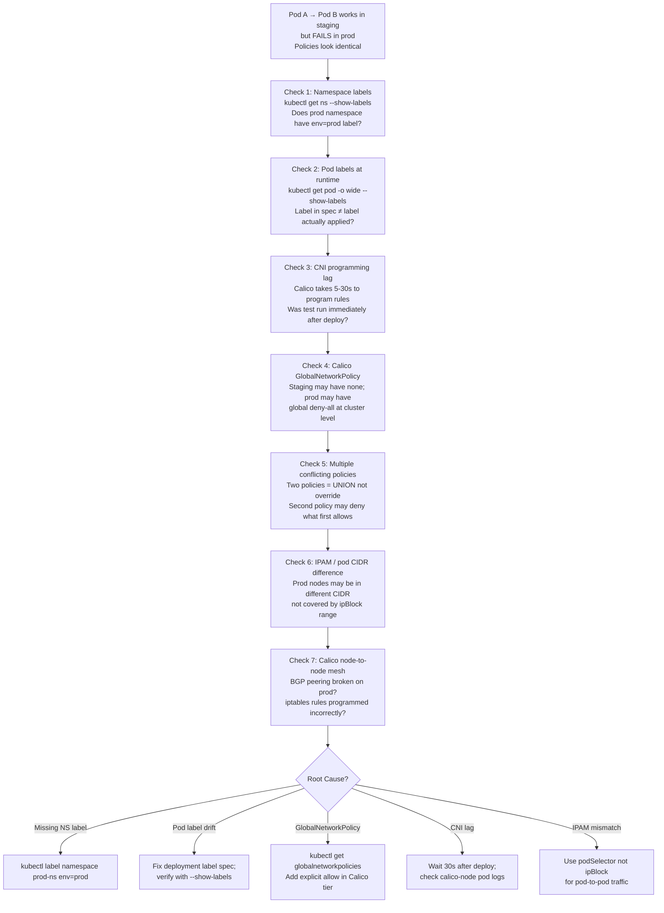

# 1. Staging Works, Prod Fails — NetworkPolicy Identical

**Difficulty**: ⭐⭐⭐  
**Topics**: Label resolution, namespace selectors, CNI state, RBAC, pod CIDR

---

## Problem

> Your NetworkPolicy is identical in staging and prod (copy-paste verified). Pod A can reach Pod B in staging but not in prod. Both clusters run Calico. Namespaces, labels, and pod CIDRs look identical. What are the 7 things you check first?

---

## The Trap

"Identical YAML" does not mean "identical runtime state." Kubernetes evaluates policies against **live label state**, **CNI-programmed rules**, and **cluster-level config** — all of which can silently differ.

---

## Workflow



---

## 7 Checks with Commands

### 1. Namespace labels (most common cause)
```bash
kubectl get ns --show-labels | grep -E 'staging|prod'
# If prod namespace missing label used in namespaceSelector → policy won't match
```

### 2. Pod labels at runtime
```bash
kubectl get pods -n prod -o wide --show-labels | grep pod-a
# Labels in manifest ≠ labels running (e.g., label removed by webhook)
```

### 3. Calico GlobalNetworkPolicy (prod-only deny)
```bash
kubectl get globalnetworkpolicies.crd.projectcalico.org -A
# Prod clusters often have a global deny-all not present in staging
```

### 4. Multiple policies — union logic
```bash
kubectl get networkpolicy -n prod
# If 2 policies exist: both are evaluated; a DENY in second wins
```

### 5. CNI programming lag
```bash
kubectl logs -n kube-system -l k8s-app=calico-node --tail=100 | grep -i error
# If calico-node crashing or slow: rules not yet programmed
```

### 6. Pod CIDR / ipBlock mismatch
```bash
kubectl cluster-info dump | grep -i cidr
az aks show -g <rg> -n <cluster> --query networkProfile.podCidr
# Prod pods in different subnet not covered by ipBlock in policy
```

### 7. Calico node BGP mesh
```bash
kubectl get bgppeers.crd.projectcalico.org
kubectl exec -n kube-system -l k8s-app=calico-node -- calicoctl node status
# If BGP session down: cross-node traffic fails even with correct policy
```

---

## Real Answer (Almost Always)

> The namespace in prod is **missing the label** used in `namespaceSelector`. Staging namespace was labelled manually; prod was not. The policy YAML is identical but the runtime state is not.

```yaml
# Policy uses this selector
namespaceSelector:
  matchLabels:
    env: prod   # ← This label MUST exist on the namespace object

# Fix:
kubectl label namespace prod-payments env=prod
```

---

## Key Takeaway

| Layer | What to Check |
|---|---|
| K8s labels | Namespace + pod labels match policy selectors |
| Calico global | No hidden global deny-all in prod |
| Policy union | Multiple policies = additive, not override |
| CNI state | calico-node healthy and rules programmed |
| IPAM | Pod CIDR covered by policy |
