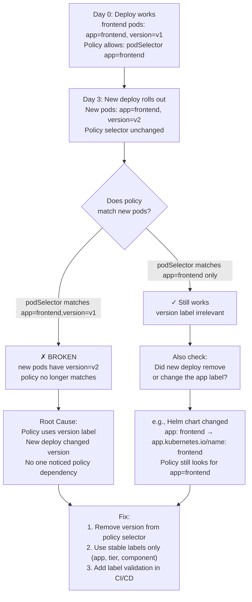

# 2. Silent Break After New Deploy — default-deny-all

**Difficulty**: ⭐⭐⭐  
**Topics**: Label drift, rolling deploy, NetworkPolicy evaluation timing

---

## Problem

> A `default-deny-all` is applied to namespace `payments`. You add an allow rule for `frontend → payments:8080`. Devs confirm it works. 3 days later, a new deploy breaks it silently — no policy changed. How and why?

---

## The Trap

Policies match **pods by label**. A new deploy creates **new pods**. If those new pods have **different labels** (even slightly), the allow rule no longer matches them.

---

## Workflow



---

## What Actually Changed

### Original pods (Day 0)
```bash
kubectl get pods -n frontend --show-labels
# NAME              LABELS
# frontend-abc123   app=frontend, version=v1, tier=web
```

### NetworkPolicy (Day 0)
```yaml
from:
- podSelector:
    matchLabels:
      app: frontend
      version: v1   # ← The trap: version is in the selector
```

### New pods (Day 3)
```bash
kubectl get pods -n frontend --show-labels
# NAME              LABELS
# frontend-xyz789   app=frontend, version=v2, tier=web
#                                  ^^^ changed by new deploy
```

**Result**: Policy selector `app=frontend, version=v1` no longer matches. Traffic silently denied.

---

## Other Silent Break Scenarios

### Scenario B: Helm chart changed label key
```yaml
# Old pods
labels:
  app: frontend

# New pods (Helm upgraded to use recommended labels)
labels:
  app.kubernetes.io/name: frontend  # ← different key!
```

### Scenario C: Namespace label removed by accident
```bash
# Someone ran:
kubectl label namespace frontend env-   # removes env label
# Policy uses namespaceSelector env=prod → now matches nothing
```

### Scenario D: New deploy added a new namespace
```bash
# Frontend was in namespace 'frontend'
# New microservice deployed to namespace 'frontend-v2'
# Policy only allows namespace 'frontend'
```

---

## Correct Policy — Use Stable Labels Only

```yaml
apiVersion: networking.k8s.io/v1
kind: NetworkPolicy
metadata:
  name: allow-frontend-to-payments
  namespace: payments
spec:
  podSelector:
    matchLabels:
      app: payments   # target pods
  ingress:
  - from:
    - namespaceSelector:
        matchLabels:
          team: frontend   # stable namespace label
      podSelector:
        matchLabels:
          app: frontend    # stable pod label — NO version!
    ports:
    - protocol: TCP
      port: 8080
```

---

## Prevention

```bash
# In CI/CD: verify policy selectors still match after deploy
kubectl get pods -n frontend --show-labels | grep app=frontend
kubectl get networkpolicy -n payments -o yaml | grep -A5 podSelector

# Alert: If pod count in a namespace drops to 0 unexpectedly
# Often means new pods don't match existing policies
```

---

## Key Takeaway

| Rule | Reason |
|---|---|
| Never use `version` in NetworkPolicy selectors | Changes every deploy |
| Never use `pod-template-hash` | Auto-generated; changes every rollout |
| Use `app`, `tier`, `component`, `team` | Stable across versions |
| Label namespaces, not just pods | Namespaces don't change often |
| Test policy match after every deploy | `kubectl get pods --show-labels` |
