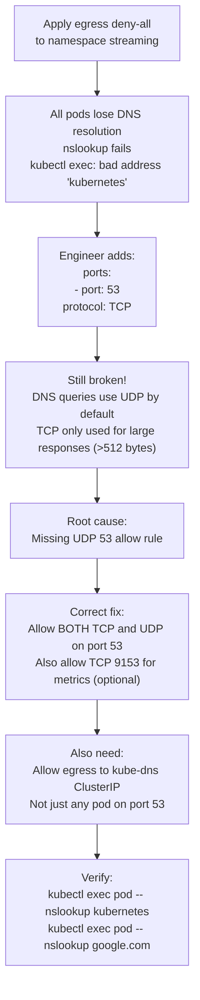

# 3. DNS Black Hole — Egress Deny-All Breaks DNS

**Difficulty**: ⭐⭐⭐⭐  
**Topics**: Egress policy, DNS, UDP vs TCP, kube-dns, CoreDNS

---

## Problem

> You apply a strict egress deny-all to namespace `streaming`. Pods can't resolve DNS anymore. You add an allow rule for port `53` to `kube-dns`. Still broken. Why — and what's the exact fix?

---

## The Trap

Most engineers only allow **TCP port 53**. DNS uses **UDP port 53** by default. Without explicitly allowing UDP, DNS remains broken.

---

## Workflow



---

## Wrong Fix (What Most People Write)

```yaml
egress:
- to:
  - namespaceSelector:
      matchLabels:
        kubernetes.io/metadata.name: kube-system
    podSelector:
      matchLabels:
        k8s-app: kube-dns
  ports:
  - protocol: TCP   # ← WRONG: DNS is UDP by default!
    port: 53
```

---

## Correct Fix

```yaml
apiVersion: networking.k8s.io/v1
kind: NetworkPolicy
metadata:
  name: allow-dns-egress
  namespace: streaming
spec:
  podSelector: {}   # applies to all pods in namespace
  policyTypes:
  - Egress
  egress:
  # Allow DNS — BOTH UDP and TCP required
  - to:
    - namespaceSelector:
        matchLabels:
          kubernetes.io/metadata.name: kube-system
      podSelector:
        matchLabels:
          k8s-app: kube-dns
    ports:
    - protocol: UDP   # ← Primary DNS protocol
      port: 53
    - protocol: TCP   # ← Fallback for large responses (DNSSEC, etc.)
      port: 53
  
  # Also allow access to kube-dns service IP directly
  - to:
    - ipBlock:
        cidr: 10.96.0.10/32   # ← Replace with your kube-dns ClusterIP
    ports:
    - protocol: UDP
      port: 53
    - protocol: TCP
      port: 53
```

---

## How to Find Your kube-dns ClusterIP

```bash
kubectl get svc -n kube-system kube-dns
# NAME       TYPE        CLUSTER-IP   PORT(S)
# kube-dns   ClusterIP   10.96.0.10   53/UDP,53/TCP,9153/TCP
```

---

## Full Egress Policy Template (Production-Safe)

```yaml
apiVersion: networking.k8s.io/v1
kind: NetworkPolicy
metadata:
  name: streaming-egress-policy
  namespace: streaming
spec:
  podSelector: {}
  policyTypes:
  - Egress
  egress:
  # 1. DNS (always required)
  - to:
    - namespaceSelector:
        matchLabels:
          kubernetes.io/metadata.name: kube-system
    ports:
    - protocol: UDP
      port: 53
    - protocol: TCP
      port: 53
  
  # 2. Allow to specific internal services
  - to:
    - namespaceSelector:
        matchLabels:
          team: platform
      podSelector:
        matchLabels:
          app: origin-cache
    ports:
    - protocol: TCP
      port: 8080
  
  # 3. Allow HTTPS to external CDN
  - to:
    - ipBlock:
        cidr: 0.0.0.0/0
        except:
        - 10.0.0.0/8       # block internal RFC1918
        - 172.16.0.0/12
        - 192.168.0.0/16
    ports:
    - protocol: TCP
      port: 443
```

---

## Verification Steps

```bash
# 1. Check DNS resolves
kubectl exec -n streaming <pod> -- nslookup kubernetes.default.svc.cluster.local

# 2. Check external DNS
kubectl exec -n streaming <pod> -- nslookup google.com

# 3. Check what DNS server is being used
kubectl exec -n streaming <pod> -- cat /etc/resolv.conf
# Should show: nameserver 10.96.0.10 (kube-dns ClusterIP)

# 4. Trace which policies apply
kubectl get networkpolicy -n streaming -o yaml | grep -A 20 egress
```

---

## Key Takeaway

| Protocol | Port | When Used |
|---|---|---|
| UDP | 53 | **Default** — all normal DNS queries |
| TCP | 53 | Large DNS responses (>512 bytes), DNSSEC, zone transfers |

> **Rule**: Always allow **both** UDP/53 and TCP/53 in egress policies. Forgetting UDP is the #1 DNS-related NetworkPolicy mistake.
