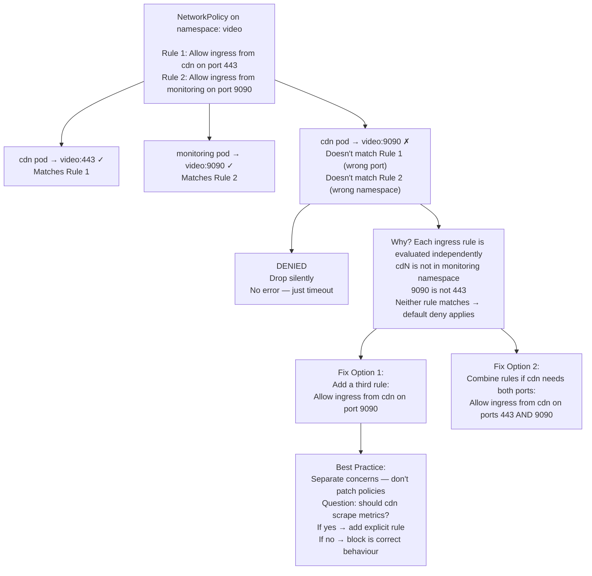

# 4. Partial Allow Paradox — Port Isolation Per Namespace

**Difficulty**: ⭐⭐⭐⭐  
**Topics**: Policy union logic, port-level isolation, ingress rules

---

## Problem

> You allow ingress from namespace `cdn` on port `443` and from namespace `monitoring` on port `9090`. A pod in `cdn` tries to scrape metrics on port `9090`. It fails. No policy changes were made. Explain exactly why.

---

## The Trap

Each `from` block in a NetworkPolicy is **independently scoped**. A pod in `cdn` is only allowed on port `443`. Port `9090` is only open to `monitoring`. There is **no cross-permission** between the two rules.

---

## Workflow



---

## The Policy That Causes This

```yaml
apiVersion: networking.k8s.io/v1
kind: NetworkPolicy
metadata:
  name: video-ingress
  namespace: video
spec:
  podSelector: {}
  ingress:
  # Rule 1: cdn can reach port 443
  - from:
    - namespaceSelector:
        matchLabels:
          team: cdn
    ports:
    - protocol: TCP
      port: 443

  # Rule 2: monitoring can reach port 9090
  - from:
    - namespaceSelector:
        matchLabels:
          team: monitoring
    ports:
    - protocol: TCP
      port: 9090
```

**cdn pod → port 9090**: doesn't match Rule 1 (wrong port), doesn't match Rule 2 (wrong namespace) → **DENIED**.

---

## Fix: Add Explicit Rule for cdn + 9090

```yaml
  # Rule 3: cdn can also reach metrics port
  - from:
    - namespaceSelector:
        matchLabels:
          team: cdn
    ports:
    - protocol: TCP
      port: 9090
```

---

## Fix: Combine cdn Rules (Cleaner)

```yaml
  # cdn can reach both ports
  - from:
    - namespaceSelector:
        matchLabels:
          team: cdn
    ports:
    - protocol: TCP
      port: 443
    - protocol: TCP
      port: 9090
```

---

## Advanced: AND vs OR Logic — The Real Trap Within This

```yaml
# This means: pods that are (in namespace cdn) AND (have label role=edge)
from:
- namespaceSelector:
    matchLabels:
      team: cdn
  podSelector:
    matchLabels:
      role: edge

# This means: pods that are (in namespace cdn) OR (have label role=edge in any namespace)
from:
- namespaceSelector:
    matchLabels:
      team: cdn
- podSelector:
    matchLabels:
      role: edge
```

> **One dash = AND. Two dashes = OR.**  
> This is the most commonly misunderstood YAML structure in NetworkPolicy.

---

## Key Takeaway

| Concept | Behaviour |
|---|---|
| Multiple `ingress` blocks | Each is independently evaluated (OR between blocks) |
| `from` + `ports` in same block | BOTH must match (AND logic within a block) |
| Different namespace + different port | Need a separate rule — no cross-permission |
| `namespaceSelector` + `podSelector` same dash | AND logic |
| `namespaceSelector` + `podSelector` separate dashes | OR logic |
