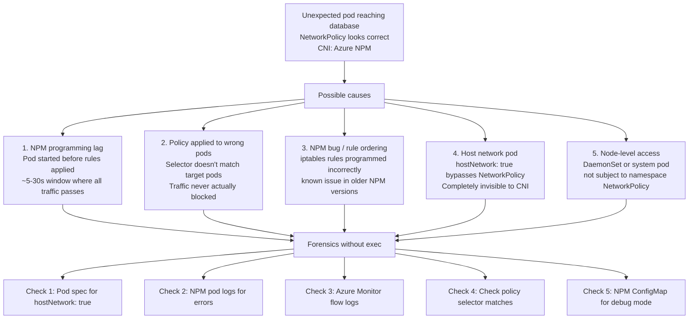
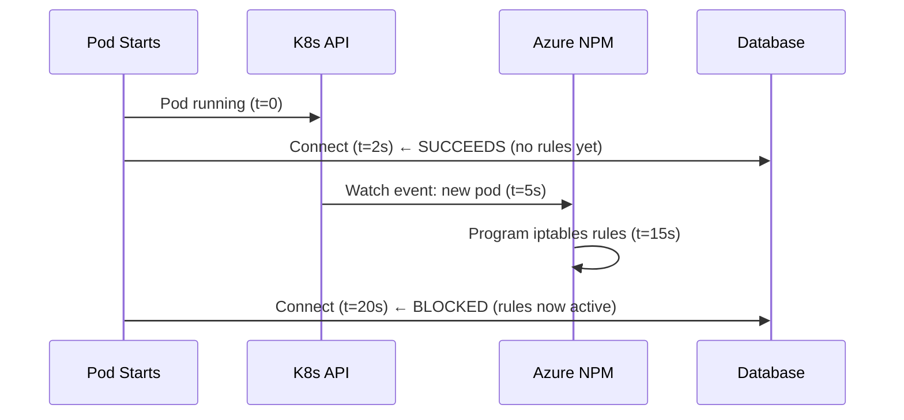
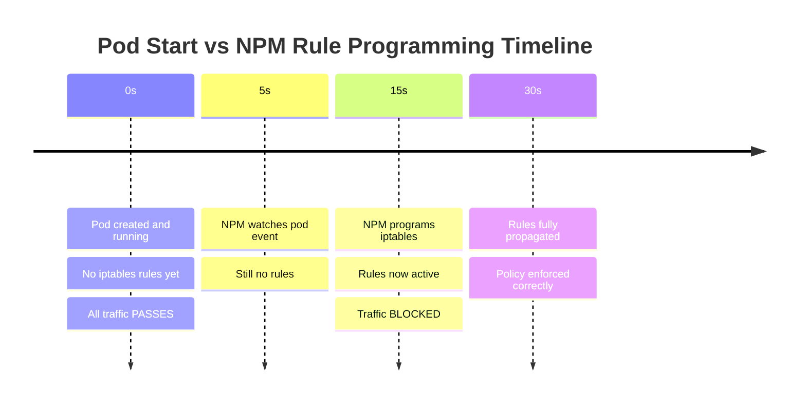

# 5. Ghost Traffic — Unexpected Pod Reaches Database

**Difficulty**: ⭐⭐⭐⭐⭐  
**Topics**: Azure NPM, CNI programming lag, policy enforcement timing, forensics without exec

---

## Problem

> Your NetworkPolicy shows all rules are correct. But traffic from an unexpected pod is reaching your database. CNI is Azure NPM. How is this possible — and how do you prove it forensically without exec access?

---

## The Trap

Azure NPM (Network Policy Manager) programs iptables rules **asynchronously**. There is a **window between when a pod starts and when rules are programmed** — traffic can pass through during this window. Also, NPM bugs and rule ordering can cause policy bypass.

---

## Workflow



---

## 5 Causes and How to Prove Each (No Exec)

### Cause 1: NPM Programming Lag Window

```bash
# Check when pod started vs when NPM programmed rules
kubectl describe pod <unexpected-pod> | grep "Started:"
kubectl logs -n kube-system -l app=azure-npm --tail=500 | grep "programming\|applied\|error"

# NPM takes 5-30 seconds after pod creation to apply rules
# If pod connected in first 30s: this is your window
```



### Cause 2: Policy Selector Doesn't Actually Match

```bash
# Verify policy selector matches your DB pods
kubectl get pod -n database --show-labels
# Look for: app=postgres (or whatever your policy targets)

kubectl get networkpolicy -n database -o yaml | grep -A5 podSelector
# If podSelector is {} → applies to ALL pods in namespace
# If podSelector has labels → ONLY those pods

# Common trap: Policy on namespace A doesn't protect namespace B
kubectl get networkpolicy -A | grep -i database
```

### Cause 3: hostNetwork Pod Bypasses Policy

```bash
# Check if unexpected pod uses host network
kubectl get pod <pod-name> -o yaml | grep hostNetwork
# If hostNetwork: true → pod uses node IP, not pod IP
# NetworkPolicy only applies to pod-network traffic, not host-network
```

### Cause 4: NPM Bug — Check Version and Logs

```bash
# Check NPM version
kubectl get pods -n kube-system -l app=azure-npm -o yaml | grep image

# Check NPM errors
kubectl logs -n kube-system -l app=azure-npm --tail=200 | grep -iE "error|fail|panic"

# Check NPM telemetry (if enabled)
kubectl get configmap -n kube-system azure-npm-config -o yaml
```

### Cause 5: Azure Monitor — Prove Traffic Forensically

```bash
# Enable NSG flow logs on AKS node subnet (Portal)
# Azure Portal → Network Watcher → NSG Flow Logs
# Then query:
az monitor log-analytics query \
  --workspace <workspace-id> \
  --analytics-query "AzureNetworkAnalytics_CL
    | where SubType_s == 'FlowLog'
    | where SrcIP_s == '<unexpected-pod-ip>'
    | where DestIP_s == '<database-pod-ip>'
    | where DestPort_d == 5432
    | project TimeGenerated, SrcIP_s, DestIP_s, FlowStatus_s"
```

---

## The NPM Programming Race — Visual



> If your unexpected pod connected at `t < 15s` → it got in through the lag window.

---

## Fix: Close the Lag Window

```yaml
# Add readiness gate: pod only accepts traffic after NPM rules applied
spec:
  readinessGates:
  - conditionType: "azure.com/network-policy-ready"

# Or: Use init container to delay traffic acceptance
initContainers:
- name: wait-for-policy
  image: busybox
  command: ['sh', '-c', 'sleep 30']  # Wait for NPM to program rules
```

---

## Key Takeaway

| Cause | Forensic Signal | Fix |
|---|---|---|
| NPM lag | Pod connected in first 30s | Readiness gate / init delay |
| Wrong selector | Policy labels don't match pod | Fix podSelector |
| hostNetwork pod | `hostNetwork: true` in spec | Separate NSG rule for this pod |
| NPM bug | Errors in NPM pod logs | Upgrade NPM / AKS version |
| No flow logs | Can't see traffic | Enable NSG flow logs |
