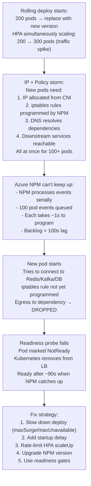
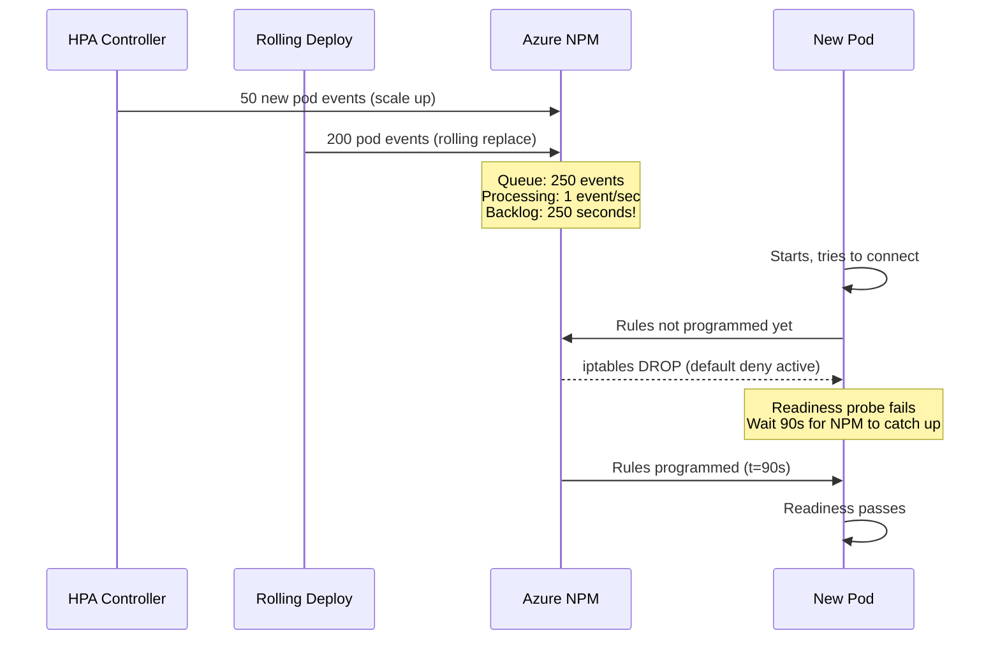
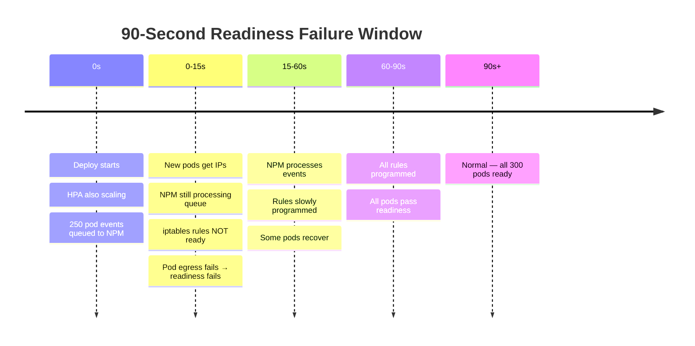

# 6. Rolling Deploy — 90-Second Readiness Failure Window

**Difficulty**: ⭐⭐⭐⭐⭐  
**Topics**: CNI IP allocation, NPM programming race, HPA + rolling deploy interaction

---

## Problem

> During a rolling deploy of 200 pods, ~15% fail readiness for 90 seconds before recovering. No app changes. NetworkPolicy unchanged. HPA is scaling simultaneously. What's causing the 90s window?

---

## The Trap

When HPA scales AND a rolling deploy happens simultaneously, the CNI (especially Azure NPM or Calico) can't keep up with IP allocation + policy programming at the rate pods are being created. New pods get IPs but **NetworkPolicy rules aren't programmed yet** — dependency calls (DNS, downstream services) time out → readiness probe fails.

---

## Workflow



---

## Root Cause: NPM Event Queue Saturation



---

## Fix 1: Slow Down Rolling Deploy

```yaml
apiVersion: apps/v1
kind: Deployment
metadata:
  name: fanout-service
spec:
  strategy:
    type: RollingUpdate
    rollingUpdate:
      maxSurge: 10        # Only 10 new pods at a time (was 50)
      maxUnavailable: 5   # Only 5 pods down at a time
  # Result: NPM only gets 10-15 events per batch
  # Processes in < 15s; pods ready quickly
```

---

## Fix 2: Add Startup Delay (Init Container)

```yaml
spec:
  initContainers:
  - name: wait-for-cni
    image: busybox:1.35
    command:
    - sh
    - -c
    - |
      echo "Waiting for CNI policy programming..."
      sleep 15
      echo "Checking DNS..."
      until nslookup redis-service.default.svc.cluster.local; do
        echo "DNS not ready yet, waiting..."
        sleep 2
      done
      echo "Network ready"
  containers:
  - name: fanout
    ...
    readinessProbe:
      httpGet:
        path: /ready
        port: 8080
      initialDelaySeconds: 5  # Give app time after init container
```

---

## Fix 3: Rate-Limit HPA Scale-Up During Deploys

```yaml
apiVersion: autoscaling/v2
kind: HorizontalPodAutoscaler
metadata:
  name: fanout-hpa
spec:
  behavior:
    scaleUp:
      stabilizationWindowSeconds: 60
      policies:
      - type: Pods
        value: 10        # Max 10 pods per cycle during normal operation
        periodSeconds: 30
      # During deploy: HPA won't fight the rolling deploy
      selectPolicy: Min  # Most conservative policy
    scaleDown:
      stabilizationWindowSeconds: 300
```

---

## Fix 4: Use Readiness Gates (Long-Term)

```yaml
spec:
  readinessGates:
  - conditionType: "networking.azure.com/policy-ready"
  # Pod won't become Ready until CNI signals policy is programmed
  # Requires Azure NPM v1.4+ or custom webhook
```

---

## Monitoring: Detect This Before It Happens

```yaml
apiVersion: monitoring.coreos.com/v1
kind: PrometheusRule
metadata:
  name: deploy-readiness-lag
spec:
  groups:
  - name: deploy
    rules:
    - alert: HighReadinessFailureDuringDeploy
      expr: |
        rate(kubelet_probe_failure_total{probe_type="readiness"}[2m]) > 5
        and on()
        rate(kube_pod_container_status_restarts_total[2m]) > 0
      for: 1m
      annotations:
        summary: "Readiness failures spiking during deploy — possible CNI lag"
        action: "Check NPM queue depth; slow down rolling deploy"
    
    - alert: NPMQueueDepthHigh
      expr: |
        npm_controller_work_queue_depth > 50
      for: 30s
      annotations:
        summary: "NPM queue > 50 events; policy programming lagging"
        action: "Reduce pod creation rate; HPA + deploy overlap"
```

---

## Summary of Timeline



---

## Key Takeaway

| Cause | Signal | Fix |
|---|---|---|
| NPM event queue saturation | 90s readiness window, NPM logs show backlog | Reduce `maxSurge` |
| HPA + deploy overlap | Both creating pods simultaneously | Rate-limit HPA during deploys |
| No startup delay | Pod connects before rules active | Init container with delay |
| No readiness gates | App marks ready before network ready | Readiness gate on NetworkPolicy |
