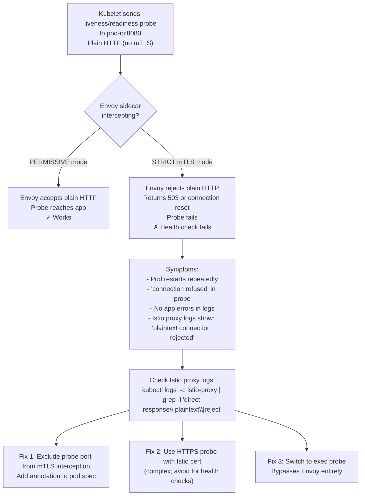
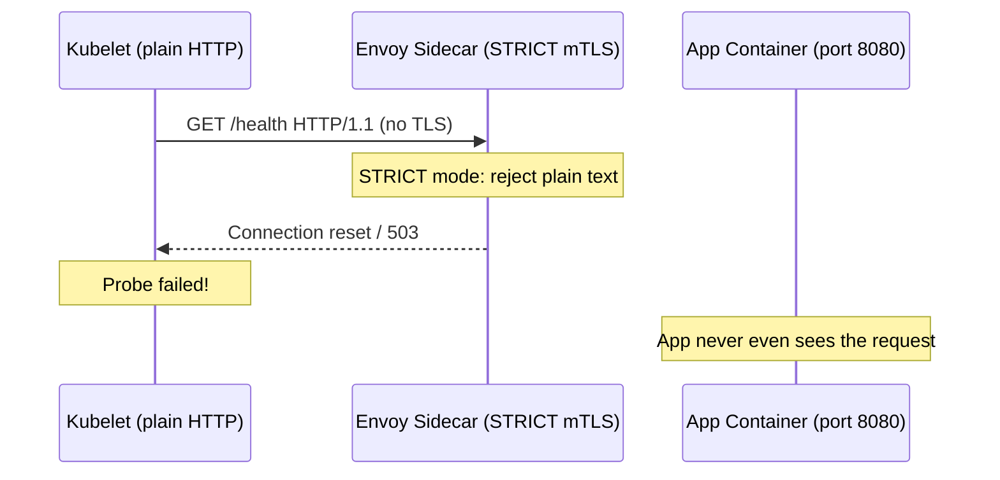

# 7. Istio mTLS + NetworkPolicy Port Conflict

**Difficulty**: ⭐⭐⭐⭐⭐  
**Topics**: Istio STRICT mTLS, Envoy sidecar interception, NetworkPolicy port isolation, dual-layer policy

---

## Problem

> You run Istio with `PeerAuthentication` set to `STRICT` mTLS in namespace `payments`. You also have a NetworkPolicy allowing ingress only on port `8080`. A service mesh health check starts failing. No config changed. Explain the port conflict.

---

## The Trap

Envoy sidecar intercepts traffic on port `15006` (inbound) and `15001` (outbound). The kubelet sends health checks **directly to the pod IP**, bypassing Envoy. But in `STRICT` mTLS mode, Envoy **rejects plain-text connections** from the kubelet. The NetworkPolicy allows port `8080` but the conflict is at the **Envoy/mTLS layer**, not the NetworkPolicy layer.

---

## Workflow



---

## The Architecture Problem Visualised



---

## Fix 1: Exclude Probe Port from mTLS (Recommended)

```yaml
apiVersion: apps/v1
kind: Deployment
metadata:
  name: payments-service
spec:
  template:
    metadata:
      annotations:
        # Tell Envoy NOT to intercept traffic on port 8080 from kubelet
        traffic.sidecar.istio.io/excludeInboundPorts: "8080"
        # Or: exclude specific kubelet IP range
        # traffic.sidecar.istio.io/excludeInboundIPRanges: "169.254.169.254/32"
    spec:
      containers:
      - name: payments
        livenessProbe:
          httpGet:
            path: /health
            port: 8080
        readinessProbe:
          httpGet:
            path: /ready
            port: 8080
```

---

## Fix 2: Use a Separate Health Port (Best Practice)

```yaml
spec:
  containers:
  - name: payments
    ports:
    - containerPort: 8080
      name: http-app        # mTLS enforced by Istio
    - containerPort: 8081
      name: http-health     # health-only port, excluded from mTLS

    livenessProbe:
      httpGet:
        path: /health
        port: 8081           # Direct to app, no Envoy interception

    readinessProbe:
      httpGet:
        path: /ready
        port: 8081
```

```yaml
# Exclude health port from Envoy interception
metadata:
  annotations:
    traffic.sidecar.istio.io/excludeInboundPorts: "8081"
```

---

## Fix 3: Switch to exec Probe (Avoids Envoy Entirely)

```yaml
livenessProbe:
  exec:
    command:
    - /bin/sh
    - -c
    - curl -sf http://localhost:8080/health   # localhost bypasses Envoy
  initialDelaySeconds: 10
  periodSeconds: 10
```

> `localhost` connections within a pod are **not intercepted** by Envoy sidecar in most Istio configurations.

---

## NetworkPolicy Layer — Must Allow Envoy Ports Too

```yaml
apiVersion: networking.k8s.io/v1
kind: NetworkPolicy
metadata:
  name: payments-ingress
  namespace: payments
spec:
  podSelector:
    matchLabels:
      app: payments
  ingress:
  # App traffic (via Envoy/mTLS)
  - from:
    - namespaceSelector:
        matchLabels:
          istio-injection: enabled
    ports:
    - protocol: TCP
      port: 8080

  # Istio control plane communication
  - from:
    - namespaceSelector:
        matchLabels:
          kubernetes.io/metadata.name: istio-system
    ports:
    - protocol: TCP
      port: 15010   # Istio Pilot gRPC (plaintext)
    - protocol: TCP
      port: 15012   # Istio Pilot gRPC (mTLS)
    - protocol: TCP
      port: 15014   # Istiod monitoring
    - protocol: TCP
      port: 15017   # Webhook

  # Prometheus scraping Istio metrics
  - from:
    - namespaceSelector:
        matchLabels:
          team: monitoring
    ports:
    - protocol: TCP
      port: 15020   # Envoy merged Prometheus metrics
    - protocol: TCP
      port: 15090   # Envoy admin metrics
```

---

## Istio-Relevant Ports Reference

| Port | Component | Purpose |
|---|---|---|
| `15001` | Envoy | Outbound traffic capture |
| `15006` | Envoy | Inbound traffic capture |
| `15020` | Envoy | Prometheus metrics (merged) |
| `15090` | Envoy | Prometheus metrics (raw) |
| `15010` | Istiod | xDS gRPC (plaintext) |
| `15012` | Istiod | xDS gRPC (mTLS) |
| `15014` | Istiod | Control plane monitoring |
| `15021` | Envoy | Health check port |

---

## Key Takeaway

| Layer | Issue | Fix |
|---|---|---|
| Istio mTLS STRICT | Rejects kubelet plain-HTTP probes | Exclude probe port from interception |
| NetworkPolicy | Only allows port 8080 | Also allow Istio control plane ports |
| Probe type | httpGet → hits Envoy | Use exec + localhost or separate health port |
| Diagnosis | Check istio-proxy container logs | `grep -i "plaintext\|reject\|direct response"` |
