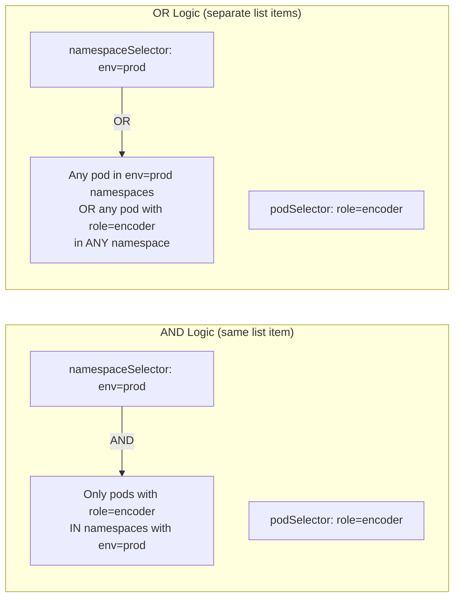
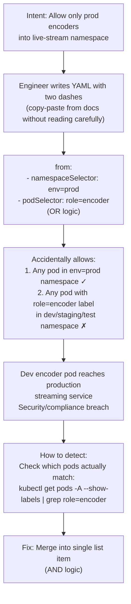

# 8. Cross-Namespace Label Collision — AND vs OR Selector Logic

**Difficulty**: ⭐⭐⭐⭐⭐  
**Topics**: NetworkPolicy YAML structure, AND vs OR logic, namespaceSelector, podSelector

---

## Problem

> You write a policy using `namespaceSelector + podSelector` under a single `from` block. It accidentally allows traffic from an unintended namespace. Why — and what is the precise YAML fix?

---

## The Trap

In Kubernetes NetworkPolicy YAML, **indentation and list structure** determine whether selectors are combined with AND or OR logic. One extra `-` (list item) completely changes the semantics.

---

## The AND vs OR Visual



---

## The Two YAML Forms

### Form A: AND Logic (what you probably want)

```yaml
ingress:
- from:
  - namespaceSelector:        # ← one list item (one dash)
      matchLabels:
        env: prod
    podSelector:              # ← same list item (no dash = AND)
      matchLabels:
        role: encoder
```

**Meaning**: Allow pods that are **BOTH** in a namespace with `env=prod` **AND** have label `role=encoder`.

---

### Form B: OR Logic (accidentally too permissive)

```yaml
ingress:
- from:
  - namespaceSelector:        # ← first list item
      matchLabels:
        env: prod
  - podSelector:              # ← second list item (new dash = OR)
      matchLabels:
        role: encoder
```

**Meaning**: Allow pods that are in a namespace with `env=prod` **OR** any pod with label `role=encoder` **in any namespace** — including `dev`, `staging`, `test`.

---

## Workflow: How the Accident Happens



---

## Proof: How to Check Which Pods Are Allowed

```bash
# Find ALL pods with role=encoder (reveals OR logic impact)
kubectl get pods -A -l role=encoder --show-labels

# NAME                    NAMESPACE    LABELS
# encoder-prod-abc        prod         role=encoder, env=prod
# encoder-staging-xyz     staging      role=encoder, env=staging  ← shouldn't be allowed!
# encoder-dev-123         dev          role=encoder, env=dev       ← shouldn't be allowed!

# If you used OR logic: all 3 would be allowed into your production namespace
# If you used AND logic: only encoder-prod-abc would be allowed
```

---

## Full Correct Policy

```yaml
apiVersion: networking.k8s.io/v1
kind: NetworkPolicy
metadata:
  name: allow-prod-encoders-only
  namespace: live-stream
spec:
  podSelector:
    matchLabels:
      app: live-stream
  ingress:
  # AND logic: pod must be in prod namespace AND have role=encoder
  - from:
    - namespaceSelector:          # ← one dash
        matchLabels:
          env: prod
      podSelector:                # ← no dash (same list item = AND)
        matchLabels:
          role: encoder
    ports:
    - protocol: TCP
      port: 8080
```

---

## Side-by-Side Comparison

```yaml
# ✗ WRONG — OR logic (too permissive)
from:
- namespaceSelector:
    matchLabels:
      env: prod
- podSelector:          # ← NEW DASH = new list item = OR
    matchLabels:
      role: encoder

# ✓ CORRECT — AND logic (intended)
from:
- namespaceSelector:
    matchLabels:
      env: prod
  podSelector:          # ← NO DASH = same list item = AND
    matchLabels:
      role: encoder
```

---

## Mnemonic to Remember

> **Same dash level = AND**  
> **New dash = new rule = OR**

Or visually:
```
from:
- nsSelector   )
  podSelector  )  ← together under one dash = AND (intersection)

from:
- nsSelector   ← standalone = first condition
- podSelector  ← standalone = second condition = OR (union)
```

---

## Key Takeaway

| YAML Structure | Logic | Effect |
|---|---|---|
| `namespaceSelector` + `podSelector` under **same** `-` | AND | Only pods matching BOTH criteria |
| `namespaceSelector` + `podSelector` as **separate** `-` items | OR | Pods matching EITHER criteria |
| Most common mistake | OR when AND intended | Over-permissive; allows unintended namespaces |
| Verification | `kubectl get pods -A -l <label>` | See all pods that would be allowed |
