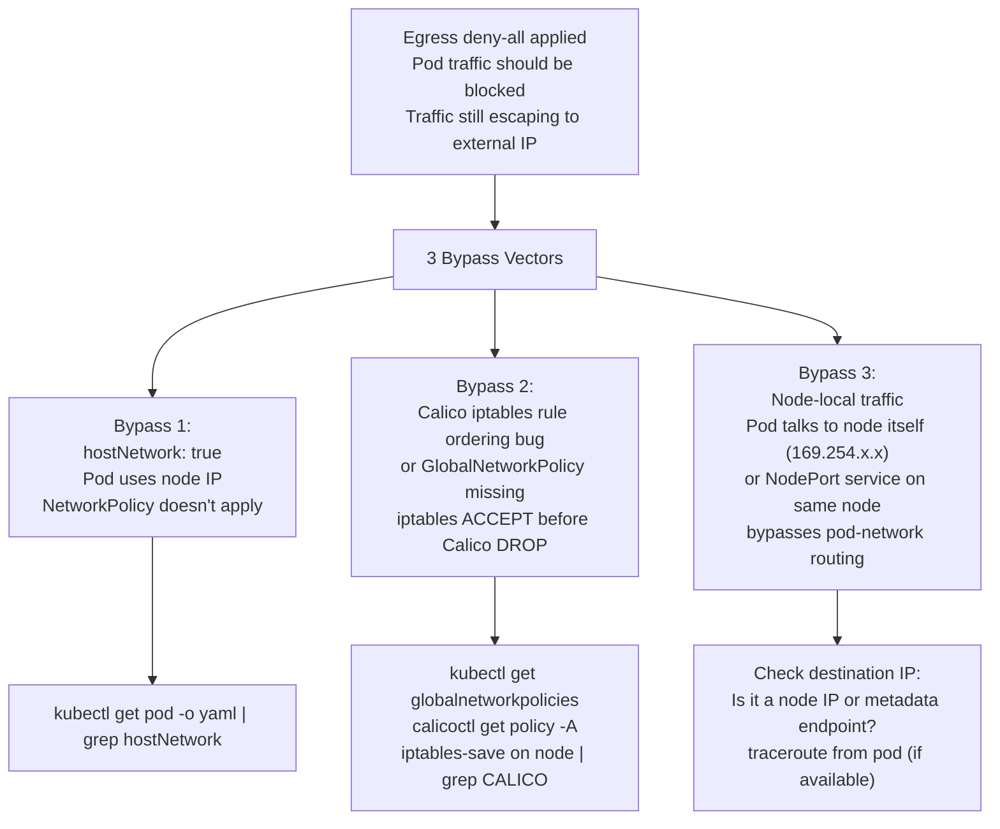
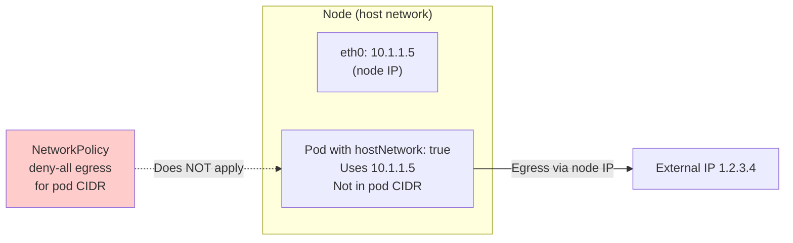
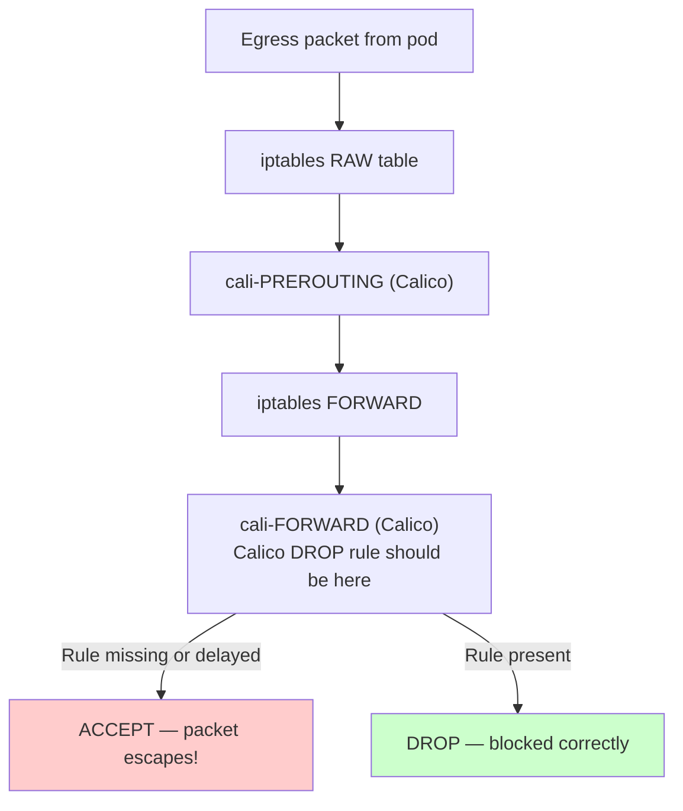
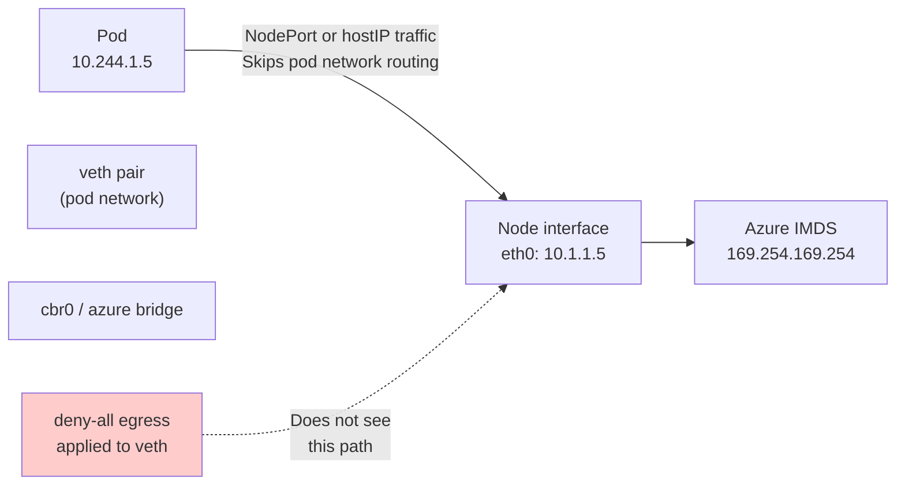

# 9. Silent Egress Escape — Deny-All Not Working

**Difficulty**: ⭐⭐⭐⭐⭐  
**Topics**: Egress policy bypass, hostNetwork, Calico node, iptables order, DaemonSet

---

## Problem

> You apply a `deny-all` egress policy. Your team swears traffic is still leaving the pod to an external IP. You verify the policy is applied. CNI is Calico. How is egress traffic still escaping — name 3 possible reasons.

---

## The Trap

Kubernetes NetworkPolicy only controls **pod-network traffic**. Several bypass vectors exist at the node, host, and CNI levels.

---

## Workflow



---

## Bypass 1: hostNetwork Pod

```bash
# Check if pod uses host network
kubectl get pod <pod-name> -o yaml | grep -i hostNetwork

# If hostNetwork: true:
# Pod shares the NODE's network namespace
# Uses NODE's IP, not pod IP
# NetworkPolicy doesn't apply — it only controls pod-network interfaces
```



**Fix**: Don't use `hostNetwork: true` unless absolutely necessary. Use NSG/firewall rules to control host-network pods.

---

## Bypass 2: Calico iptables Rule Ordering / Missing GlobalNetworkPolicy

```bash
# Check if Calico has a GlobalNetworkPolicy
kubectl get globalnetworkpolicies.crd.projectcalico.org -A
# If empty: no global deny; namespace policy may not be enforced at calico tier

# Check iptables order on node (requires node access or debug pod)
# iptables-save | grep -E 'CALICO|cali-' | head -50

# Check if Calico felix is programming rules correctly
kubectl logs -n kube-system -l k8s-app=calico-node -c calico-node --tail=200 | grep -iE "error|program|deny"
```



**Root cause**: Calico programs rules asynchronously. If Felix (Calico agent) crashes or lags, rules are missing and traffic passes through `ACCEPT` by default.

```bash
# Check Calico Felix status
kubectl get pods -n kube-system -l k8s-app=calico-node
kubectl describe pod -n kube-system -l k8s-app=calico-node | grep -A5 "calico-node"

# If Felix crashed/restarting: policy temporarily not enforced
```

---

## Bypass 3: Node-Local Traffic Bypassing Pod Network

```bash
# Traffic to 169.254.169.254 (Azure IMDS) or node IPs
# goes through the NODE's routing table, not pod network
# NetworkPolicy only applies to pod-network (veth) traffic

# Check destination of escaping traffic
kubectl exec <pod> -- cat /proc/net/tcp6  # active connections
kubectl exec <pod> -- ss -tnp             # if available
```



**Fix**: Block IMDS/NodePort traffic at NSG level in addition to NetworkPolicy.

---

## Comprehensive Forensic Checklist (No Exec)

```bash
# 1. Verify policy is actually applied
kubectl get networkpolicy -n <namespace> -o yaml

# 2. Verify pod is NOT using hostNetwork
kubectl get pod <pod> -o jsonpath='{.spec.hostNetwork}'

# 3. Check Calico node health
kubectl get pods -n kube-system -l k8s-app=calico-node
kubectl describe pod -n kube-system -l k8s-app=calico-node | grep -E "Ready|Error|OOM"

# 4. Check Calico Felix logs
kubectl logs -n kube-system -l k8s-app=calico-node -c calico-node --tail=300 | \
  grep -iE "error|fail|policy|deny"

# 5. Check GlobalNetworkPolicy existence
kubectl get globalnetworkpolicies.crd.projectcalico.org -A 2>/dev/null || echo "No CRD"

# 6. Use Azure Monitor to see actual traffic (no exec needed)
az monitor log-analytics query \
  --workspace <ws-id> \
  --analytics-query "AzureNetworkAnalytics_CL
    | where SrcIP_s == '<pod-ip>'
    | where FlowStatus_s == 'A'  // Allowed
    | project TimeGenerated, SrcIP_s, DestIP_s, DestPort_d"
```

---

## Key Takeaway

| Bypass Vector | Why Policy Doesn't Apply | Fix |
|---|---|---|
| `hostNetwork: true` | Pod uses node IP, not pod CIDR | Remove hostNetwork; use NSG for host pods |
| Calico Felix crash/lag | Rules temporarily unprogrammed | Monitor Felix health; alert on crashes |
| Node-local / IMDS traffic | Bypasses veth routing | NSG rules to block at node level |
| Missing GlobalNetworkPolicy | Namespace policy alone insufficient | Add Calico GlobalNetworkPolicy default-deny |

> **Rule**: NetworkPolicy controls pod-network traffic only. For anything at the node level, use NSG + Calico GlobalNetworkPolicy.
