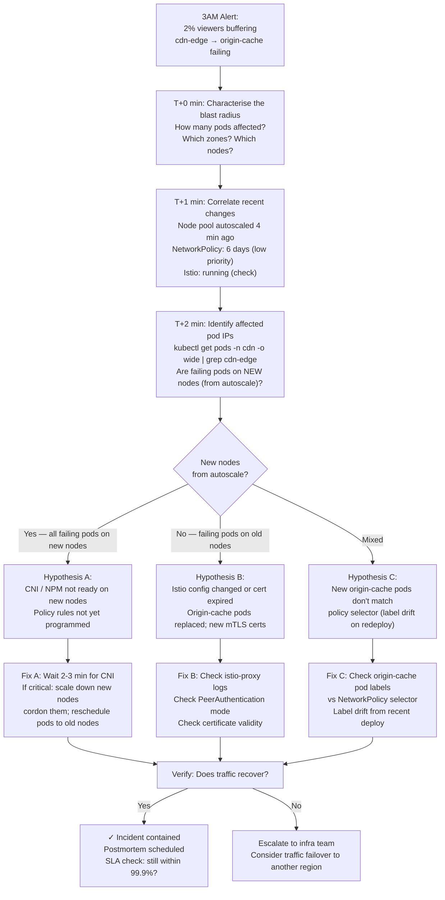
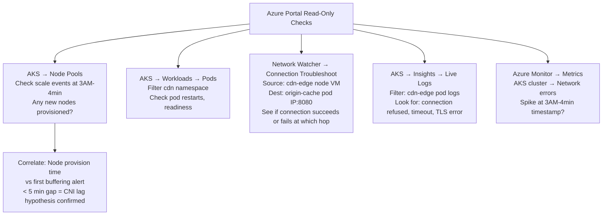
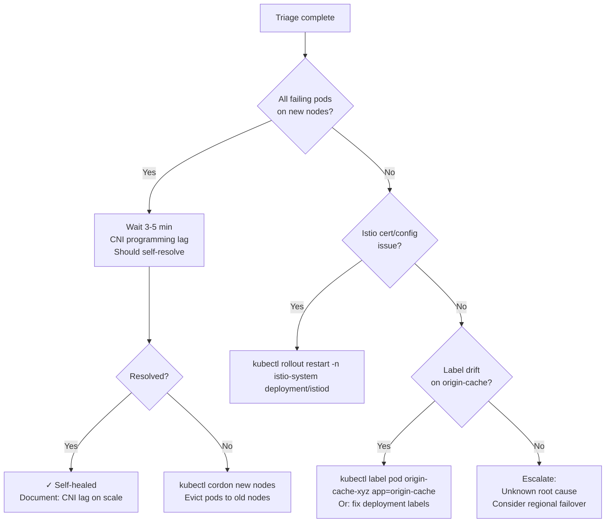

# 10. IPL Final 3AM — cdn-edge Can't Reach origin-cache

**Difficulty**: ⭐⭐⭐⭐⭐  
**Topics**: Incident response, read-only triage, Istio + NetworkPolicy, autoscaler + CNI race, rollback

---

## Problem

> During an IPL final at 3AM, 2% of viewers start buffering. You trace it to `cdn-edge` pods unable to reach `origin-cache` pods. NetworkPolicy was last changed 6 days ago. Node pool autoscaled 4 minutes ago. Istio is running. You have **read-only access**. Give your exact triage runbook in order.

---

## Triage Philosophy

> "Correlate the **most recent change** with the **earliest symptom timestamp**. Node pool autoscaled 4 min ago = #1 suspect. Six-day-old policy = low probability. Istio = always suspect when new pods appear."

---

## Complete Triage Workflow



---

## Exact Command Runbook (Read-Only)

### Step 1: Characterise (T+0 to T+2 min)

```bash
# How many pods are failing?
kubectl get pods -n cdn -o wide | grep -v Running
kubectl get pods -n origin-cache -o wide

# Are failing pods on new nodes (autoscaled 4 min ago)?
kubectl get nodes --sort-by=.metadata.creationTimestamp | tail -10
# Check timestamp — any nodes created ~4 min ago?

# Get IP of affected pods
kubectl get pods -n cdn -l app=cdn-edge -o wide | awk '{print $6, $7}'
# Cross-reference: are these IPs on new nodes?
```

### Step 2: Correlate Recent Changes (T+2 to T+4 min)

```bash
# Check recent events across cluster
kubectl get events -A --sort-by='.lastTimestamp' | tail -50 | grep -iE "scale|node|network|policy"

# Check if new origin-cache pods were created recently
kubectl get pods -n origin-cache --sort-by=.metadata.creationTimestamp | tail -10

# Check NetworkPolicy (6 days ago — verify nothing changed)
kubectl get networkpolicy -n origin-cache -o yaml | grep -A5 "annotations\|lastApplied"

# Check Istio config
kubectl get peerauthentication -A
kubectl get destinationrule -A
kubectl get virtualservice -A | grep origin-cache
```

### Step 3: Test Connectivity Without Exec

```bash
# Deploy a temporary debug pod in cdn namespace (if allowed)
kubectl run debug-cdn --image=nicolaka/netshoot -n cdn --restart=Never \
  -- sleep 300
# Then test: kubectl exec debug-cdn -n cdn -- curl -v http://origin-cache-svc:8080/health

# Without exec: use Azure Network Watcher
# Portal → Network Watcher → Connection Troubleshoot
# Source: AKS node VM of cdn-edge pod
# Destination: origin-cache pod IP
# Port: 8080
```

### Step 4: Check CNI/NPM State

```bash
# Check Azure NPM health
kubectl get pods -n kube-system -l app=azure-npm
kubectl logs -n kube-system -l app=azure-npm --tail=200 | grep -iE "error|queue|delay|fail"

# Check if NPM queue is backed up (new nodes = lots of events)
kubectl logs -n kube-system -l app=azure-npm --tail=500 | grep "queue depth\|processing"
```

### Step 5: Check Istio (High-Value Check)

```bash
# Are origin-cache pods getting new Istio certs after redeploy?
kubectl get pods -n origin-cache -o yaml | grep -A5 "istio"

# Check Istio proxy status on affected pods
kubectl get pod -n cdn -l app=cdn-edge -o yaml | grep -A3 "istio-proxy"

# Check PeerAuthentication mode
kubectl get peerauthentication -n origin-cache -o yaml
# If STRICT: origin-cache only accepts mTLS
# cdn-edge must have Envoy sidecar injected

# Check if Istio control plane is healthy
kubectl get pods -n istio-system
kubectl get pods -n istio-system | grep -v Running
```

---

## Azure Portal Checks (No CLI)



---

## Decision Tree: To Rollback or Not



---

## SLA Calculation

$$\text{Downtime so far} = \text{Detection time} + \text{Triage time}$$

$$\text{99.9\% SLA budget (monthly)} = 43.2 \text{ min}$$

$$\text{If resolution in } < 10 \text{ min} \Rightarrow \text{SLA preserved}$$

> At 3AM with a 10-minute triage-to-fix, you'll use ~10 min of your 43.2 min monthly budget — SLA still intact.

---

## Postmortem Actions

| Finding | Action | Owner |
|---|---|---|
| CNI lag on node scale | Add readiness gate or init delay | Platform team |
| No pre-incident canary traffic test | Add synthetic traffic monitoring | SRE team |
| NPM queue depth not monitored | Add alert on NPM queue > 50 | Observability team |
| Read-only access slowed triage | Pre-staged debug namespace | Security + SRE team |

---

## Key Takeaway

| Priority | Check | Reason |
|---|---|---|
| 1st | Node creation timestamp vs alert | Autoscale 4 min ago = #1 suspect |
| 2nd | Are failing pods on new nodes | Confirms CNI lag hypothesis |
| 3rd | Istio cert/proxy health | New pods = new certs; mTLS can fail |
| 4th | NetworkPolicy selector match | Least likely (6 days ago) but verify |
| 5th | NSG / Azure Network Watcher | Confirm at network layer |
